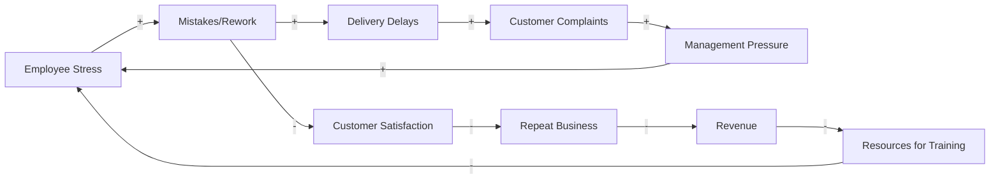
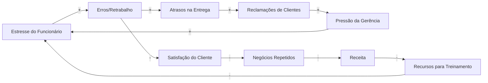

# L0.C1 Systems Thinking 101

## Navigation
**Course**: [[../../index|Course Home]] > [[../../Level0_index|Level 0]] > Chapter 1  
**Previous**: [[../../Level0_index|Level 0 Index]]  
**Next**: [[L0_C2_reading|Chapter 2: Business Process Basics]]

---

## Learning Objectives
- Understand the fundamental principles of systems thinking and its application to business processes
- Identify feedback loops, delays, and unintended consequences in organizational systems
- Apply mental models to analyze complex business challenges
- Create basic causal-loop diagrams to visualize system relationships
- Recognize the difference between symptoms and root causes in business problems

## Real-World Scenario

Sarah runs a mid-sized print shop in Denver with 35 employees. Over the past six months, she's noticed customer complaints have tripled, delivery times have stretched from 3 days to 7 days, and employee turnover has hit 40%. Her immediate reaction was to hire more staff and offer overtime pay to meet deadlines. However, costs skyrocketed while quality continued to decline. 

Sarah's accountant suggested cutting costs by reducing staff training and switching to cheaper paper suppliers. The marketing team recommended aggressive discounts to win back customers. Each department offered solutions focused on their area, but none addressed why a previously successful operation was suddenly failing across multiple dimensions simultaneously.

This scenario illustrates the danger of linear thinking in complex systems. Sarah needs systems thinking to understand how her business components interconnect and influence each other.

## Core Theory

### What is Systems Thinking?

Systems thinking is a holistic approach to analysis that focuses on the way that a system's constituent parts interrelate and how systems work over time and within the context of larger systems. Rather than breaking down complex problems into isolated parts, systems thinking views problems as part of an overall system.

**Key Principles:**

1. **Holistic Perspective**: The whole is greater than the sum of its parts. A print shop isn't just equipment + people + materials; it's the interactions between these elements that create value.

2. **Structure Drives Behavior**: Poor performance often stems from flawed system design, not individual failures. If good people consistently produce poor results, examine the system.

3. **Non-Linearity**: Small changes can produce big results, and big changes can produce small results. A minor process improvement might dramatically increase efficiency, while major equipment upgrades might yield minimal gains.

4. **Purpose and Function**: Every system exists for a purpose. Understanding this purpose helps identify when the system is working effectively.

### Mental Models

Mental models are internal representations of how the world works. They shape what we see and how we interpret information. Common mental models that limit business effectiveness include:

- **Event-oriented thinking**: Focusing only on what happened, not why it happened
- **Linear cause-and-effect**: Assuming A directly causes B, ignoring intermediate factors
- **Static thinking**: Believing current conditions will remain unchanged
- **Single-point optimization**: Improving one area without considering system-wide effects

### Feedback Loops

Feedback loops are the building blocks of systems. They occur when outputs of a system are routed back as inputs, creating a closed loop.

**Reinforcing (Positive) Feedback Loops** amplify or accelerate change:
- High-quality work → satisfied customers → more referrals → more revenue → ability to invest in better equipment → higher quality work

**Balancing (Negative) Feedback Loops** seek equilibrium:
- Increased demand → higher prices → reduced demand → pressure to lower prices

### Delays and Unintended Consequences

Systems often include delays between causes and effects. Actions taken today may not show results for weeks or months. This creates two problems:

1. **Delayed feedback** makes it difficult to connect cause and effect
2. **Policy resistance** occurs when the system pushes back against changes

Understanding delays helps prevent overcorrection—continuing to apply solutions past their effectiveness point.

### Leverage Points

Not all parts of a system are equally influential. Leverage points are places where small shifts in one thing can produce big changes in everything. The highest leverage points often involve changing paradigms, goals, or system structure rather than tweaking parameters.

## Tool Demonstration

### Creating a Basic Causal-Loop Diagram

Causal-loop diagrams visualize the circular causal chains that form feedback loops. Here's how to create one:

1. **Identify the key variables** in your system (customer satisfaction, delivery time, quality, etc.)
2. **Draw arrows** connecting variables that influence each other
3. **Mark each arrow** with "+" (same direction) or "-" (opposite direction)
4. **Add delay marks** (||) where there are significant time delays
5. **Identify the loops** by tracing circular paths
6. **Label loops** as reinforcing (R) or balancing (B)

7. **Test the diagram** by mentally simulating what happens when you change one variable
8. **Look for leverage points** where small changes could break negative loops or strengthen positive ones
9. **Identify intervention points** that address structure rather than symptoms
10. **Validate with stakeholders** to ensure the diagram reflects reality

## Mini Project

**Create a Systems Map for a Local Business Challenge**

Choose a local business you're familiar with (restaurant, retail store, service provider) that appears to be struggling with a recurring problem. This could be long wait times, inconsistent quality, high employee turnover, or customer service issues.

**Deliverables:**
1. **Problem Statement** (150 words): Describe the visible symptoms and their impact
2. **Stakeholder Map** (visual): Identify all parties affected by or influencing the problem
3. **Causal-Loop Diagram** (hand-drawn or digital): Show at least two feedback loops contributing to the problem
4. **Intervention Analysis** (300 words): Identify three potential leverage points and explain why addressing symptoms alone won't solve the underlying issue

**File to submit**: `systems_analysis_[business_name].pdf`

**Evaluation criteria:**
- Demonstrates understanding of systems vs. linear thinking
- Accurately identifies feedback loops and delays
- Proposes interventions that address root causes
- Shows awareness of unintended consequences

## Quiz Placeholder
<QUIZ_LINK will be replaced by generated HTML file>

---

### Portuguese Version

# L0.C1 Pensamento Sistêmico 101

## Objetivos de Aprendizagem
- Compreender os princípios fundamentais do pensamento sistêmico (systems thinking) e sua aplicação aos processos empresariais
- Identificar feedback loops, atrasos e consequências não intencionais em sistemas organizacionais
- Aplicar modelos mentais para analisar desafios empresariais complexos
- Criar diagramas básicos de causal-loop para visualizar relacionamentos sistêmicos
- Reconhecer a diferença entre sintomas e causas raiz em problemas empresariais

## Cenário do Mundo Real

Sarah administra uma gráfica de médio porte em Denver com 35 funcionários. Nos últimos seis meses, ela notou que as reclamações de clientes triplicaram, os prazos de entrega se estenderam de 3 para 7 dias, e a rotatividade de funcionários atingiu 40%. Sua reação imediata foi contratar mais pessoal e oferecer pagamento de horas extras para cumprir prazos. No entanto, os custos dispararam enquanto a qualidade continuou a declinar.

O contador de Sarah sugeriu cortar custos reduzindo o treinamento de funcionários e mudando para fornecedores de papel mais baratos. A equipe de marketing recomendou descontos agressivos para reconquistar clientes. Cada departamento ofereceu soluções focadas em sua área, mas nenhuma abordou por que uma operação anteriormente bem-sucedida estava subitamente falhando em múltiplas dimensões simultaneamente.

Este cenário ilustra o perigo do pensamento linear em sistemas complexos. Sarah precisa do pensamento sistêmico para entender como os componentes de seu negócio se interconectam e se influenciam mutuamente.

## Teoria Central

### O que é Pensamento Sistêmico?

Pensamento sistêmico (systems thinking) é uma abordagem holística de análise que foca na maneira como as partes constituintes de um sistema se inter-relacionam e como os sistemas funcionam ao longo do tempo e dentro do contexto de sistemas maiores. Em vez de dividir problemas complexos em partes isoladas, o pensamento sistêmico vê os problemas como parte de um sistema geral.

**Princípios Chave:**

1. **Perspectiva Holística**: O todo é maior que a soma de suas partes. Uma gráfica não é apenas equipamentos + pessoas + materiais; são as interações entre esses elementos que criam valor.

2. **Estrutura Dirige Comportamento**: Desempenho ruim frequentemente decorre de design de sistema falho, não falhas individuais. Se pessoas boas consistentemente produzem resultados ruins, examine o sistema.

3. **Não-Linearidade**: Pequenas mudanças podem produzir grandes resultados, e grandes mudanças podem produzir pequenos resultados. Uma melhoria menor no processo pode aumentar dramaticamente a eficiência, enquanto upgrades maiores de equipamento podem render ganhos mínimos.

4. **Propósito e Função**: Todo sistema existe para um propósito. Entender esse propósito ajuda a identificar quando o sistema está funcionando efetivamente.

### Modelos Mentais

Modelos mentais são representações internas de como o mundo funciona. Eles moldam o que vemos e como interpretamos informações. Modelos mentais comuns que limitam a efetividade empresarial incluem:

- **Pensamento orientado por eventos**: Focar apenas no que aconteceu, não por que aconteceu
- **Causa-e-efeito linear**: Assumir que A diretamente causa B, ignorando fatores intermediários
- **Pensamento estático**: Acreditar que condições atuais permanecerão inalteradas
- **Otimização de ponto único**: Melhorar uma área sem considerar efeitos em todo o sistema

### Feedback Loops

Feedback loops são os blocos de construção de sistemas. Eles ocorrem quando saídas de um sistema são direcionadas de volta como entradas, criando um loop fechado.

**Reinforcing (Positive) Feedback Loops** amplificam ou aceleram mudanças:
- Trabalho de alta qualidade → clientes satisfeitos → mais indicações → mais receita → capacidade de investir em melhor equipamento → trabalho de maior qualidade

**Balancing (Negative) Feedback Loops** buscam equilíbrio:
- Aumento da demanda → preços mais altos → demanda reduzida → pressão para baixar preços

### Atrasos e Consequências Não Intencionais

Sistemas frequentemente incluem atrasos entre causas e efeitos. Ações tomadas hoje podem não mostrar resultados por semanas ou meses. Isso cria dois problemas:

1. **Feedback atrasado** torna difícil conectar causa e efeito
2. **Resistência de política** (policy resistance) ocorre quando o sistema reage contra mudanças

Entender atrasos ajuda a prevenir supercorreção—continuar aplicando soluções além de seu ponto de efetividade.

### Pontos de Alavancagem

Nem todas as partes de um sistema são igualmente influentes. Leverage points são lugares onde pequenas mudanças em uma coisa podem produzir grandes mudanças em tudo. Os pontos de alavancagem mais altos frequentemente envolvem mudar paradigmas, objetivos ou estrutura do sistema em vez de ajustar parâmetros.

## Demonstração de Ferramenta

### Criando um Diagrama Básico de Causal-Loop

Diagramas de causal-loop visualizam as cadeias causais circulares que formam feedback loops. Aqui está como criar um:

1. **Identifique as variáveis-chave** em seu sistema (satisfação do cliente, tempo de entrega, qualidade, etc.)
2. **Desenhe setas** conectando variáveis que se influenciam mutuamente
3. **Marque cada seta** com "+" (mesma direção) ou "-" (direção oposta)
4. **Adicione marcas de atraso** (||) onde há atrasos de tempo significativos
5. **Identifique os loops** traçando caminhos circulares
6. **Rotule loops** como reinforcing (R) ou balancing (B)

7. **Teste o diagrama** simulando mentalmente o que acontece quando você muda uma variável
8. **Procure por leverage points** onde pequenas mudanças poderiam quebrar loops negativos ou fortalecer positivos
9. **Identifique pontos de intervenção** que abordem estrutura em vez de sintomas
10. **Valide com stakeholders** para garantir que o diagrama reflete a realidade

## Mini Projeto

**Crie um Mapa de Sistemas para um Desafio Empresarial Local**

Escolha um negócio local que você conhece (restaurante, loja de varejo, provedor de serviços) que parece estar lutando com um problema recorrente. Isso pode ser longos tempos de espera, qualidade inconsistente, alta rotatividade de funcionários, ou problemas de atendimento ao cliente.

**Entregáveis:**
1. **Declaração do Problema** (150 palavras): Descreva os sintomas visíveis e seu impacto
2. **Mapa de Stakeholders** (visual): Identifique todas as partes afetadas ou influenciando o problema
3. **Diagrama de Causal-Loop** (desenhado à mão ou digital): Mostre pelo menos dois feedback loops contribuindo para o problema
4. **Análise de Intervenção** (300 palavras): Identifique três leverage points potenciais e explique por que abordar apenas sintomas não resolverá o problema subjacente

**Arquivo para submeter**: `analise_sistemas_[nome_negocio].pdf`

**Critérios de avaliação:**
- Demonstra compreensão de pensamento sistêmico vs. linear
- Identifica accurately feedback loops e atrasos
- Propõe intervenções que abordam causas raiz
- Mostra consciência de consequências não intencionais

---

## Chapter Links
- 🧠 **Quiz**: [[L0_C1_quiz.html|Take the Systems Thinking Quiz]]
- 🎯 **Project**: [[L0_C1_project|Project Assignment]]  
- ✅ **Solutions**: [[L0_C1_solutions|Solutions Guide]]

## Navigation
**Previous**: [[../../Level0_index|Level 0 Index]]  
**Next**: [[L0_C2_reading|Chapter 2: Business Process Basics]]  
**Up**: [[../../Level0_index|Level 0 Index]]