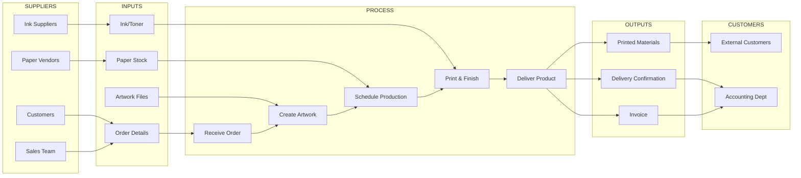
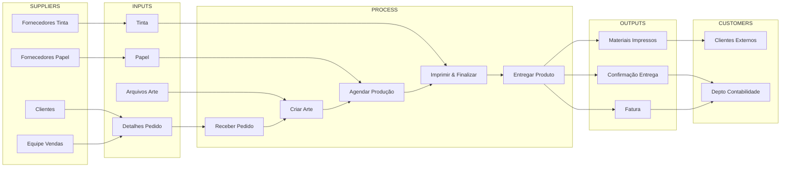

# L0.C2 Business Process Basics

## Navigation
**Course**: [[../../index|Course Home]] > [[../../Level0_index|Level 0]] > Chapter 2  
**Previous**: [[L0_C1_reading|Chapter 1: Systems Thinking 101]]  
**Next**: [[L0_C3_reading|Chapter 3: BPMN Basics]]

---

## Learning Objectives
- Understand the fundamental concepts of business processes and their role in value creation
- Distinguish between processes, procedures, and workflows
- Apply the SIPOC framework to define process scope and boundaries
- Identify different types of processes within organizations
- Recognize the relationship between processes and business strategy

## Real-World Scenario

Mike owns PrintMax, a commercial printing company in Phoenix with 50 employees. His business has grown rapidly over five years from a small copy shop to a full-service printing operation handling everything from business cards to large format banners. However, growth has brought chaos. 

Last week, a rush order for 10,000 conference programs arrived Monday morning for Friday delivery. The sales rep promised same-day artwork approval, the design team committed to Tuesday completion, production scheduled Wednesday printing, and finishing planned Thursday binding. By Wednesday afternoon, the customer had requested three design revisions, the wrong paper stock had been ordered, and the binding equipment was tied up with another job that had similar delivery promises.

Mike watched his team work frantically, with employees shuttling between departments asking "What's the status on the conference job?" and "Who approved the final artwork?" The job was eventually completed Saturday morning, requiring overtime pay and a partial refund to the unhappy customer. This scenario repeats weekly with different orders.

Mike realizes he needs to understand how work actually flows through his company and design reliable processes that can handle complexity without constant firefighting.

## Core Theory

### What is a Business Process?

A business process is a collection of linked activities that create value by transforming inputs into outputs for customers. Processes are the "how" of business—they represent the way work gets done to achieve strategic objectives.

**Key Characteristics of Processes:**
1. **Cross-functional**: Most processes span multiple departments or functions
2. **Repeatable**: They can be performed consistently multiple times
3. **Measurable**: Their performance can be quantified and improved
4. **Value-creating**: They produce outcomes that customers are willing to pay for
5. **Customer-focused**: They exist to meet internal or external customer needs

### Process vs. Procedure vs. Workflow

These terms are often confused but have distinct meanings:

**Process**: The complete end-to-end flow of activities that transforms inputs into outputs
- Example: "Order to Cash" process includes everything from initial customer contact through payment collection

**Procedure**: Step-by-step instructions for performing specific tasks within a process
- Example: "How to set up artwork files for printing" procedure within the production process

**Workflow**: The sequence and routing of work items through the process
- Example: "Route print job from design → prepress → production → finishing → shipping"

Think of process as the highway system, procedures as traffic rules, and workflow as the actual traffic flow.

### The SIPOC Framework

SIPOC is a tool for defining process scope and boundaries:

**S - Suppliers**: Who provides inputs to the process?
**I - Inputs**: What materials, information, or resources enter the process?
**P - Process**: What are the high-level steps that transform inputs to outputs?
**O - Outputs**: What products, services, or information does the process produce?
**C - Customers**: Who receives and uses the process outputs?

### Value Chain Concept

Organizations create value through interconnected processes. Michael Porter's Value Chain model categorizes activities into:

**Primary Activities** (directly create customer value):
- Inbound logistics
- Operations
- Outbound logistics
- Marketing & sales
- Service

**Support Activities** (enable primary activities):
- Infrastructure
- Human resource management
- Technology development
- Procurement

Each activity is actually a collection of processes working together to create competitive advantage.

### Types of Business Processes

**Core Processes** directly serve external customers and generate revenue:
- Product development
- Order fulfillment
- Customer service
- Sales and marketing

**Support Processes** enable core processes to function effectively:
- Human resources
- Information technology
- Finance and accounting
- Facilities management

**Management Processes** provide direction and oversight:
- Strategic planning
- Performance management
- Risk management
- Governance and compliance

### Process Hierarchy and Decomposition

Processes exist at multiple levels:

**Level 1 - Value Chain**: Highest level processes that span the entire organization
- Example: "Deliver printing services to customers"

**Level 2 - Core Processes**: Major processes within the value chain
- Example: "Fulfill print orders"

**Level 3 - Sub-processes**: Components of core processes
- Example: "Prepare artwork for production"

**Level 4 - Activities**: Individual tasks within sub-processes
- Example: "Convert customer files to print-ready format"

**Level 5 - Tasks**: Specific actions within activities
- Example: "Check file resolution and color profile"

### Process Performance Dimensions

Processes can be evaluated across multiple dimensions:

**Effectiveness**: Does the process produce the right outputs?
- Quality metrics: defect rates, customer satisfaction
- Delivery metrics: on-time performance, completeness

**Efficiency**: Does the process use resources optimally?
- Time metrics: cycle time, throughput
- Cost metrics: unit cost, resource utilization

**Adaptability**: Can the process handle variation and change?
- Flexibility metrics: setup time, changeover capability
- Scalability metrics: volume handling, peak capacity

### Process Ownership and Governance

Effective processes require clear ownership:

**Process Owner**: Person accountable for end-to-end process performance
- Responsible for process design and improvement
- Has authority to make changes across functional boundaries
- Measured on overall process outcomes, not departmental metrics

**Process Participants**: People who perform activities within the process
- Execute specific tasks according to procedures
- Provide feedback on process effectiveness
- Suggest improvements based on front-line experience

### Horizontal vs. Vertical Organization

Traditional organizations are structured vertically by function:
- Marketing department
- Production department  
- Finance department
- Human resources department

Process thinking emphasizes horizontal flow:
- How does work move across departmental boundaries?
- Where do handoffs create delays or errors?
- How can cross-functional teams optimize overall performance?

This shift from vertical to horizontal thinking is fundamental to process improvement.

## Tool Demonstration

### Creating a SIPOC Diagram

Here's how to create a SIPOC diagram for PrintMax's order fulfillment process:

1. **Start with the Process (P)**: Define 4-7 high-level steps
   - Receive customer order
   - Create artwork and proof
   - Schedule and produce job
   - Finish and deliver product

2. **Identify Outputs (O)**: What does the process produce?
   - Printed materials meeting specifications
   - Delivery confirmation
   - Invoice for payment

3. **Identify Customers (C)**: Who receives the outputs?
   - External customers (businesses, organizations)
   - Internal customers (accounting department receives delivery confirmation)

4. **Identify Inputs (I)**: What's needed to run the process?
   - Customer order details and specifications
   - Digital artwork files
   - Raw materials (paper, ink, binding materials)
   - Production schedule and capacity

5. **Identify Suppliers (S)**: Who provides the inputs?
   - Customers (order details, artwork)
   - Paper suppliers
   - Ink vendors
   - Equipment manufacturers
   - Internal suppliers (sales team provides orders)

6. **Validate the SIPOC**: Check that inputs and outputs match across boundaries
7. **Define Process Scope**: Clarify what's included and excluded
8. **Identify Key Metrics**: How will you measure process performance?
9. **Document Assumptions**: Note any constraints or special conditions
10. **Review with Stakeholders**: Ensure accuracy and buy-in from process participants

## Mini Project

**Map Your Daily Work Process Using SIPOC**

Choose a work process you're personally involved in—either from current employment, volunteer work, school projects, or even household management. The key is selecting something you can analyze from direct experience.

**Process Selection Criteria:**
- You participate in or observe the complete process
- The process repeats regularly (daily, weekly, or monthly)
- Multiple people or departments are involved
- There are clear inputs and outputs
- You can identify specific customers who use the outputs

**Examples of Suitable Processes:**
- Course assignment completion (from professor assignment to grade submission)
- Weekly grocery shopping and meal preparation
- Monthly budget planning and expense tracking
- Job application process (from job search to interview)
- Event planning process (from initial idea to event completion)
- Content creation process (from idea to publication)

**Deliverables:**
1. **Process Selection Justification** (100 words): Explain why you chose this process and how you're involved in it

2. **SIPOC Diagram** (visual): Create a clear diagram showing:
   - Suppliers (minimum 3)
   - Inputs (minimum 4)
   - Process steps (4-7 high-level steps)
   - Outputs (minimum 3)
   - Customers (minimum 2)

3. **Process Analysis** (300 words):
   - **Current State Issues**: What problems or inefficiencies exist?
   - **Handoff Points**: Where does work transfer between people/departments?
   - **Value-Added vs. Non-Value-Added**: Which steps directly contribute to customer value?
   - **Improvement Opportunities**: What changes could improve effectiveness or efficiency?

**File to submit**: `process_analysis_[process_name].pdf`

**Format Requirements:**
- SIPOC diagram should be visual (hand-drawn, digital tool, or simple flowchart)
- Analysis should be structured with clear headings
- Include specific examples and details from your experience
- Stay within word limits while being thorough

## Quiz Placeholder
<QUIZ_LINK will be replaced by generated HTML file>

---

### Portuguese Version

# L0.C2 Fundamentos de Processos Empresariais

## Objetivos de Aprendizagem
- Compreender os conceitos fundamentais de processos empresariais e seu papel na criação de valor
- Distinguir entre processos, procedimentos e workflows
- Aplicar o framework SIPOC para definir escopo e limites de processos
- Identificar diferentes tipos de processos dentro das organizações
- Reconhecer a relação entre processos e estratégia empresarial

## Cenário do Mundo Real

Mike possui a PrintMax, uma empresa de impressão comercial em Phoenix com 50 funcionários. Seu negócio cresceu rapidamente ao longo de cinco anos, de uma pequena copiadora para uma operação completa de impressão, lidando com tudo, desde cartões de visita até banners de grande formato. No entanto, o crescimento trouxe caos.

Na semana passada, um pedido urgente de 10.000 programas de conferência chegou na segunda-feira de manhã para entrega na sexta-feira. O representante de vendas prometeu aprovação da arte no mesmo dia, a equipe de design se comprometeu com a conclusão na terça-feira, a produção agendou a impressão para quarta-feira, e o acabamento planejou a encadernação para quinta-feira. Na tarde de quarta-feira, o cliente havia solicitado três revisões de design, o papel errado havia sido encomendado, e o equipamento de encadernação estava ocupado com outro trabalho que tinha promessas de entrega similares.

Mike assistiu sua equipe trabalhar freneticamente, com funcionários transitando entre departamentos perguntando "Qual é o status do trabalho da conferência?" e "Quem aprovou a arte final?" O trabalho foi eventualmente concluído no sábado de manhã, exigindo pagamento de horas extras e um reembolso parcial para o cliente insatisfeito. Este cenário se repete semanalmente com diferentes pedidos.

Mike percebe que precisa entender como o trabalho realmente flui através de sua empresa e projetar processos confiáveis que possam lidar com complexidade sem constante combate a incêndios.

## Teoria Central

### O que é um Processo Empresarial?

Um processo empresarial é uma coleção de atividades vinculadas que criam valor transformando inputs em outputs para clientes. Processos são o "como" dos negócios—eles representam a maneira como o trabalho é feito para alcançar objetivos estratégicos.

**Características Chave dos Processos:**
1. **Cross-functional**: A maioria dos processos abrange múltiplos departamentos ou funções
2. **Repetível**: Eles podem ser executados consistentemente múltiplas vezes
3. **Mensurável**: Seu desempenho pode ser quantificado e melhorado
4. **Criador de valor**: Eles produzem resultados pelos quais os clientes estão dispostos a pagar
5. **Focado no cliente**: Eles existem para atender necessidades de clientes internos ou externos

### Processo vs. Procedimento vs. Workflow

Estes termos são frequentemente confundidos, mas têm significados distintos:

**Processo**: O fluxo completo de ponta a ponta de atividades que transforma inputs em outputs
- Exemplo: processo "Order to Cash" inclui tudo desde o contato inicial do cliente até a cobrança do pagamento

**Procedimento**: Instruções passo a passo para executar tarefas específicas dentro de um processo
- Example: procedimento "Como configurar arquivos de arte para impressão" dentro do processo de produção

**Workflow**: A sequência e roteamento de itens de trabalho através do processo
- Exemplo: "Rotear trabalho de impressão de design → pré-impressão → produção → acabamento → envio"

Pense no processo como o sistema rodoviário, procedimentos como regras de trânsito, e workflow como o fluxo real de tráfego.

### O Framework SIPOC

SIPOC é uma ferramenta para definir escopo e limites do processo:

**S - Suppliers**: Quem fornece inputs para o processo?
**I - Inputs**: Que materiais, informações ou recursos entram no processo?
**P - Process**: Quais são os passos de alto nível que transformam inputs em outputs?
**O - Outputs**: Que produtos, serviços ou informações o processo produz?
**C - Customers**: Quem recebe e usa os outputs do processo?

### Conceito de Cadeia de Valor

Organizações criam valor através de processos interconectados. O modelo de Cadeia de Valor de Michael Porter categoriza atividades em:

**Atividades Primárias** (criam diretamente valor para o cliente):
- Logística interna
- Operações
- Logística externa
- Marketing & vendas
- Serviço

**Atividades de Apoio** (habilitam atividades primárias):
- Infraestrutura
- Gestão de recursos humanos
- Desenvolvimento de tecnologia
- Procurement

Cada atividade é na verdade uma coleção de processos trabalhando juntos para criar vantagem competitiva.

### Tipos de Processos Empresariais

**Processos Centrais** servem diretamente clientes externos e geram receita:
- Desenvolvimento de produtos
- Fulfillment de pedidos
- Atendimento ao cliente
- Vendas e marketing

**Processos de Apoio** habilitam processos centrais a funcionar efetivamente:
- Recursos humanos
- Tecnologia da informação
- Finanças e contabilidade
- Gestão de instalações

**Processos de Gestão** fornecem direção e supervisão:
- Planejamento estratégico
- Gestão de desempenho
- Gestão de riscos
- Governança e compliance

### Hierarquia e Decomposição de Processos

Processos existem em múltiplos níveis:

**Nível 1 - Cadeia de Valor**: Processos de mais alto nível que abrangem toda a organização
- Exemplo: "Entregar serviços de impressão para clientes"

**Nível 2 - Processos Centrais**: Processos principais dentro da cadeia de valor
- Exemplo: "Cumprir pedidos de impressão"

**Nível 3 - Sub-processos**: Componentes de processos centrais
- Exemplo: "Preparar arte para produção"

**Nível 4 - Atividades**: Tarefas individuais dentro de sub-processos
- Exemplo: "Converter arquivos do cliente para formato pronto para impressão"

**Nível 5 - Tarefas**: Ações específicas dentro de atividades
- Exemplo: "Verificar resolução e perfil de cor do arquivo"

### Dimensões de Performance de Processos

Processos podem ser avaliados através de múltiplas dimensões:

**Efetividade**: O processo produz os outputs corretos?
- Métricas de qualidade: taxas de defeito, satisfação do cliente
- Métricas de entrega: performance on-time, completude

**Eficiência**: O processo usa recursos de forma otimizada?
- Métricas de tempo: cycle time, throughput
- Métricas de custo: custo unitário, utilização de recursos

**Adaptabilidade**: O processo pode lidar com variação e mudança?
- Métricas de flexibilidade: tempo de setup, capacidade de changeover
- Métricas de escalabilidade: manuseio de volume, capacidade pico

### Ownership e Governança de Processos

Processos efetivos requerem ownership clara:

**Process Owner**: Pessoa responsável pela performance do processo de ponta a ponta
- Responsável pelo design e melhoria do processo
- Tem autoridade para fazer mudanças através de limites funcionais
- Medido nos resultados gerais do processo, não métricas departamentais

**Participantes do Processo**: Pessoas que executam atividades dentro do processo
- Executam tarefas específicas de acordo com procedimentos
- Fornecem feedback sobre efetividade do processo
- Sugerem melhorias baseadas na experiência de linha de frente

### Organização Horizontal vs. Vertical

Organizações tradicionais são estruturadas verticalmente por função:
- Departamento de marketing
- Departamento de produção
- Departamento de finanças
- Departamento de recursos humanos

Pensamento de processo enfatiza fluxo horizontal:
- Como o trabalho se move através de limites departamentais?
- Onde handoffs criam atrasos ou erros?
- Como equipes cross-funcionais podem otimizar performance geral?

Esta mudança de pensamento vertical para horizontal é fundamental para melhoria de processos.

## Demonstração de Ferramenta

### Criando um Diagrama SIPOC

Aqui está como criar um diagrama SIPOC para o processo de fulfillment de pedidos da PrintMax:

1. **Comece com o Processo (P)**: Defina 4-7 passos de alto nível
   - Receber pedido do cliente
   - Criar arte e prova
   - Agendar e produzir trabalho
   - Finalizar e entregar produto

2. **Identifique Outputs (O)**: O que o processo produz?
   - Materiais impressos atendendo especificações
   - Confirmação de entrega
   - Fatura para pagamento

3. **Identifique Customers (C)**: Quem recebe os outputs?
   - Clientes externos (empresas, organizações)
   - Clientes internos (departamento de contabilidade recebe confirmação de entrega)

4. **Identifique Inputs (I)**: O que é necessário para executar o processo?
   - Detalhes e especificações do pedido do cliente
   - Arquivos de arte digital
   - Matérias-primas (papel, tinta, materiais de encadernação)
   - Cronograma de produção e capacidade

5. **Identifique Suppliers (S)**: Quem fornece os inputs?
   - Clientes (detalhes do pedido, arte)
   - Fornecedores de papel
   - Vendedores de tinta
   - Fabricantes de equipamentos
   - Fornecedores internos (equipe de vendas fornece pedidos)

6. **Valide o SIPOC**: Verifique que inputs e outputs coincidem através dos limites
7. **Defina Escopo do Processo**: Esclareça o que está incluído e excluído
8. **Identifique Métricas Chave**: Como você medirá a performance do processo?
9. **Documente Premissas**: Note quaisquer restrições ou condições especiais
10. **Revise com Stakeholders**: Garanta precisão e buy-in dos participantes do processo

## Mini Projeto

**Mapeie Seu Processo de Trabalho Diário Usando SIPOC**

Escolha um processo de trabalho no qual você está pessoalmente envolvido—seja do emprego atual, trabalho voluntário, projetos escolares, ou até mesmo gestão doméstica. A chave é selecionar algo que você pode analisar a partir de experiência direta.

**Critérios de Seleção do Processo:**
- Você participa ou observa o processo completo
- O processo se repete regularmente (diário, semanal ou mensal)
- Múltiplas pessoas ou departamentos estão envolvidos
- Há inputs e outputs claros
- Você pode identificar clientes específicos que usam os outputs

**Exemplos de Processos Adequados:**
- Conclusão de tarefas do curso (da atribuição do professor à submissão da nota)
- Compras semanais de mercado e preparação de refeições
- Planejamento orçamentário mensal e rastreamento de despesas
- Processo de candidatura a emprego (da busca de emprego à entrevista)
- Processo de planejamento de eventos (da ideia inicial à conclusão do evento)
- Processo de criação de conteúdo (da ideia à publicação)

**Entregáveis:**
1. **Justificativa de Seleção do Processo** (100 palavras): Explique por que você escolheu este processo e como está envolvido nele

2. **Diagrama SIPOC** (visual): Crie um diagrama claro mostrando:
   - Suppliers (mínimo 3)
   - Inputs (mínimo 4)
   - Passos do processo (4-7 passos de alto nível)
   - Outputs (mínimo 3)
   - Customers (mínimo 2)

3. **Análise do Processo** (300 palavras):
   - **Problemas do Estado Atual**: Que problemas ou ineficiências existem?
   - **Pontos de Handoff**: Onde o trabalho transfere entre pessoas/departamentos?
   - **Value-Added vs. Non-Value-Added**: Quais passos contribuem diretamente para valor do cliente?
   - **Oportunidades de Melhoria**: Que mudanças poderiam melhorar efetividade ou eficiência?

**Arquivo para submeter**: `analise_processo_[nome_processo].pdf`

**Requisitos de Formato:**
- Diagrama SIPOC deve ser visual (desenhado à mão, ferramenta digital, ou flowchart simples)
- Análise deve ser estruturada com cabeçalhos claros
- Inclua exemplos específicos e detalhes de sua experiência
- Mantenha-se dentro dos limites de palavras sendo completo

## Quiz Placeholder
<QUIZ_LINK will be replaced by generated HTML file>

---

## Chapter Links
- 🧠 **Quiz**: [[L0_C2_quiz.html|Take the Business Process Basics Quiz]]
- 🎯 **Project**: [[L0_C2_project|Project Assignment]]  
- ✅ **Solutions**: [[L0_C2_solutions|Solutions Guide]]

## Navigation
**Previous**: [[L0_C1_reading|Chapter 1: Systems Thinking 101]]  
**Next**: [[L0_C3_reading|Chapter 3: BPMN Basics]]  
**Up**: [[../../Level0_index|Level 0 Index]]