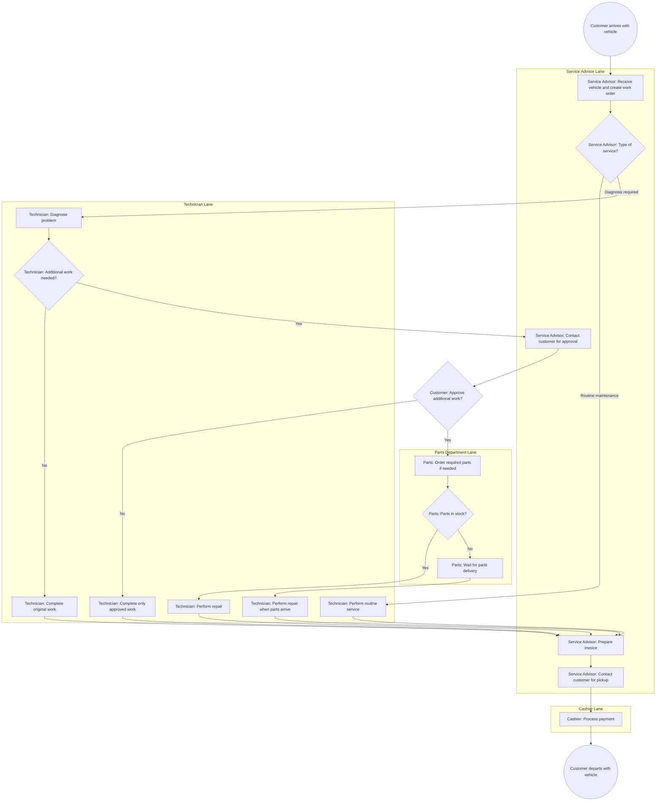
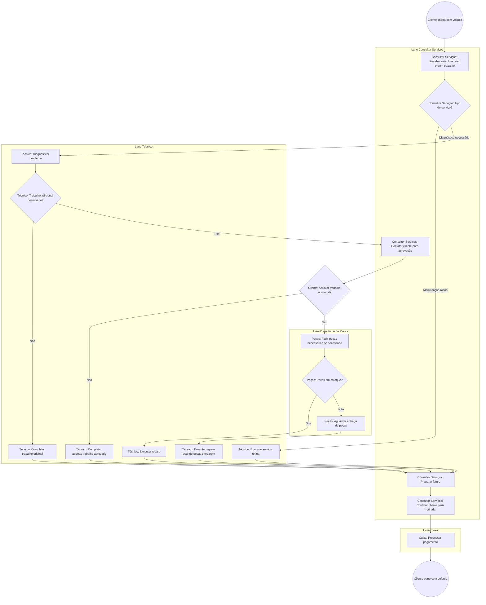

# L0.C3 Process Mapping with BPMN

## Navigation
**Course**: [[../../index|Course Home]] > [[../../Level0_index|Level 0]] > Chapter 3  
**Previous**: [[L0_C2_reading|Chapter 2: Business Process Basics]]  
**Next**: [[L0_C4_reading|Chapter 4: Lean & Six Sigma Foundations]]

---

## Learning Objectives
- Master the fundamentals of Business Process Model and Notation (BPMN) standard
- Create process maps using correct BPMN symbols and conventions
- Design swimlane diagrams to show cross-functional responsibilities
- Identify and represent different types of gateways and decision points
- Apply BPMN to document and analyze existing business processes

## Real-World Scenario

Jennifer manages operations at QuickFix Auto Repair, a 12-bay service center that handles everything from oil changes to major engine repairs. The shop processes 80-120 vehicles daily, but customer complaints about wait times and communication have increased 40% over six months.

Yesterday's typical chaos illustrates the problem: A customer dropped off a car for brake inspection at 8 AM, expecting completion by noon. The service advisor wrote "check brakes" on a work order and placed it in the technician queue. By 10 AM, the technician discovered the brake pads needed replacement but couldn't locate the customer to get approval. The advisor was helping another customer and the phone was busy. The work order sat idle for two hours.

When the advisor finally reached the customer at 12:30 PM, they approved the repair. However, the shop was out of the correct brake pads. Parts ordered the correct pads, but they wouldn't arrive until 3 PM. The technician moved to another job, planning to return to the brake repair later. At 4 PM, the customer called asking for status—no one knew where the work order was or who was responsible.

The repair was eventually completed at 5:30 PM, requiring the customer to return the next day. Jennifer realizes her team needs a clear visual representation of how work should flow through the shop, with defined handoffs, decision points, and responsibilities. She's heard about BPMN but doesn't know where to start.

## Core Theory

### What is BPMN?

Business Process Model and Notation (BPMN) is an international standard for creating visual diagrams of business processes. It provides a common language that bridges the communication gap between business process design and implementation, allowing both business users and technical implementers to understand the same diagram.

**Key Benefits of BPMN:**
1. **Standardization**: Universal symbols and conventions ensure consistent interpretation
2. **Clarity**: Visual representation makes complex processes easy to understand
3. **Communication**: Common language between stakeholders, analysts, and technicians
4. **Analysis**: Enables systematic identification of bottlenecks, redundancies, and improvements
5. **Documentation**: Creates reliable process documentation for training and compliance

### Core BPMN Elements

**Flow Objects** (the main elements):

**Events** (circles): Something that happens during the process
- **Start Event** (thin circle): Triggers the process
- **Intermediate Event** (double circle): Occurs during the process
- **End Event** (thick circle): Concludes the process

**Activities** (rounded rectangles): Work performed in the process
- **Task**: Single unit of work (e.g., "Review application")
- **Sub-process**: Contains other activities (e.g., "Complete background check")

**Gateways** (diamonds): Control process flow and decisions
- **Exclusive Gateway** (X): Either/or decision (one path only)
- **Parallel Gateway** (+): Multiple paths execute simultaneously
- **Inclusive Gateway** (O): One or more paths execute based on conditions

**Connecting Objects**:
- **Sequence Flow** (solid arrow): Shows order of activities
- **Message Flow** (dashed arrow): Communication between participants
- **Association** (dotted line): Links artifacts to activities

**Swimlanes**:
- **Pool**: Represents major participants (organizations, departments)
- **Lane**: Shows roles or responsibilities within a pool

### BPMN Notation Standards

**Naming Conventions:**
- **Events**: Noun phrases describing what happened ("Customer order received")
- **Activities**: Verb-noun phrases describing actions ("Review credit application")
- **Gateways**: Questions that can be answered yes/no or with specific conditions

**Flow Direction:**
- Standard flow is left-to-right, top-to-bottom
- Avoid crossing lines when possible
- Use pools and lanes to organize complex processes

### Types of Process Maps

**Level 1 - Value Stream Maps**: Highest level view showing major process phases
- Shows overall flow from customer request to delivery
- Focuses on value-added time vs. total cycle time
- Identifies major handoffs between organizations or departments

**Level 2 - Process Maps**: Detailed workflow within major phases
- Shows specific activities, decisions, and handoffs
- Includes all significant steps and decision points
- Suitable for process improvement and problem-solving

**Level 3 - Procedure Maps**: Step-by-step instructions for specific tasks
- Shows detailed work instructions for individual activities
- Includes specific tools, systems, and resources needed
- Used for training and quality control

### Swimlane Diagrams

Swimlanes organize processes by responsibility, making it clear who does what:

**Horizontal Swimlanes** (most common):
- Each lane represents a role, department, or system
- Activities are placed in the appropriate lane
- Sequence flows show work moving between lanes
- Message flows show communication between lanes

**Vertical Swimlanes**:
- Sometimes used when processes have many participants
- Less common but useful for certain process types

### Common BPMN Patterns

**Sequential Pattern**: Activities happen one after another
```
[Start] → [Activity 1] → [Activity 2] → [Activity 3] → [End]
```

**Parallel Pattern**: Multiple activities happen simultaneously
```
[Start] → [Split Gateway +] → [Activity 1]
                           → [Activity 2] → [Join Gateway +] → [End]
```

**Decision Pattern**: Process branches based on conditions
```
[Start] → [Decision Gateway X] → [Activity A] → [End]
                               → [Activity B] → [End]
```

**Loop Pattern**: Activities repeat until conditions are met
```
[Start] → [Activity] → [Check Gateway X] → [End]
              ↑              ↓
              └──────────────┘
```

## Tool Demonstration

### Creating a BPMN Diagram for Auto Repair Process

Let's map QuickFix Auto Repair's vehicle service process using proper BPMN notation:



### Step-by-Step BPMN Creation Process

1. **Identify Process Scope**: Define clear start and end points
   - Start: Customer arrives with vehicle
   - End: Customer departs with completed service

2. **List Major Activities**: Brainstorm all significant steps
   - Receive vehicle, diagnose problems, get approvals, order parts, perform work, collect payment

3. **Identify Participants**: Determine who performs each activity
   - Service advisor, technician, parts department, cashier, customer

4. **Create Swimlanes**: Set up lanes for each participant
   - Use horizontal lanes for clear responsibility assignment

5. **Place Activities**: Put each activity in the appropriate lane
   - Use verb-noun naming convention for activities

6. **Add Decision Points**: Identify where process branches
   - Type of service, additional work needed, customer approval, parts availability

7. **Connect with Sequence Flows**: Show the order of activities
   - Use solid arrows for normal flow within the organization

8. **Add Message Flows**: Show communication between participants
   - Use dashed arrows for customer interactions and approvals

9. **Review and Validate**: Check that the diagram accurately represents reality
   - Walk through the process with actual participants
   - Ensure all paths lead to proper end events

10. **Refine and Standardize**: Apply proper BPMN conventions
    - Consistent naming, proper gateway symbols, clear swimlane boundaries

## Mini Project

**Create a BPMN Process Map for a Service Process**

Map a service process that involves multiple people or departments. Focus on processes where handoffs and communication are important for success.

**Process Selection Criteria:**
- Involves at least 3 different roles or departments
- Has at least one decision point that affects the process flow
- Includes customer or external party interactions
- You can observe or participate in the complete process
- Process has clear start and end events

**Suitable Process Examples:**
- Restaurant food ordering and delivery process
- Library book checkout and return process
- University course registration process
- Medical clinic appointment and treatment process
- Online order fulfillment process
- Job interview scheduling and execution process
- Event ticket purchase and attendance process

**Deliverables:**

1. **Process Description** (150 words): Describe the process scope, participants, and current challenges

2. **BPMN Diagram** (visual): Create a process map that includes:
   - **Minimum 3 swimlanes** representing different roles/departments
   - **8-12 activities** using proper BPMN task notation
   - **At least 2 gateways** showing decision points or parallel activities
   - **Proper start and end events**
   - **Sequence flows** connecting all activities logically
   - **Message flows** (dashed lines) showing communication between participants

3. **Process Analysis** (200 words):
   - **Bottlenecks**: Where do delays typically occur?
   - **Handoff Issues**: Which transitions between swimlanes cause problems?
   - **Decision Clarity**: Are decision criteria clear to participants?
   - **Improvement Opportunities**: What specific changes would improve flow?

**Technical Requirements:**
- Use standard BPMN symbols (circles for events, rectangles for tasks, diamonds for gateways)
- Label all activities with verb-noun phrases
- Label all events with noun phrases describing what happened
- Use consistent swimlane widths and clear boundaries
- Ensure all paths from start to end are complete

**File to submit**: `bpmn_process_map_[process_name].pdf`

**Evaluation Focus:**
- Correct use of BPMN notation and symbols
- Clear swimlane organization showing responsibilities
- Logical process flow with all paths complete
- Identification of realistic process improvement opportunities
- Professional diagram presentation

## Quiz Placeholder
<QUIZ_LINK will be replaced by generated HTML file>

---

### Portuguese Version

# L0.C3 Mapeamento de Processos com BPMN

## Objetivos de Aprendizagem
- Dominar os fundamentos do padrão Business Process Model and Notation (BPMN)
- Criar mapas de processos usando símbolos e convenções BPMN corretos
- Projetar diagramas de swimlane para mostrar responsabilidades cross-funcionais
- Identificar e representar diferentes tipos de gateways e pontos de decisão
- Aplicar BPMN para documentar e analisar processos empresariais existentes

## Cenário do Mundo Real

Jennifer gerencia operações na QuickFix Auto Repair, um centro de serviço de 12 boxes que lida com tudo, desde trocas de óleo até grandes reparos de motor. A oficina processa 80-120 veículos diariamente, mas as reclamações de clientes sobre tempos de espera e comunicação aumentaram 40% nos últimos seis meses.

O caos típico de ontem ilustra o problema: Um cliente deixou um carro para inspeção de freios às 8h, esperando conclusão até meio-dia. O consultor de serviços escreveu "verificar freios" em uma ordem de trabalho e a colocou na fila do técnico. Às 10h, o técnico descobriu que as pastilhas de freio precisavam ser substituídas, mas não conseguiu localizar o cliente para obter aprovação. O consultor estava ajudando outro cliente e o telefone estava ocupado. A ordem de trabalho ficou parada por duas horas.

Quando o consultor finalmente alcançou o cliente às 12h30, eles aprovaram o reparo. No entanto, a oficina estava sem as pastilhas de freio corretas. O departamento de peças pediu as pastilhas corretas, mas elas não chegariam até às 15h. O técnico mudou para outro trabalho, planejando retornar ao reparo de freios mais tarde. Às 16h, o cliente ligou perguntando sobre o status—ninguém sabia onde estava a ordem de trabalho ou quem era responsável.

O reparo foi eventualmente concluído às 17h30, exigindo que o cliente retornasse no dia seguinte. Jennifer percebe que sua equipe precisa de uma representação visual clara de como o trabalho deve fluir através da oficina, com handoffs definidos, pontos de decisão e responsabilidades. Ela ouviu falar sobre BPMN mas não sabe por onde começar.

## Teoria Central

### O que é BPMN?

Business Process Model and Notation (BPMN) é um padrão internacional para criar diagramas visuais de processos empresariais. Ele fornece uma linguagem comum que conecta a lacuna de comunicação entre design de processos empresariais e implementação, permitindo que tanto usuários de negócios quanto implementadores técnicos entendam o mesmo diagrama.

**Benefícios Chave do BPMN:**
1. **Padronização**: Símbolos e convenções universais garantem interpretação consistente
2. **Clareza**: Representação visual torna processos complexos fáceis de entender
3. **Comunicação**: Linguagem comum entre stakeholders, analistas e técnicos
4. **Análise**: Permite identificação sistemática de gargalos, redundâncias e melhorias
5. **Documentação**: Cria documentação confiável de processos para treinamento e compliance

### Elementos Centrais do BPMN

**Flow Objects** (os elementos principais):

**Events** (círculos): Algo que acontece durante o processo
- **Start Event** (círculo fino): Dispara o processo
- **Intermediate Event** (círculo duplo): Ocorre durante o processo
- **End Event** (círculo grosso): Conclui o processo

**Activities** (retângulos arredondados): Trabalho executado no processo
- **Task**: Unidade única de trabalho (ex: "Revisar aplicação")
- **Sub-process**: Contém outras atividades (ex: "Completar verificação de antecedentes")

**Gateways** (diamantes): Controlam fluxo do processo e decisões
- **Exclusive Gateway** (X): Decisão ou/ou (apenas um caminho)
- **Parallel Gateway** (+): Múltiplos caminhos executam simultaneamente
- **Inclusive Gateway** (O): Um ou mais caminhos executam baseados em condições

**Connecting Objects**:
- **Sequence Flow** (seta sólida): Mostra ordem das atividades
- **Message Flow** (seta tracejada): Comunicação entre participantes
- **Association** (linha pontilhada): Liga artefatos às atividades

**Swimlanes**:
- **Pool**: Representa participantes principais (organizações, departamentos)
- **Lane**: Mostra papéis ou responsabilidades dentro de um pool

### Padrões de Notação BPMN

**Convenções de Nomeação:**
- **Events**: Frases substantivas descrevendo o que aconteceu ("Pedido do cliente recebido")
- **Activities**: Frases verbo-substantivo descrevendo ações ("Revisar aplicação de crédito")
- **Gateways**: Perguntas que podem ser respondidas sim/não ou com condições específicas

**Direção do Fluxo:**
- Fluxo padrão é esquerda-para-direita, topo-para-baixo
- Evite cruzar linhas quando possível
- Use pools e lanes para organizar processos complexos

### Tipos de Mapas de Processos

**Nível 1 - Value Stream Maps**: Visão de mais alto nível mostrando fases principais do processo
- Mostra fluxo geral desde solicitação do cliente até entrega
- Foca em tempo de valor agregado vs. tempo total de ciclo
- Identifica handoffs principais entre organizações ou departamentos

**Nível 2 - Process Maps**: Workflow detalhado dentro de fases principais
- Mostra atividades específicas, decisões e handoffs
- Inclui todos os passos significativos e pontos de decisão
- Adequado para melhoria de processos e resolução de problemas

**Nível 3 - Procedure Maps**: Instruções passo-a-passo para tarefas específicas
- Mostra instruções detalhadas de trabalho para atividades individuais
- Inclui ferramentas específicas, sistemas e recursos necessários
- Usado para treinamento e controle de qualidade

### Diagramas de Swimlane

Swimlanes organizam processos por responsabilidade, deixando claro quem faz o quê:

**Swimlanes Horizontais** (mais comum):
- Cada lane representa um papel, departamento ou sistema
- Atividades são colocadas na lane apropriada
- Sequence flows mostram trabalho movendo entre lanes
- Message flows mostram comunicação entre lanes

**Swimlanes Verticais**:
- Às vezes usadas quando processos têm muitos participantes
- Menos comum mas útil para certos tipos de processo

### Padrões Comuns do BPMN

**Padrão Sequencial**: Atividades acontecem uma após a outra
```
[Start] → [Atividade 1] → [Atividade 2] → [Atividade 3] → [End]
```

**Padrão Paralelo**: Múltiplas atividades acontecem simultaneamente
```
[Start] → [Split Gateway +] → [Atividade 1]
                           → [Atividade 2] → [Join Gateway +] → [End]
```

**Padrão de Decisão**: Processo se ramifica baseado em condições
```
[Start] → [Decision Gateway X] → [Atividade A] → [End]
                               → [Atividade B] → [End]
```

**Padrão de Loop**: Atividades repetem até condições serem atendidas
```
[Start] → [Atividade] → [Check Gateway X] → [End]
              ↑              ↓
              └──────────────┘
```

## Demonstração de Ferramenta

### Criando um Diagrama BPMN para Processo de Reparo Automotivo

Vamos mapear o processo de serviço de veículos da QuickFix Auto Repair usando notação BPMN adequada:



### Processo de Criação BPMN Passo-a-Passo

1. **Identificar Escopo do Processo**: Definir pontos de início e fim claros
   - Início: Cliente chega com veículo
   - Fim: Cliente parte com serviço concluído

2. **Listar Atividades Principais**: Brainstorm de todos os passos significativos
   - Receber veículo, diagnosticar problemas, obter aprovações, pedir peças, executar trabalho, coletar pagamento

3. **Identificar Participantes**: Determinar quem executa cada atividade
   - Consultor de serviços, técnico, departamento de peças, caixa, cliente

4. **Criar Swimlanes**: Configurar lanes para cada participante
   - Use lanes horizontais para atribuição clara de responsabilidade

5. **Colocar Atividades**: Colocar cada atividade na lane apropriada
   - Use convenção de nomeação verbo-substantivo para atividades

6. **Adicionar Pontos de Decisão**: Identificar onde o processo se ramifica
   - Tipo de serviço, trabalho adicional necessário, aprovação do cliente, disponibilidade de peças

7. **Conectar com Sequence Flows**: Mostrar a ordem das atividades
   - Use setas sólidas para fluxo normal dentro da organização

8. **Adicionar Message Flows**: Mostrar comunicação entre participantes
   - Use setas tracejadas para interações com clientes e aprovações

9. **Revisar e Validar**: Verificar se o diagrama representa precisamente a realidade
   - Percorrer o processo com participantes reais
   - Garantir que todos os caminhos levem a eventos de fim apropriados

10. **Refinar e Padronizar**: Aplicar convenções BPMN adequadas
    - Nomeação consistente, símbolos de gateway apropriados, limites claros de swimlane

## Mini Projeto

**Criar um Mapa de Processo BPMN para um Processo de Serviço**

Mapeie um processo de serviço que envolva múltiplas pessoas ou departamentos. Foque em processos onde handoffs e comunicação são importantes para o sucesso.

**Critérios de Seleção do Processo:**
- Envolve pelo menos 3 papéis ou departamentos diferentes
- Tem pelo menos um ponto de decisão que afeta o fluxo do processo
- Inclui interações com clientes ou partes externas
- Você pode observar ou participar do processo completo
- Processo tem eventos de início e fim claros

**Exemplos de Processos Adequados:**
- Processo de pedido e entrega de comida em restaurante
- Processo de empréstimo e devolução de livros em biblioteca
- Processo de registro em curso universitário
- Processo de agendamento e tratamento em clínica médica
- Processo de fulfillment de pedido online
- Processo de agendamento e execução de entrevista de emprego
- Processo de compra e participação em evento com ingressos

**Entregáveis:**

1. **Descrição do Processo** (150 palavras): Descreva o escopo do processo, participantes e desafios atuais

2. **Diagrama BPMN** (visual): Crie um mapa de processo que inclua:
   - **Mínimo 3 swimlanes** representando diferentes papéis/departamentos
   - **8-12 atividades** usando notação de task BPMN adequada
   - **Pelo menos 2 gateways** mostrando pontos de decisão ou atividades paralelas
   - **Eventos de início e fim adequados**
   - **Sequence flows** conectando todas as atividades logicamente
   - **Message flows** (linhas tracejadas) mostrando comunicação entre participantes

3. **Análise do Processo** (200 palavras):
   - **Gargalos**: Onde atrasos tipicamente ocorrem?
   - **Problemas de Handoff**: Quais transições entre swimlanes causam problemas?
   - **Clareza de Decisão**: Os critérios de decisão são claros para os participantes?
   - **Oportunidades de Melhoria**: Que mudanças específicas melhorariam o fluxo?

**Requisitos Técnicos:**
- Use símbolos BPMN padrão (círculos para eventos, retângulos para tasks, diamantes para gateways)
- Rotule todas as atividades com frases verbo-substantivo
- Rotule todos os eventos com frases substantivas descrevendo o que aconteceu
- Use larguras consistentes de swimlane e limites claros
- Garanta que todos os caminhos do início ao fim estejam completos

**Arquivo para submeter**: `mapa_processo_bpmn_[nome_processo].pdf`

**Foco de Avaliação:**
- Uso correto de notação e símbolos BPMN
- Organização clara de swimlane mostrando responsabilidades
- Fluxo lógico do processo com todos os caminhos completos
- Identificação de oportunidades realistas de melhoria do processo
- Apresentação profissional do diagrama

## Quiz Placeholder
<QUIZ_LINK will be replaced by generated HTML file>

---

## Chapter Links
- 🧠 **Quiz**: [[L0_C3_quiz.html|Take the BPMN Basics Quiz]]
- 🎯 **Project**: [[L0_C3_project|Project Assignment]]  
- ✅ **Solutions**: [[L0_C3_solutions|Solutions Guide]]

## Navigation
**Previous**: [[L0_C2_reading|Chapter 2: Business Process Basics]]  
**Next**: [[L0_C4_reading|Chapter 4: Lean & Six Sigma Foundations]]  
**Up**: [[../../Level0_index|Level 0 Index]]