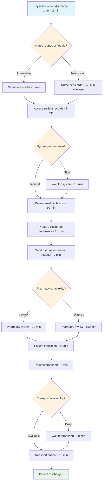
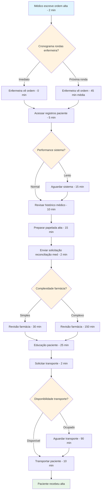

# L1.C2 AS-IS Mapping & Bottleneck Hunting

## Navigation
**Course**: [[../../index|Course Home]] > [[../../Level1_index|Level 1]] > Chapter 2  
**Previous**: [[L1_C1_reading|Chapter 1: Stakeholder Interviewing]]  
**Next**: [[L1_C3_reading|Chapter 3: TO-BE Process Design]]

---

## Learning Objectives
- Create detailed AS-IS process maps that reveal hidden inefficiencies
- Calculate and analyze cycle time, takt time, and throughput metrics
- Identify bottlenecks using constraint theory and queuing analysis
- Apply value stream mapping techniques to highlight waste
- Use time and motion studies to validate process performance data

## Real-World Scenario

Following her successful stakeholder interviews at Mountain View Medical Center, Lisa now needed to create detailed AS-IS maps of the patient discharge process. The interviews revealed disconnected perspectives, but she needed objective data to understand the actual flow of work.

Armed with a stopwatch and clipboard, Lisa began shadowing the discharge process at 6 AM on Tuesday. What she discovered challenged everyone's assumptions about where delays occurred.

Patient #1 (Room 302): Discharge order written at 6:15 AM, but nurse didn't see it until 7:30 AM during morning rounds (75-minute delay). Nurse attempted to access patient records at 7:35 AM but system was slow during shift change (15-minute delay). Medication reconciliation request sent to pharmacy at 7:50 AM, completed at 10:20 AM (150-minute delay). Patient education took 25 minutes, but transport wasn't available until 12:30 PM (125-minute delay). Total time: 6 hours, 15 minutes.

Patient #2 (Room 315): Similar discharge order at 6:20 AM, but this nurse checked orders every 30 minutes. She prepared discharge paperwork while waiting for pharmacy (smart workaround). Patient had complex medications requiring pharmacist consultation, adding 45 minutes. However, transport was immediately available. Total time: 3 hours, 45 minutes.

The pattern became clear: the process wasn't broken—it was wildly inconsistent. Some nurses checked orders continuously while others waited for rounds. Pharmacy response times varied from 30 minutes to 4 hours depending on complexity and staffing. Transport availability was random, creating artificial delays.

But the real revelation came when Lisa mapped the actual workflow versus the official procedure. The official process showed 8 steps taking 90 minutes. Reality revealed 23 discrete activities with 14 handoffs, averaging 4.2 hours with massive variation. No wonder stakeholders were frustrated—everyone was working within a fundamentally unpredictable system.

## Core Theory

### AS-IS Process Mapping Fundamentals

AS-IS mapping documents how work actually flows through a system today, revealing the gap between official procedures and reality. Unlike high-level BPMN diagrams, AS-IS maps capture the messy details of real operations.

**Key Purposes of AS-IS Mapping:**
- **Reality Check**: Document what actually happens vs. what should happen
- **Bottleneck Identification**: Find constraints that limit overall system performance
- **Waste Discovery**: Highlight non-value-added activities consuming resources
- **Variation Analysis**: Understand why performance varies across instances
- **Baseline Establishment**: Create measurement foundation for improvement efforts

### Elements of Comprehensive AS-IS Maps

**Process Activities**: Every discrete step in the workflow
- Value-added activities (customer pays for these)
- Business value-added activities (required but customer doesn't pay)
- Non-value-added activities (pure waste)

**Decision Points**: Where process flow branches based on conditions
- Automated decisions (system-driven)
- Human decisions (judgment-based)
- External decisions (customer/supplier-driven)

**Handoffs**: Transfer of work between people, systems, or departments
- Physical handoffs (documents, products)
- Information handoffs (data, approvals)
- Responsibility handoffs (accountability transfers)

**Wait States**: Periods when work sits idle
- Queue time (waiting for capacity)
- Delay time (waiting for information/materials)
- Processing time (active work being performed)

### Time and Motion Analysis

**Cycle Time**: Total elapsed time from process start to completion
- Includes both work time and wait time
- Measured from customer perspective
- Critical for capacity planning and customer expectations

**Processing Time**: Actual time spent adding value
- Only includes hands-on work
- Excludes waiting, transportation, and delays
- Foundation for labor productivity calculations

**Takt Time**: Customer demand rate
- Available work time ÷ customer demand
- Sets the rhythm for process design
- Determines required capacity for each process step

**Lead Time**: Time from customer request to delivery
- May include time before process actually starts
- Includes all queuing and batching delays
- Key metric for customer satisfaction

### Bottleneck Theory and Constraint Analysis

Based on Eliyahu Goldratt's Theory of Constraints, every system has bottlenecks that limit overall performance.

**Identifying Bottlenecks:**
1. **Capacity Analysis**: Which step has the lowest throughput capacity?
2. **Queue Analysis**: Where do work items accumulate and wait?
3. **Resource Utilization**: Which resources operate at highest utilization rates?
4. **Variation Impact**: Which steps create the most downstream delays?

**Types of Bottlenecks:**

**Physical Bottlenecks**: Limited equipment or workspace
- Single piece of equipment serving multiple processes
- Physical space constraints limiting throughput
- Shared resources creating scheduling conflicts

**Human Bottlenecks**: Limited skilled personnel
- Specialized expertise required for certain steps
- Key individuals who become single points of failure
- Skill gaps creating processing delays

**Policy Bottlenecks**: Rules and procedures that limit flow
- Approval requirements creating artificial delays
- Batch processing rules preventing continuous flow
- Quality control procedures causing rework loops

**Information Bottlenecks**: Data or communication delays
- System integration gaps requiring manual data entry
- Information approval chains slowing decisions
- Lack of real-time visibility into process status

### Value Stream Mapping for AS-IS Analysis

Value stream mapping visualizes both material and information flows, highlighting waste and improvement opportunities.

**Material Flow**: Physical movement of work through the process
- Products, documents, or service deliverables
- Transportation between process steps
- Inventory accumulation at each stage

**Information Flow**: Communications that trigger and coordinate work
- Customer orders and specifications
- Work instructions and schedules
- Status updates and completion notifications

**Time Analysis**: Quantitative measurement of flow performance
- Processing time (value-added work)
- Wait time (non-value-added delays)
- Lead time (total customer experience)

### Waste Identification in AS-IS Mapping

Building on Lean's eight wastes, AS-IS mapping reveals specific waste instances:

**Overproduction Waste**: Making more than needed
- Batching work for efficiency but creating inventory
- Preparing reports no one reads
- Collecting data not used for decisions

**Waiting Waste**: Idle time between process steps
- Approval delays while work sits in queues
- Information delays while waiting for responses
- Resource delays while waiting for equipment/people

**Transportation Waste**: Unnecessary movement of materials
- Physical routing between distant workstations
- Digital handoffs requiring data re-entry
- Back-and-forth for missing information or corrections

**Processing Waste**: Work that doesn't add customer value
- Duplicate data entry across systems
- Excessive approvals for routine decisions
- Over-engineering solutions for simple problems

### Data Collection for AS-IS Mapping

**Direct Observation**: Physically following work through the process
- Shadow specific work items from start to finish
- Time each activity and handoff
- Note variations between different instances
- Document workarounds and informal practices

**Time Studies**: Quantitative measurement of process performance
- Sample multiple instances to understand variation
- Measure both normal and peak demand periods
- Separate value-added from non-value-added time
- Calculate utilization rates for key resources

**System Data Analysis**: Extract performance metrics from existing systems
- Transaction logs showing actual processing times
- Queue lengths and wait times
- Error rates and rework frequencies
- Resource utilization and capacity data

**Document Review**: Understand official procedures and policies
- Standard operating procedures
- Job descriptions and training materials
- Quality requirements and specifications
- Regulatory or compliance requirements

## Tool Demonstration

### Creating an AS-IS Process Map: Hospital Discharge Example

Let's document the actual patient discharge process Lisa observed:

**Step 1: Define Process Boundaries**
- **Start**: Physician writes discharge order
- **End**: Patient physically leaves hospital
- **Scope**: Single patient discharge (not batch processing)
- **Participants**: Physician, nurse, pharmacy, transport, patient

**Step 2: Map the Actual Process Flow**



**Step 3: Quantify Time and Capacity Data**

| Activity | Min Time | Max Time | Average | Frequency | Bottleneck Risk |
|----------|----------|----------|---------|-----------|----------------|
| Write order | 1 min | 3 min | 2 min | 100% | Low |
| Nurse rounds delay | 0 min | 120 min | 45 min | 70% | Medium |
| System access | 3 min | 30 min | 8 min | 100% | Medium |
| Paperwork prep | 10 min | 25 min | 15 min | 100% | Low |
| Pharmacy review | 15 min | 240 min | 90 min | 100% | **HIGH** |
| Patient education | 15 min | 45 min | 25 min | 100% | Low |
| Transport wait | 0 min | 180 min | 45 min | 60% | **HIGH** |

**Step 4: Calculate Process Metrics**

**Cycle Time Analysis:**
- Minimum possible: 67 minutes (best case scenario)
- Maximum observed: 485 minutes (worst case scenario)  
- Average actual: 252 minutes (4.2 hours)
- Standard deviation: 98 minutes (high variation)

**Value-Added Analysis:**
- Value-added time: 59 minutes (23%)
- Business value-added: 45 minutes (18%)
- Non-value-added time: 148 minutes (59%)

**Bottleneck Analysis:**
- Primary bottleneck: Pharmacy review (150 min average for complex cases)
- Secondary bottleneck: Transport availability (90 min average wait)
- Constraint capacity: 4 complex pharmacy reviews per hour

### Bottleneck Hunting Methodology

**Step 1: Map Resource Utilization**
Create utilization chart for each resource:

```
Pharmacy Staff Utilization:
Morning (7-11 AM):  ████████████ 95% (Peak demand)
Midday (11-3 PM):   ████████ 75% (Steady state)  
Evening (3-7 PM):   ████████████ 90% (Discharge rush)
Night (7-11 PM):    ████ 35% (Minimal activity)
```

**Step 2: Identify Queue Accumulation Points**
Track where work items accumulate:
- Pharmacy queue: 8-12 pending reviews during peak hours
- Transport queue: 5-8 patients waiting during shift changes
- Nurse queue: 3-5 pending discharges per nurse during rounds

**Step 3: Calculate Bottleneck Impact**
Using Little's Law (Lead Time = Work in Process ÷ Throughput Rate):

**Pharmacy Bottleneck:**
- Work in Process: 10 pending reviews (average)
- Throughput Rate: 4 reviews per hour
- Lead Time: 2.5 hours average wait

**Transport Bottleneck:**
- Work in Process: 6 patients waiting (average)
- Throughput Rate: 8 transports per hour  
- Lead Time: 45 minutes average wait

**Step 4: Root Cause Analysis of Bottlenecks**

**Pharmacy Bottleneck Root Causes:**
- Complex medication reconciliation requires pharmacist review (policy constraint)
- Only 2 pharmacists on duty during peak discharge hours (capacity constraint)
- No prioritization system for discharge vs. new admission orders (scheduling constraint)
- Electronic medical record lacks integration with pharmacy system (information constraint)

**Transport Bottleneck Root Causes:**
- Only 3 transport staff for 200-bed hospital (capacity constraint)
- No advance scheduling of discharges (planning constraint)
- Transport staff also handle emergency calls (priority conflict)
- Physical distance between departments creates travel time (layout constraint)

## Mini Project

**AS-IS Process Mapping and Bottleneck Analysis**

Create a detailed AS-IS process map for a real process, identify bottlenecks, and quantify improvement opportunities.

**Process Selection Criteria:**
Choose a process you can observe and measure:
- **Workplace process**: Order fulfillment, customer service, hiring
- **Service process**: Food service, retail checkout, appointment scheduling  
- **Personal process**: Morning routine, meal preparation, study workflow
- **Educational process**: Course registration, assignment submission, grading

**Requirements:**
- Process must have **multiple steps** (minimum 8 activities)
- Process must have **handoffs** between people or systems
- You must be able to **observe multiple instances** of the process
- Process should have **measurable time components**

**Deliverables:**

### 1. Process Documentation (300 words)

**Process Definition** (100 words):
- Clear start and end points
- Scope and boundaries  
- Key participants and their roles
- Why this process matters (business impact)

**Current Performance** (100 words):
- How often process runs (volume)
- Current cycle time and variation
- Quality issues or customer complaints
- Resource utilization levels

**Data Collection Approach** (100 words):
- How you observed/measured the process
- Number of instances studied
- Time period of observation
- Tools used for measurement

### 2. Detailed AS-IS Process Map (Visual)

Create comprehensive process map showing:

**Process Flow Diagram:**
- All activities in sequence with timing
- Decision points and branching logic
- Handoffs between participants
- Wait states and queue points

**Time Analysis Table:**
| Activity | Min Time | Max Time | Average | % of Total | Value Type |
|----------|----------|----------|---------|------------|------------|
| Activity 1 | X min | Y min | Z min | %% | VA/BVA/NVA |

**Resource Utilization Chart:**
- Show capacity usage for key resources
- Identify peak demand periods
- Highlight underutilized resources

### 3. Bottleneck Analysis (400 words)

**Bottleneck Identification** (150 words):
- Which step limits overall process throughput?
- How did you identify this bottleneck?
- What evidence supports this conclusion?
- How does this bottleneck impact customers?

**Root Cause Analysis** (150 words):
- Why does this bottleneck exist?
- What constraints create this limitation?
- Are there policy, capacity, or information barriers?
- How do people currently work around this bottleneck?

**Impact Quantification** (100 words):
- How much time does the bottleneck add to total cycle time?
- What is the cost impact (resources, customer satisfaction)?
- How does bottleneck variation affect overall process performance?
- What throughput improvement is possible if bottleneck is addressed?

### 4. Improvement Opportunities (300 words)

**Quick Wins** (100 words):
- Changes that could be implemented immediately
- Low-cost solutions to reduce bottleneck impact
- Process tweaks to improve flow
- Better resource utilization strategies

**Medium-Term Improvements** (100 words):
- Changes requiring some investment or coordination
- Technology solutions to automate delays
- Staffing or scheduling improvements
- Policy changes to reduce constraints

**Strategic Improvements** (100 words):
- Fundamental process redesign opportunities
- Technology investments for major improvement
- Organizational changes for better flow
- Long-term capacity expansion needs

**File to submit**: `as_is_mapping_[process_name].pdf`

**Evaluation Criteria:**
- **Process Documentation**: Clear definition and data collection approach (20%)
- **AS-IS Map Quality**: Comprehensive, accurate process representation (30%)
- **Bottleneck Analysis**: Systematic identification and root cause analysis (30%)
- **Improvement Insights**: Practical, actionable recommendations (20%)

## Quiz Placeholder
<QUIZ_LINK will be replaced by generated HTML file>

---

### Portuguese Version

# L1.C2 Mapeamento AS-IS & Caça aos Gargalos

## Objetivos de Aprendizagem
- Criar mapas detalhados de processos AS-IS que revelam ineficiências ocultas
- Calcular e analisar cycle time, takt time e métricas de throughput
- Identificar gargalos usando teoria de restrições e análise de filas
- Aplicar técnicas de value stream mapping para destacar desperdícios
- Usar estudos de tempo e movimento para validar dados de performance de processos

## Cenário do Mundo Real

Seguindo suas entrevistas bem-sucedidas com stakeholders no Mountain View Medical Center, Lisa agora precisava criar mapas AS-IS detalhados do processo de alta de pacientes. As entrevistas revelaram perspectivas desconectadas, mas ela precisava de dados objetivos para entender o fluxo real de trabalho.

Armada com cronômetro e prancheta, Lisa começou a acompanhar o processo de alta às 6h da terça-feira. O que ela descobriu desafiou as suposições de todos sobre onde ocorriam os atrasos.

Paciente #1 (Quarto 302): Ordem de alta escrita às 6h15, mas enfermeira não viu até 7h30 durante rondas matinais (atraso de 75 minutos). Enfermeira tentou acessar registros do paciente às 7h35, mas sistema estava lento durante mudança de turno (atraso de 15 minutos). Solicitação de reconciliação de medicamentos enviada para farmácia às 7h50, concluída às 10h20 (atraso de 150 minutos). Educação do paciente levou 25 minutos, mas transporte não estava disponível até 12h30 (atraso de 125 minutos). Tempo total: 6 horas, 15 minutos.

Paciente #2 (Quarto 315): Ordem de alta similar às 6h20, mas esta enfermeira verificava ordens a cada 30 minutos. Ela preparou papelada de alta enquanto aguardava farmácia (workaround inteligente). Paciente tinha medicamentos complexos exigindo consulta de farmacêutico, adicionando 45 minutos. No entanto, transporte estava imediatamente disponível. Tempo total: 3 horas, 45 minutos.

O padrão ficou claro: o processo não estava quebrado—era extremamente inconsistente. Algumas enfermeiras verificavam ordens continuamente enquanto outras esperavam pelas rondas. Tempos de resposta da farmácia variavam de 30 minutos a 4 horas dependendo da complexidade e pessoal disponível. Disponibilidade de transporte era aleatória, criando atrasos artificiais.

Mas a revelação real veio quando Lisa mapeou o workflow real versus o procedimento oficial. O processo oficial mostrava 8 passos levando 90 minutos. A realidade revelou 23 atividades discretas com 14 handoffs, com média de 4,2 horas com variação massiva. Não era de admirar que stakeholders estivessem frustrados—todos estavam trabalhando dentro de um sistema fundamentalmente imprevisível.

## Teoria Central

### Fundamentos do Mapeamento de Processos AS-IS

Mapeamento AS-IS documenta como o trabalho realmente flui através de um sistema hoje, revelando a lacuna entre procedimentos oficiais e realidade. Diferente de diagramas BPMN de alto nível, mapas AS-IS capturam os detalhes confusos de operações reais.

**Propósitos Chave do Mapeamento AS-IS:**
- **Reality Check**: Documentar o que realmente acontece vs. o que deveria acontecer
- **Identificação de Gargalos**: Encontrar restrições que limitam performance geral do sistema
- **Descoberta de Desperdício**: Destacar atividades sem valor agregado consumindo recursos
- **Análise de Variação**: Entender por que performance varia entre instâncias
- **Estabelecimento de Baseline**: Criar fundação de medição para esforços de melhoria

### Elementos de Mapas AS-IS Abrangentes

**Atividades do Processo**: Cada passo discreto no workflow
- Atividades de valor agregado (cliente paga por estas)
- Atividades de valor agregado empresarial (necessárias mas cliente não paga)
- Atividades sem valor agregado (desperdício puro)

**Pontos de Decisão**: Onde fluxo do processo se ramifica baseado em condições
- Decisões automatizadas (dirigidas pelo sistema)
- Decisões humanas (baseadas em julgamento)
- Decisões externas (dirigidas por cliente/fornecedor)

**Handoffs**: Transferência de trabalho entre pessoas, sistemas ou departamentos
- Handoffs físicos (documentos, produtos)
- Handoffs de informação (dados, aprovações)
- Handoffs de responsabilidade (transferências de accountability)

**Estados de Espera**: Períodos quando trabalho fica parado
- Tempo de fila (esperando capacidade)
- Tempo de atraso (esperando informação/materiais)
- Tempo de processamento (trabalho ativo sendo executado)

### Análise de Tempo e Movimento

**Cycle Time**: Tempo total decorrido desde início até conclusão do processo
- Inclui tanto tempo de trabalho quanto tempo de espera
- Medido da perspectiva do cliente
- Crítico para planejamento de capacidade e expectativas do cliente

**Processing Time**: Tempo real gasto adicionando valor
- Inclui apenas trabalho hands-on
- Exclui espera, transporte e atrasos
- Fundação para cálculos de produtividade de mão de obra

**Takt Time**: Taxa de demanda do cliente
- Tempo de trabalho disponível ÷ demanda do cliente
- Define o ritmo para design do processo
- Determina capacidade necessária para cada passo do processo

**Lead Time**: Tempo desde solicitação do cliente até entrega
- Pode incluir tempo antes do processo realmente começar
- Inclui todos os atrasos de fila e batch
- Métrica chave para satisfação do cliente

### Teoria de Gargalos e Análise de Restrições

Baseada na Teoria das Restrições de Eliyahu Goldratt, todo sistema tem gargalos que limitam performance geral.

**Identificando Gargalos:**
1. **Análise de Capacidade**: Qual passo tem a menor capacidade de throughput?
2. **Análise de Fila**: Onde itens de trabalho se acumulam e esperam?
3. **Utilização de Recursos**: Quais recursos operam com as maiores taxas de utilização?
4. **Impacto de Variação**: Quais passos criam mais atrasos downstream?

**Tipos de Gargalos:**

**Gargalos Físicos**: Equipamento ou espaço de trabalho limitado
- Peça única de equipamento servindo múltiplos processos
- Restrições de espaço físico limitando throughput
- Recursos compartilhados criando conflitos de agendamento

**Gargalos Humanos**: Pessoal especializado limitado
- Expertise especializada necessária para certos passos
- Indivíduos-chave que se tornam pontos únicos de falha
- Lacunas de habilidade criando atrasos de processamento

**Gargalos de Política**: Regras e procedimentos que limitam fluxo
- Requisitos de aprovação criando atrasos artificiais
- Regras de processamento em batch prevenindo fluxo contínuo
- Procedimentos de controle de qualidade causando loops de retrabalho

**Gargalos de Informação**: Dados ou atrasos de comunicação
- Lacunas de integração de sistema exigindo entrada manual de dados
- Cadeias de aprovação de informação atrasando decisões
- Falta de visibilidade em tempo real do status do processo

## Demonstração de Ferramenta

### Criando um Mapa de Processo AS-IS: Exemplo de Alta Hospitalar

Vamos documentar o processo real de alta de pacientes que Lisa observou:

**Passo 1: Definir Limites do Processo**
- **Início**: Médico escreve ordem de alta
- **Fim**: Paciente fisicamente deixa hospital
- **Escopo**: Alta de paciente único (não processamento em batch)
- **Participantes**: Médico, enfermeira, farmácia, transporte, paciente

**Passo 2: Mapear o Fluxo Real do Processo**



**Passo 3: Quantificar Dados de Tempo e Capacidade**

| Atividade | Tempo Min | Tempo Max | Média | Frequência | Risco Gargalo |
|-----------|-----------|-----------|-------|------------|---------------|
| Escrever ordem | 1 min | 3 min | 2 min | 100% | Baixo |
| Atraso rondas enfermeira | 0 min | 120 min | 45 min | 70% | Médio |
| Acesso sistema | 3 min | 30 min | 8 min | 100% | Médio |
| Prep papelada | 10 min | 25 min | 15 min | 100% | Baixo |
| Revisão farmácia | 15 min | 240 min | 90 min | 100% | **ALTO** |
| Educação paciente | 15 min | 45 min | 25 min | 100% | Baixo |
| Espera transporte | 0 min | 180 min | 45 min | 60% | **ALTO** |

**Passo 4: Calcular Métricas do Processo**

**Análise de Cycle Time:**
- Mínimo possível: 67 minutos (melhor caso)
- Máximo observado: 485 minutos (pior caso)
- Média real: 252 minutos (4,2 horas)
- Desvio padrão: 98 minutos (alta variação)

**Análise de Valor Agregado:**
- Tempo de valor agregado: 59 minutos (23%)
- Valor agregado empresarial: 45 minutos (18%)
- Tempo sem valor agregado: 148 minutos (59%)

**Análise de Gargalo:**
- Gargalo primário: Revisão farmácia (150 min média para casos complexos)
- Gargalo secundário: Disponibilidade transporte (90 min espera média)
- Capacidade de restrição: 4 revisões complexas de farmácia por hora

## Mini Projeto

**Mapeamento de Processo AS-IS e Análise de Gargalos**

Crie um mapa detalhado de processo AS-IS para um processo real, identifique gargalos e quantifique oportunidades de melhoria.

**Critérios de Seleção do Processo:**
Escolha um processo que você pode observar e medir:
- **Processo de trabalho**: Fulfillment de pedidos, atendimento ao cliente, contratação
- **Processo de serviço**: Serviço de comida, checkout varejo, agendamento de consultas
- **Processo pessoal**: Rotina matinal, preparação de refeições, workflow de estudo
- **Processo educacional**: Registro de curso, submissão de tarefas, avaliação

**Requisitos:**
- Processo deve ter **múltiplos passos** (mínimo 8 atividades)
- Processo deve ter **handoffs** entre pessoas ou sistemas
- Você deve ser capaz de **observar múltiplas instâncias** do processo
- Processo deve ter **componentes de tempo mensuráveis**

**Entregáveis:**

### 1. Documentação do Processo (300 palavras)

**Definição do Processo** (100 palavras):
- Pontos de início e fim claros
- Escopo e limites
- Participantes-chave e seus papéis
- Por que este processo importa (impacto empresarial)

**Performance Atual** (100 palavras):
- Com que frequência o processo roda (volume)
- Cycle time atual e variação
- Problemas de qualidade ou reclamações de clientes
- Níveis de utilização de recursos

**Abordagem de Coleta de Dados** (100 palavras):
- Como você observou/mediu o processo
- Número de instâncias estudadas
- Período de tempo da observação
- Ferramentas usadas para medição

### 2. Mapa Detalhado de Processo AS-IS (Visual)

Crie mapa abrangente de processo mostrando:

**Diagrama de Fluxo de Processo:**
- Todas as atividades em sequência com timing
- Pontos de decisão e lógica de ramificação
- Handoffs entre participantes
- Estados de espera e pontos de fila

**Tabela de Análise de Tempo:**
| Atividade | Tempo Min | Tempo Max | Média | % do Total | Tipo Valor |
|-----------|-----------|-----------|-------|------------|------------|
| Atividade 1 | X min | Y min | Z min | %% | VA/BVA/NVA |

**Gráfico de Utilização de Recursos:**
- Mostrar uso de capacidade para recursos-chave
- Identificar períodos de demanda pico
- Destacar recursos subutilizados

### 3. Análise de Gargalos (400 palavras)

**Identificação de Gargalos** (150 palavras):
- Qual passo limita throughput geral do processo?
- Como você identificou este gargalo?
- Que evidência apoia esta conclusão?
- Como este gargalo impacta clientes?

**Análise de Causa Raiz** (150 palavras):
- Por que este gargalo existe?
- Que restrições criam esta limitação?
- Há barreiras de política, capacidade ou informação?
- Como pessoas atualmente contornam este gargalo?

**Quantificação de Impacto** (100 palavras):
- Quanto tempo o gargalo adiciona ao cycle time total?
- Qual é o impacto de custo (recursos, satisfação do cliente)?
- Como a variação do gargalo afeta performance geral do processo?
- Que melhoria de throughput é possível se gargalo for abordado?

### 4. Oportunidades de Melhoria (300 palavras)

**Quick Wins** (100 palavras):
- Mudanças que poderiam ser implementadas imediatamente
- Soluções de baixo custo para reduzir impacto do gargalo
- Ajustes de processo para melhorar fluxo
- Estratégias de melhor utilização de recursos

**Melhorias de Médio Prazo** (100 palavras):
- Mudanças exigindo algum investimento ou coordenação
- Soluções tecnológicas para automatizar atrasos
- Melhorias de pessoal ou agendamento
- Mudanças de política para reduzir restrições

**Melhorias Estratégicas** (100 palavras):
- Oportunidades de redesign fundamental do processo
- Investimentos tecnológicos para melhoria maior
- Mudanças organizacionais para melhor fluxo
- Necessidades de expansão de capacidade de longo prazo

**Arquivo para submeter**: `mapeamento_as_is_[nome_processo].pdf`

**Critérios de Avaliação:**
- **Documentação do Processo**: Definição clara e abordagem de coleta de dados (20%)
- **Qualidade do Mapa AS-IS**: Representação abrangente e precisa do processo (30%)
- **Análise de Gargalos**: Identificação sistemática e análise de causa raiz (30%)
- **Insights de Melhoria**: Recomendações práticas e acionáveis (20%)

## Quiz Placeholder
<QUIZ_LINK will be replaced by generated HTML file>

---

## Chapter Links
- 🧠 **Quiz**: [[L1_C2_quiz.html|Take the AS-IS Mapping Quiz]]
- 🎯 **Project**: [[L1_C2_project|Project Assignment]]  
- ✅ **Solutions**: [[L1_C2_solutions|Solutions Guide]]

## Navigation
**Previous**: [[L1_C1_reading|Chapter 1: Stakeholder Interviewing]]  
**Next**: [[L1_C3_reading|Chapter 3: TO-BE Process Design]]  
**Up**: [[../../Level1_index|Level 1 Index]]