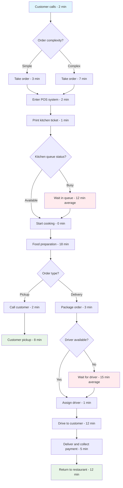

# L1.C2 Solutions Guide: AS-IS Process Mapping Project

## Navigation
**Course**: [[../../index|Course Home]] > [[../../Level1_index|Level 1]] > [[L1_C2_reading|Chapter 2]] > Solutions  
**Project**: [[L1_C2_project|View Project Assignment]]  
**Previous**: [[L1_C2_project|Project Assignment]]  
**Next**: [[L1_C3_reading|Chapter 3: Root Cause Analysis and Data Collection]]  
**Related**: [[L1_C2_reading|Chapter 2 Reading]] | [[L1_C2_quiz.html|Chapter 2 Quiz]]

---

## Purpose of This Guide

This solutions guide provides sample process analysis, evaluation frameworks, and common challenge patterns to help instructors assess student work and help students understand professional-level AS-IS mapping and bottleneck analysis standards.

## Sample Solution: Restaurant Order-to-Delivery Process

### Sample Process Documentation

**Process Definition:**
Tony's Pizza operates a 50-seat restaurant with delivery service, processing 150-200 orders daily during peak hours (5-9 PM). The order-to-delivery process starts when customer places phone order and ends when food is delivered and payment collected. Process matters because delivery time directly impacts customer satisfaction and repeat business—current average delivery time of 52 minutes exceeds promised 35-minute window, generating complaints and lost customers. Observed process during Friday evening rush to capture peak performance challenges.

**Current Performance:**
Average cycle time varies dramatically: dine-in orders 23 minutes, pickup orders 31 minutes, delivery orders 52 minutes with standard deviation of 18 minutes. Error rate runs 12% (wrong orders, missing items, cold food) requiring rework or refunds. Kitchen utilization peaks at 95% during rush hours while delivery drivers show 40% utilization due to route inefficiencies. Customer satisfaction scores dropped from 4.2 to 3.1 over six months, with delivery time as primary complaint.

**Data Collection Approach:**
Observed 25 complete order instances over three Friday evenings (5-9 PM), timing each step with stopwatch and noting all activities. Documented both successful completions and error scenarios. Used restaurant's POS system data to validate order timestamps and reviewed customer feedback forms to understand quality impacts. Limited to peak hours only due to access constraints—results may not represent slower periods when staffing and processes differ.

### Sample AS-IS Process Map

**Process Flow Analysis:**

**Time Analysis Results:**

| Activity | Min Time | Max Time | Average | Std Dev | % of Total | Value Type |
|----------|----------|----------|---------|---------|------------|------------|
| Take order | 2 min | 9 min | 4.2 min | ±2.1 min | 8% | BVA |
| Enter POS | 1 min | 4 min | 2.1 min | ±0.8 min | 4% | BVA |
| Kitchen queue wait | 0 min | 25 min | 12.3 min | ±8.2 min | 24% | NVA |
| Food preparation | 15 min | 25 min | 18.6 min | ±3.1 min | 36% | VA |
| Package order | 2 min | 5 min | 3.1 min | ±0.9 min | 6% | BVA |
| Driver wait | 0 min | 35 min | 14.8 min | ±12.1 min | 28% | NVA |
| Drive to customer | 8 min | 18 min | 11.9 min | ±3.4 min | 23% | BVA |
| Delivery & payment | 3 min | 8 min | 4.8 min | ±1.6 min | 9% | VA |
| Return drive | 8 min | 18 min | 11.7 min | ±3.2 min | 22% | BVA |

### Sample Bottleneck Analysis

**Bottleneck Identification:**
Kitchen capacity is the primary bottleneck during peak hours, with single grill station limiting throughput to 8 orders per hour maximum. Evidence includes: queue times averaging 12.3 minutes with peak waits up to 25 minutes, kitchen utilization consistently at 95% while other resources show much lower utilization. Secondary bottleneck is driver availability, particularly between 6-7 PM when demand peaks but only 2 drivers available for coverage area requiring 25-minute average round trips.

**Root Cause Analysis:**
Kitchen bottleneck stems from physical constraint—single grill handles all pizza orders and has 18-minute average cook time. During peak hours, orders arrive every 7-8 minutes but grill capacity only allows completion every 18 minutes, creating inevitable queue buildup. Driver bottleneck caused by poor route planning (drivers leave immediately rather than batching nearby deliveries) and lack of delivery area analysis to optimize territory coverage. Management hasn't invested in additional equipment due to space constraints, and driver hiring challenges due to part-time evening work requirements.

**Quantitative Impact Assessment:**
Kitchen bottleneck adds average 12.3 minutes per order (24% of total cycle time) and creates cascade effect—delayed kitchen output means drivers wait idle, then rush to catch up creating unsafe driving and customer complaints. Using Little's Law: Work in Process = 3.2 orders in kitchen queue, Throughput = 8 orders/hour, Lead Time = 24 minutes average wait. Driver bottleneck adds 14.8 minutes average (28% of cycle time) with cost impact of lost customers—delivery window promises broken 68% of the time during peak hours.

### Sample Value Stream Analysis

**Value-Added Analysis:**
- Value-Added time: 23.4 minutes (45%) - food preparation and actual delivery
- Business Value-Added: 19.7 minutes (38%) - order taking, packaging, driving
- Non-Value-Added: 8.9 minutes (17%) - queue waits and delays

Major waste sources: Kitchen queuing waste (waiting), Driver scheduling waste (waiting), Route planning waste (transportation), Order complexity waste (overprocessing for simple orders). Largest improvement opportunity is kitchen queue elimination, which would reduce cycle time by 24% and improve customer satisfaction significantly.

**Flow Analysis:**
Information flow shows delays between order entry and kitchen notification (2-minute gap while ticket prints and moves to kitchen). Material flow reveals packaging inefficiencies—drivers must return to kitchen for forgotten items 15% of the time. Communication breakdown between kitchen staff and drivers creates coordination delays—no systematic handoff process means drivers occasionally leave with wrong orders or miss ready orders.

**Variation Analysis:**
Cycle time standard deviation of 18 minutes (35% of mean) indicates high process instability. Primary variation sources: order complexity (simple orders 15% faster), kitchen queue length (varies with arrival patterns), driver availability (weekend staffing 50% of weekday levels), delivery distance (varies 2x based on customer location). High variation makes delivery time promises unreliable and creates customer dissatisfaction even when average performance meets targets.

### Sample Improvement Opportunities

**Quick Wins (0-30 days):**
Implement batched delivery routes to reduce driver round trips by 30%, redesign kitchen ticket system to eliminate 2-minute notification delay, cross-train additional staff member on grill operations for peak hour coverage, standardize order-taking process to reduce complexity variation. These changes require minimal investment but could reduce average cycle time by 8-12 minutes.

**Medium-Term Improvements (1-6 months):**
Install second grill station to double kitchen capacity during peak hours, implement GPS routing software to optimize delivery efficiency, establish delivery zone boundaries to ensure realistic time promises, create kitchen dashboard to provide real-time queue visibility to drivers and management. Investment of $15,000-$25,000 could reduce cycle time by 18-22 minutes.

**Strategic Improvements (6+ months):**
Consider delivery-focused satellite location to reduce average delivery distance, implement online ordering system to reduce phone order complexity, develop customer analytics to predict demand patterns and optimize staffing, establish partnerships with third-party delivery services for overflow capacity during peak periods. Major investment but potential to achieve 35-minute delivery promise consistently.

## Evaluation Framework

### Process Documentation Assessment (25 points)

**Outstanding (22-25 points):**
- Crystal clear process definition with specific start/end points and scope
- Comprehensive current performance data with variation analysis
- Detailed data collection methodology with representative sampling
- Professional approach acknowledging limitations and biases

**Proficient (18-21 points):**
- Clear process definition with adequate scope documentation
- Good performance data with some variation insight
- Reasonable data collection approach with basic methodology
- Appropriate professional documentation

**Developing (15-17 points):**
- Basic process definition with limited scope clarity
- Limited performance data without variation analysis
- Simple data collection with minimal methodology detail
- Adequate documentation meeting basic requirements

**Inadequate (0-14 points):**
- Unclear process definition or missing scope boundaries
- Little to no current performance documentation
- Poor or missing data collection methodology
- Unprofessional or incomplete documentation

### AS-IS Mapping Quality (30 points)

**Outstanding (27-30 points):**
- Comprehensive, accurate process map with proper notation
- Complete time analysis with statistical measures
- Professional visual presentation with clear flow logic
- Evidence of thorough observation and measurement

**Proficient (22-26 points):**
- Good process map covering major activities and flows
- Adequate time analysis with basic measurements
- Clear visual presentation with understandable notation
- Evidence of reasonable observation effort

**Developing (18-21 points):**
- Basic process map with some missing elements or unclear flows
- Limited time analysis with minimal statistical insight
- Simple visual presentation meeting basic requirements
- Limited evidence of systematic observation

**Inadequate (0-17 points):**
- Incomplete or inaccurate process map with poor notation
- Little to no time analysis or unreliable measurements
- Poor visual presentation with unclear or missing elements
- No evidence of systematic observation or measurement

### Bottleneck Analysis (25 points)

**Outstanding (22-25 points):**
- Systematic bottleneck identification with compelling evidence
- Thorough root cause analysis addressing multiple constraint types
- Quantitative impact assessment with calculations and implications
- Professional application of constraint theory and Little's Law

**Proficient (18-21 points):**
- Good bottleneck identification with reasonable supporting evidence
- Adequate root cause analysis addressing primary causes
- Basic quantitative assessment with some calculations
- Appropriate application of analytical frameworks

**Developing (15-17 points):**
- Basic bottleneck identification with limited supporting evidence
- Simple root cause analysis with surface-level insights
- Minimal quantitative assessment without detailed calculations
- Limited application of analytical frameworks

**Inadequate (0-14 points):**
- Poor or incorrect bottleneck identification
- No meaningful root cause analysis
- Missing quantitative assessment or unreliable calculations
- No evidence of analytical framework application

### Improvement Recommendations (20 points)

**Outstanding (18-20 points):**
- Practical, prioritized improvements with clear implementation pathway
- Strong connection between analysis findings and recommendations
- Realistic resource requirements and timeline considerations
- Creative solutions addressing root causes rather than symptoms

**Proficient (15-17 points):**
- Reasonable improvements with general implementation approach
- Good connection between analysis and recommendations
- Basic resource and timeline considerations
- Appropriate solutions addressing identified problems

**Developing (12-14 points):**
- Basic improvements with limited implementation detail
- Some connection between analysis and recommendations
- Minimal resource or timeline considerations
- Simple solutions with limited innovation

**Inadequate (0-11 points):**
- Vague or inappropriate recommendations
- Little connection between analysis and suggestions
- No implementation considerations
- Unrealistic or poorly conceived solutions

## Common Student Mistakes and Guidance

### Mistake 1: Choosing Overly Simple Processes
**Student approach:** Maps 4-step process with no handoffs or variation
**Guidance:** Select processes with minimum 8 activities, multiple participants, and clear bottleneck potential. Complexity is necessary for meaningful analysis.

### Mistake 2: Inadequate Timing Data Collection
**Student approach:** Times process once and uses that as average
**Guidance:** Observe minimum 5-10 instances to understand variation. Document both typical and outlier cases. Use statistical measures (mean, standard deviation).

### Mistake 3: Superficial Bottleneck Analysis
**Student approach:** Says "this step takes longest" without deeper analysis
**Guidance:** Use queue analysis, utilization calculations, and constraint theory. Prove bottleneck identification with quantitative evidence.

### Mistake 4: Poor Value-Added Categorization
**Student approach:** Categorizes all work as value-added
**Guidance:** Be strict about VA definition—only work customer pays for. Most coordination, approval, and transportation activities are BVA or NVA.

### Mistake 5: Generic Improvement Recommendations
**Student approach:** Suggests "add more staff" or "buy better technology" without analysis
**Guidance:** Recommendations must directly address identified bottlenecks and root causes. Include implementation considerations and resource requirements.

### Mistake 6: Missing Process Variation Analysis
**Student approach:** Reports only average times without variation insight
**Guidance:** Calculate standard deviation, identify variation sources, and explain impact on customer experience and process predictability.

## Teaching Tips

1. **Emphasize Observation Skills:** Teach students to see beyond official procedures to understand how work actually flows. Practice identifying informal workarounds and adaptations.

2. **Stress Quantitative Rigor:** Require statistical analysis of timing data. Teach proper sampling techniques and calculation methods for process metrics.

3. **Connect Theory to Practice:** Show how constraint theory, Little's Law, and value stream mapping apply to real process analysis. Use examples from multiple industries.

4. **Focus on Root Causes:** Help students dig deeper than surface symptoms. Teach systematic root cause analysis techniques and critical thinking skills.

5. **Develop Implementation Mindset:** Encourage students to think like consultants—recommendations must be practical, prioritized, and implementable with realistic resource requirements.

6. **Review Real Examples:** Share (anonymized) examples of excellent process maps and bottleneck analyses from previous student work or professional consulting projects.

This solutions guide provides the framework for developing professional-level process analysis capabilities essential for improvement consulting work.

---

## Navigation
**Project Assignment**: [[L1_C2_project|Return to Project Assignment]]  
**Next Chapter**: [[L1_C3_reading|Chapter 3: Root Cause Analysis and Data Collection]]  
**Level Index**: [[../../Level1_index|Level 1 Index]]