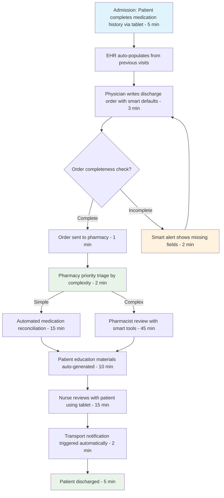

# L1.C4 TO-BE Design & KPI Definition

## Navigation
**Course**: [[../../index|Course Home]] > [[../../Level1_index|Level 1]] > Chapter 4  
**Previous**: [[L1_C3_reading|Chapter 3: Root-Cause & Data Capture]]  
**Next**: [[../../Level2_index|Level 2: Tech Integration]]

---

## Learning Objectives
- Design future state processes that eliminate root causes and optimize workflow
- Create measurable KPIs that track process performance and improvement success
- Apply change management principles to ensure successful TO-BE implementation
- Balance ideal process design with realistic implementation constraints
- Develop monitoring systems that sustain process improvements over time

## Real-World Scenario

With deep understanding of the hospital discharge process and clear evidence that incomplete medication orders were the root cause of delays, Lisa faced her biggest challenge yet: designing a future state that would actually work in the real world.

Her initial TO-BE design was elegant on paper: mandatory medication reconciliation forms, automated physician alerts for incomplete orders, and dedicated pharmacy coverage during peak hours. The solution would theoretically reduce discharge times from 4.2 hours to 90 minutes—a 65% improvement that would delight patients and administrators.

But when Lisa presented her design to the implementation team, reality hit hard.

**Dr. Kim (Emergency Medicine)**: "This form adds 8 minutes to every discharge order. During trauma season, I write 40 discharge orders per shift. That's 5 hours of extra documentation time I don't have."

**Janet (Pharmacy Director)**: "Dedicated peak hour coverage sounds great, but where do I find extra pharmacists? We're already paying 15% above market rate and still can't fill evening positions."

**Marcus (IT Director)**: "Integration with the outpatient pharmacy database would take 18 months and $400,000. The EHR vendor says it's possible, but we'd need to rebuild our medication module."

**Linda (Nursing Supervisor)**: "My nurses are barely keeping up now. Any solution that adds complexity to their workflow will make things worse, not better."

Lisa realized that her TO-BE design, while technically correct, was practically unworkable. She needed to balance ideal process improvement with real-world constraints: limited budgets, staffing shortages, technology limitations, and human change resistance.

Going back to the drawing board, Lisa applied a different approach: design thinking that started with user constraints rather than perfect processes.

**Version 2: Constraint-Based TO-BE Design**

Instead of mandatory forms, Lisa created smart defaults in the EHR system that populated medication histories from previous admissions, reducing physician documentation time by 70%. Instead of additional pharmacists, she redesigned the workflow so that medication reconciliation happened during other waiting periods rather than creating new bottlenecks. Instead of expensive system integration, she created a simple web portal where patients could update their medication lists before admission.

The key insight: effective TO-BE design isn't about creating perfect processes—it's about creating better processes that people will actually use.

## Core Theory

### Principles of Effective TO-BE Design

**User-Centered Design**: Start with the people who will perform the process
- Understand current workarounds and informal practices that work well
- Design around existing skills and capabilities rather than requiring extensive retraining
- Minimize additional complexity, maximize automation of routine tasks
- Test design concepts with actual users before finalizing

**Constraint-Aware Solutions**: Work within realistic organizational limitations
- Budget constraints limiting technology investment and staffing changes
- Technology constraints based on existing systems and integration capabilities
- Cultural constraints reflecting organizational change readiness and resistance patterns
- Regulatory constraints requiring specific procedures or documentation

**Iterative Implementation**: Design for phased rollout rather than big-bang change
- Pilot testing with small groups to validate design assumptions
- Quick wins that build momentum and stakeholder confidence
- Learning cycles that allow design refinement based on real-world feedback
- Gradual expansion that manages risk and builds organizational capability

### TO-BE Design Framework

**Step 1: Design Principles Definition**
Establish non-negotiable requirements and guiding values:

**Performance Principles**: Minimum acceptable improvement targets
- Cycle time reduction requirements
- Quality improvement standards
- Cost reduction expectations
- Customer satisfaction improvements

**User Experience Principles**: How the process should feel to participants
- Simplicity: Reduce cognitive load and decision complexity
- Efficiency: Eliminate non-value-added activities
- Autonomy: Enable decisions at appropriate levels
- Clarity: Provide clear instructions and feedback

**Technical Principles**: System design requirements
- Integration: Minimize data re-entry between systems
- Reliability: Ensure process stability under normal and peak loads
- Scalability: Handle volume growth without performance degradation
- Security: Protect sensitive information and maintain compliance

**Step 2: Ideation and Concept Development**
Generate multiple solution approaches without constraint limitation:

**Process Flow Redesign**: Fundamental workflow improvements
- Eliminate unnecessary handoffs and approval layers
- Parallel processing of independent activities
- Exception handling procedures for complex cases
- Automation opportunities for routine decisions

**Technology Enhancement**: System improvements and new capabilities
- Workflow automation and decision support tools
- Data integration eliminating manual lookups
- Real-time dashboards and performance monitoring
- Communication tools improving coordination

**Organizational Changes**: Structural and cultural improvements
- Role clarification and accountability improvements
- Training and capability development programs
- Performance management alignment with process goals
- Communication and feedback mechanisms

**Step 3: Constraint Validation and Design Refinement**
Test concepts against real-world limitations:

**Resource Constraints**: Staff time, budget, technology capabilities
- Implementation effort required vs. available resources
- Ongoing operational costs vs. budget realities
- Training time requirements vs. staff availability
- Technology infrastructure vs. existing system capabilities

**Change Management Constraints**: Organizational readiness and resistance
- Stakeholder buy-in and support for proposed changes
- Cultural alignment with new procedures and expectations
- Historical change success patterns and failure modes
- Communication and education requirements for adoption

**Technical Constraints**: System limitations and integration challenges
- Existing system capabilities and modification possibilities
- Data quality and availability for new process requirements
- Security and compliance requirements for new procedures
- Vendor support and development timeline realities

### Key Performance Indicator (KPI) Design

**Outcome KPIs**: Measure ultimate process success
- Customer satisfaction and experience metrics
- Financial performance and cost reduction
- Quality outcomes and error rates
- Strategic goal achievement and business impact

**Process KPIs**: Measure process efficiency and effectiveness
- Cycle time and throughput metrics
- Resource utilization and capacity indicators
- Handoff efficiency and communication quality
- Exception handling and escalation patterns

**Leading Indicators**: Predict future performance trends
- Training completion and capability development
- System usage and adoption rates
- Process compliance and procedure adherence
- Early warning indicators for performance degradation

**Lagging Indicators**: Confirm achieved results
- Quarterly financial impact measurements
- Annual customer satisfaction surveys
- Compliance audit results and regulatory performance
- Long-term trend analysis and sustained improvement

### SMART KPI Development Framework

**Specific**: Clear definition with unambiguous measurement
- What exactly is being measured and why it matters
- Who is responsible for performance and improvement
- When and where measurement occurs
- How measurement will be conducted and validated

**Measurable**: Quantifiable with reliable data sources
- Numeric targets with baseline and improvement goals
- Data collection methodology and frequency
- Measurement tools and systems providing reliable data
- Statistical significance requirements for decision making

**Achievable**: Realistic given organizational constraints
- Historical performance and improvement trajectory analysis
- Benchmark comparison with similar organizations
- Resource availability for improvement initiatives
- Stakeholder capability and motivation assessment

**Relevant**: Connected to business objectives and stakeholder value
- Strategic alignment with organizational priorities
- Customer impact and value creation
- Financial performance and cost management
- Operational excellence and competitive advantage

**Time-bound**: Clear timeline for achievement and review
- Short-term milestones and progress checkpoints
- Medium-term target achievement deadlines
- Long-term sustainability and continuous improvement
- Regular review cycles and adjustment procedures

### Change Management for TO-BE Implementation

**Stakeholder Engagement Strategy**:

**Champions and Early Adopters**: Build implementation momentum
- Identify influential stakeholders who support the change
- Provide early access and training to build expertise
- Create success stories and testimonials for broader communication
- Establish peer-to-peer learning and support networks

**Resisters and Skeptics**: Address concerns and build buy-in
- Understand specific concerns and resistance sources
- Provide evidence and data addressing skeptical questions
- Involve resisters in design refinement and problem-solving
- Create safe opportunities for experimentation and feedback

**Neutral Stakeholders**: Build awareness and engagement
- Communicate benefits and rationale for change clearly
- Provide training and support for successful adoption
- Monitor adoption patterns and address barriers promptly
- Celebrate early wins and positive outcomes

**Communication and Training Strategy**:

**Multi-Channel Communication**: Reach all stakeholders effectively
- Executive sponsorship and leadership messaging
- Department-level implementation planning and coordination
- Individual training and skill development programs
- Feedback mechanisms and two-way communication channels

**Just-in-Time Training**: Provide support when needed
- Training delivered close to implementation timeline
- Job aids and quick reference materials for ongoing support
- Mentoring and buddy systems for complex changes
- Ongoing reinforcement and skill development programs

## Tool Demonstration

### TO-BE Design: Hospital Discharge Process Redesign

Based on Lisa's root cause analysis revealing incomplete medication orders as the primary issue, here's a constraint-aware TO-BE design:

**Step 1: Design Principles**

**Performance Targets**:
- Reduce average discharge time from 4.2 hours to 90 minutes (65% improvement)
- Decrease pharmacy review time from 90 minutes to 30 minutes (67% improvement)
- Improve medication order completeness from 60% to 90%
- Increase patient satisfaction scores from 3.1 to 4.0+

**User Experience Principles**:
- Zero additional documentation time for physicians
- Simplified workflow for nurses reducing decision complexity
- Faster, more predictable discharge timing for patients
- Clear role definitions and handoff procedures

**Technical Principles**:
- Work within existing EHR system capabilities
- No integration requiring vendor development
- Real-time visibility into discharge pipeline
- Mobile-friendly tools for bedside use

**Step 2: TO-BE Process Flow**



**Step 3: Key Process Improvements**

**Physician Workflow Enhancement**:
- Smart defaults populate 80% of medication fields from previous admissions
- Clinical decision support highlights potential drug interactions during order entry
- One-click medication continuation for patients with stable regimens
- Mobile order entry from anywhere in hospital

**Pharmacy Workflow Optimization**:
- Automated triage system routes simple cases to tech review, complex to pharmacist
- Predictive analytics identify high-risk patients requiring additional attention
- Standardized review templates for common medication combinations
- Real-time collaboration tools for physician questions

**Patient Engagement Innovation**:
- Tablet-based medication history collection during admission
- Educational videos and materials matched to specific medications
- Digital discharge instructions with medication reminders
- Follow-up care coordination and pharmacy pickup scheduling

**Step 4: Implementation Phases**

**Phase 1 (Months 1-3): Quick Wins**
- Deploy patient medication history tablets (cost: $15,000)
- Create smart defaults in EHR using historical data
- Implement pharmacy triage protocols
- Train staff on new procedures
- Expected improvement: 30% cycle time reduction

**Phase 2 (Months 4-9): Technology Enhancement**
- Configure EHR clinical decision support alerts
- Deploy mobile order entry capabilities
- Implement real-time dashboard for discharge pipeline
- Create automated patient education materials
- Expected improvement: Additional 25% cycle time reduction

**Phase 3 (Months 10-12): Advanced Features**
- Predictive analytics for discharge planning
- Integration with community pharmacy systems for pickup coordination
- Patient portal for post-discharge medication management
- Continuous improvement monitoring and optimization
- Expected improvement: Achieve 90-minute target consistently

### KPI Development: Hospital Discharge Process

**Primary Outcome KPIs**:

**Cycle Time Performance**:
- *Metric*: Average time from discharge order to patient departure
- *Baseline*: 4.2 hours (σ = 1.8 hours)
- *Target*: 90 minutes (σ < 30 minutes)
- *Measurement*: EHR timestamps, measured weekly
- *Review Cycle*: Weekly operational review, monthly trend analysis

**Patient Satisfaction**:
- *Metric*: Discharge experience rating (1-5 scale)
- *Baseline*: 3.1 average
- *Target*: 4.0+ average
- *Measurement*: Post-discharge survey, 48-hour follow-up
- *Review Cycle*: Monthly satisfaction review with patient feedback

**Process Quality**:
- *Metric*: Medication order completeness rate
- *Baseline*: 60% complete on first submission
- *Target*: 90% complete on first submission
- *Measurement*: EHR order analysis, automated tracking
- *Review Cycle*: Daily dashboard monitoring, weekly quality review

**Secondary Process KPIs**:

**Pharmacy Efficiency**:
- *Metric*: Average pharmacy review time by complexity
- *Simple cases*: Target <20 minutes (current 30 minutes)
- *Complex cases*: Target <45 minutes (current 90 minutes)
- *Measurement*: Pharmacy system timestamps
- *Review Cycle*: Daily capacity monitoring, weekly efficiency analysis

**Resource Utilization**:
- *Metric*: Discharge bed availability during peak hours
- *Baseline*: 73% beds occupied by completed patients
- *Target*: <50% beds occupied by completed patients
- *Measurement*: Bed management system real-time tracking
- *Review Cycle*: Real-time monitoring, daily capacity planning

**Leading Indicators**:

**Training and Adoption**:
- *Metric*: Staff competency assessment scores
- *Target*: 90% achieving proficiency within 30 days
- *Measurement*: Training system tracking and skills assessment
- *Review Cycle*: Weekly training progress review

**System Usage**:
- *Metric*: Mobile order entry adoption rate
- *Target*: 80% of discharge orders entered via mobile
- *Measurement*: EHR usage analytics
- *Review Cycle*: Monthly adoption tracking and user feedback

**Dashboard Design**:

```
DISCHARGE PROCESS PERFORMANCE DASHBOARD

TODAY'S PERFORMANCE                 TRENDING (7 DAYS)
Average Discharge Time: 95 min     ▲ 15% improvement
Bed Availability: 67%              ▲ 12% improvement  
Patient Satisfaction: 3.9          ▲ 25% improvement
Order Completeness: 87%            ▲ 45% improvement

BOTTLENECK ANALYSIS               ALERTS & ACTIONS
Current Constraint: Transport     ⚠️ 3 patients >2hr delays
Queue Length: 4 patients         ⚠️ Pharmacy staffing -20%
Estimated Relief: 45 minutes     ✅ Training completion 95%
```

## Mini Project

**TO-BE Process Design and KPI Development**

Design future state process for a real improvement opportunity, develop comprehensive KPI framework, and create implementation plan with change management considerations.

**Project Scope:**
Choose a process improvement opportunity where you can design realistic solutions:
- **Workplace process**: Workflow inefficiencies with clear improvement potential
- **Service process**: Customer experience problems with measurable impact
- **Educational process**: Student or administrative process needing optimization
- **Personal process**: Recurring inefficiencies with quantifiable improvement opportunities

**Requirements:**
- Process must have **identified root causes** from previous analysis work
- **Stakeholder access** for design validation and feedback
- **Measurable baseline** for improvement target setting
- **Realistic constraints** requiring practical solution design

**Deliverables:**

### 1. TO-BE Process Design (500 words)

**Design Principles and Targets** (150 words):
- Performance improvement targets based on root cause analysis
- User experience principles ensuring adoption and sustainability
- Technical constraints and capabilities requiring solution design
- Timeline and resource constraints affecting implementation approach

**Future State Process Flow** (200 words):
- Visual process map showing redesigned workflow
- Specific improvements addressing identified root causes
- Technology enhancements and automation opportunities
- Role clarifications and responsibility assignments
- Exception handling procedures for edge cases

**Implementation Strategy** (150 words):
- Phased rollout plan with quick wins and long-term improvements
- Resource requirements for each implementation phase
- Risk mitigation strategies for potential implementation challenges
- Stakeholder engagement and change management approach

### 2. Comprehensive KPI Framework (400 words)

**Primary Outcome KPIs** (150 words):
- 3-4 key metrics measuring ultimate process success
- Baseline performance and improvement targets
- Data collection methodology and measurement frequency
- Success criteria and review cycles

**Process Performance KPIs** (150 words):
- 4-5 operational metrics tracking efficiency and effectiveness
- Leading indicators predicting future performance
- Lagging indicators confirming achieved results
- Statistical control limits and variation analysis

**Dashboard Design** (100 words):
- Visual representation of key metrics and trends
- Real-time monitoring capabilities for critical indicators
- Alert systems for performance degradation or opportunities
- User-friendly presentation for different stakeholder audiences

### 3. Change Management Plan (300 words)

**Stakeholder Analysis** (100 words):
- Champion identification and engagement strategy
- Resistance sources and mitigation approaches
- Communication plan tailored to different stakeholder groups
- Training and support requirements for successful adoption

**Implementation Timeline** (100 words):
- Detailed timeline with milestones and dependencies
- Critical path analysis and resource allocation
- Contingency planning for potential delays or obstacles
- Success celebration and momentum building activities

**Sustainability Measures** (100 words):
- Ongoing monitoring and continuous improvement procedures
- Feedback collection and process refinement mechanisms
- Long-term capability building and knowledge transfer
- Performance management integration and accountability systems

## Submission Format

**File Name**: `to_be_design_[process_name].pdf`

**Document Structure**:
1. Executive Summary (1 page)
2. TO-BE Process Design (500 words, 2 pages including visual)
3. KPI Framework (400 words, 1 page)
4. Change Management Plan (300 words, 1 page)
5. Implementation Timeline (visual, 1 page)
6. Appendix: Stakeholder validation notes, detailed calculations

**Total Length**: 6-7 pages including visuals and supporting materials

## Evaluation Criteria

### Excellent (90-100%)
- **Process Design**: Innovative, user-centered design addressing root causes with realistic constraints
- **KPI Framework**: Comprehensive, balanced scorecard with leading/lagging indicators and clear targets
- **Implementation Planning**: Detailed, practical plan with effective change management and risk mitigation

### Proficient (80-89%)
- **Design Quality**: Good process improvements with reasonable constraint consideration
- **Measurement Strategy**: Adequate KPI coverage with basic targets and measurement approach
- **Implementation Approach**: Reasonable plan with general change management considerations

### Developing (70-79%)
- **Basic Design**: Simple process improvements with limited constraint analysis
- **Simple KPIs**: Basic metrics without comprehensive framework or targets
- **Limited Planning**: General implementation approach without detailed change management

### Inadequate (Below 70%)
- **Poor Design**: Unrealistic improvements without constraint consideration
- **Missing KPIs**: Inadequate measurement framework without clear targets
- **No Implementation Plan**: Missing or unrealistic change management approach

## Quiz Placeholder
<QUIZ_LINK will be replaced by generated HTML file>

---

### Portuguese Version

# L1.C4 Design TO-BE & Definição de KPIs

## Objetivos de Aprendizagem
- Projetar processos de estado futuro que eliminem causas raiz e otimizem workflow
- Criar KPIs mensuráveis que rastreiem performance de processo e sucesso de melhoria
- Aplicar princípios de gestão de mudança para garantir implementação TO-BE bem-sucedida
- Equilibrar design ideal de processo com restrições realistas de implementação
- Desenvolver sistemas de monitoramento que sustentem melhorias de processo ao longo do tempo

## Cenário do Mundo Real

Com entendimento profundo do processo de alta hospitalar e evidência clara de que ordens de medicamentos incompletas eram a causa raiz dos atrasos, Lisa enfrentou seu maior desafio ainda: projetar um estado futuro que realmente funcionaria no mundo real.

Seu design inicial TO-BE era elegante no papel: formulários obrigatórios de reconciliação de medicamentos, alertas automatizados para médicos sobre ordens incompletas, e cobertura dedicada de farmácia durante horários de pico. A solução teoricamente reduziria tempos de alta de 4,2 horas para 90 minutos—uma melhoria de 65% que deleitaria pacientes e administradores.

Mas quando Lisa apresentou seu design para a equipe de implementação, a realidade bateu forte.

**Dr. Kim (Medicina de Emergência)**: "Este formulário adiciona 8 minutos a cada ordem de alta. Durante temporada de trauma, escrevo 40 ordens de alta por turno. São 5 horas de tempo extra de documentação que não tenho."

**Janet (Diretora de Farmácia)**: "Cobertura dedicada em horário de pico soa ótimo, mas onde encontro farmacêuticos extras? Já pagamos 15% acima da taxa de mercado e ainda não conseguimos preencher posições noturnas."

**Marcus (Diretor de TI)**: "Integração com banco de dados de farmácia ambulatorial levaria 18 meses e $400.000. O fornecedor do EHR diz que é possível, mas precisaríamos reconstruir nosso módulo de medicamentos."

**Linda (Supervisora de Enfermagem)**: "Minhas enfermeiras mal estão conseguindo manter o ritmo agora. Qualquer solução que adicione complexidade ao workflow delas vai piorar as coisas, não melhorar."

Lisa percebeu que seu design TO-BE, embora tecnicamente correto, era praticamente inviável. Ela precisava equilibrar melhoria ideal de processo com restrições do mundo real: orçamentos limitados, escassez de pessoal, limitações tecnológicas e resistência humana à mudança.

Voltando à prancheta, Lisa aplicou uma abordagem diferente: design thinking que começou com restrições do usuário em vez de processos perfeitos.

**Versão 2: Design TO-BE Baseado em Restrições**

Em vez de formulários obrigatórios, Lisa criou defaults inteligentes no sistema EHR que populavam históricos de medicamentos de admissões anteriores, reduzindo tempo de documentação médica em 70%. Em vez de farmacêuticos adicionais, ela redesenhou o workflow para que reconciliação de medicamentos acontecesse durante outros períodos de espera em vez de criar novos gargalos. Em vez de integração cara de sistema, ela criou um portal web simples onde pacientes poderiam atualizar suas listas de medicamentos antes da admissão.

O insight chave: design TO-BE eficaz não é sobre criar processos perfeitos—é sobre criar processos melhores que pessoas realmente usarão.

## Teoria Central

### Princípios de Design TO-BE Eficaz

**Design Centrado no Usuário**: Comece com as pessoas que executarão o processo
- Entenda workarounds atuais e práticas informais que funcionam bem
- Projete em torno de habilidades e capacidades existentes em vez de exigir retreinamento extensivo
- Minimize complexidade adicional, maximize automação de tarefas rotineiras
- Teste conceitos de design com usuários reais antes de finalizar

**Soluções Conscientes de Restrições**: Trabalhe dentro de limitações organizacionais realistas
- Restrições orçamentárias limitando investimento tecnológico e mudanças de pessoal
- Restrições tecnológicas baseadas em sistemas existentes e capacidades de integração
- Restrições culturais refletindo prontidão organizacional para mudança e padrões de resistência
- Restrições regulatórias exigindo procedimentos específicos ou documentação

**Implementação Iterativa**: Projete para rollout em fases em vez de mudança big-bang
- Teste piloto com grupos pequenos para validar suposições de design
- Vitórias rápidas que constroem momentum e confiança de stakeholder
- Ciclos de aprendizado que permitem refinamento de design baseado em feedback do mundo real
- Expansão gradual que gerencia risco e constrói capacidade organizacional

## Demonstração de Ferramenta

### Design TO-BE: Redesign do Processo de Alta Hospitalar

Baseado na análise de causa raiz de Lisa revelando ordens de medicamentos incompletas como questão primária, aqui está um design TO-BE consciente de restrições:

**Passo 1: Princípios de Design**

**Metas de Performance**:
- Reduzir tempo médio de alta de 4,2 horas para 90 minutos (65% melhoria)
- Diminuir tempo de revisão de farmácia de 90 minutos para 30 minutos (67% melhoria)
- Melhorar completude de ordem de medicamentos de 60% para 90%
- Aumentar scores de satisfação de paciente de 3,1 para 4,0+

**Princípios de Experiência do Usuário**:
- Zero tempo adicional de documentação para médicos
- Workflow simplificado para enfermeiras reduzindo complexidade de decisão
- Timing de alta mais rápido e previsível para pacientes
- Definições claras de papel e procedimentos de handoff

**Princípios Técnicos**:
- Trabalhar dentro de capacidades existentes do sistema EHR
- Sem integração exigindo desenvolvimento de fornecedor
- Visibilidade em tempo real no pipeline de alta
- Ferramentas mobile-friendly para uso à beira do leito

## Mini Projeto

**Design de Processo TO-BE e Desenvolvimento de KPI**

Projete processo de estado futuro para uma oportunidade real de melhoria, desenvolva framework abrangente de KPI e crie plano de implementação com considerações de gestão de mudança.

**Escopo do Projeto:**
Escolha uma oportunidade de melhoria de processo onde você pode projetar soluções realistas:
- **Processo de trabalho**: Ineficiências de workflow com potencial claro de melhoria
- **Processo de serviço**: Problemas de experiência do cliente com impacto mensurável
- **Processo educacional**: Processo de estudante ou administrativo precisando otimização
- **Processo pessoal**: Ineficiências recorrentes com oportunidades quantificáveis de melhoria

**Requisitos:**
- Processo deve ter **causas raiz identificadas** de trabalho de análise anterior
- **Acesso a stakeholder** para validação de design e feedback
- **Baseline mensurável** para definição de meta de melhoria
- **Restrições realistas** exigindo design prático de solução

**Entregáveis:**

### 1. Design de Processo TO-BE (500 palavras)

**Princípios de Design e Metas** (150 palavras):
- Metas de melhoria de performance baseadas em análise de causa raiz
- Princípios de experiência do usuário garantindo adoção e sustentabilidade
- Restrições técnicas e capacidades exigindo design de solução
- Timeline e restrições de recursos afetando abordagem de implementação

**Fluxo de Processo de Estado Futuro** (200 palavras):
- Mapa visual de processo mostrando workflow redesenhado
- Melhorias específicas abordando causas raiz identificadas
- Melhorias tecnológicas e oportunidades de automação
- Esclarecimentos de papel e atribuições de responsabilidade
- Procedimentos de manuseio de exceção para casos extremos

**Estratégia de Implementação** (150 palavras):
- Plano de rollout em fases com vitórias rápidas e melhorias de longo prazo
- Requisitos de recursos para cada fase de implementação
- Estratégias de mitigação de risco para desafios potenciais de implementação
- Engajamento de stakeholder e abordagem de gestão de mudança

### 2. Framework Abrangente de KPI (400 palavras)

**KPIs de Resultado Primário** (150 palavras):
- 3-4 métricas chave medindo sucesso último do processo
- Performance baseline e metas de melhoria
- Metodologia de coleta de dados e frequência de medição
- Critérios de sucesso e ciclos de revisão

**KPIs de Performance de Processo** (150 palavras):
- 4-5 métricas operacionais rastreando eficiência e eficácia
- Indicadores leading predizendo performance futura
- Indicadores lagging confirmando resultados alcançados
- Limites de controle estatístico e análise de variação

**Design de Dashboard** (100 palavras):
- Representação visual de métricas chave e tendências
- Capacidades de monitoramento em tempo real para indicadores críticos
- Sistemas de alerta para degradação de performance ou oportunidades
- Apresentação user-friendly para diferentes audiências de stakeholder

### 3. Plano de Gestão de Mudança (300 palavras)

**Análise de Stakeholder** (100 palavras):
- Identificação de campeão e estratégia de engajamento
- Fontes de resistência e abordagens de mitigação
- Plano de comunicação adaptado a diferentes grupos de stakeholder
- Requisitos de treinamento e suporte para adoção bem-sucedida

**Timeline de Implementação** (100 palavras):
- Timeline detalhado com marcos e dependências
- Análise de caminho crítico e alocação de recursos
- Planejamento de contingência para atrasos ou obstáculos potenciais
- Celebração de sucesso e atividades de construção de momentum

**Medidas de Sustentabilidade** (100 palavras):
- Procedimentos de monitoramento contínuo e melhoria contínua
- Coleta de feedback e mecanismos de refinamento de processo
- Construção de capacidade de longo prazo e transferência de conhecimento
- Integração de gestão de performance e sistemas de accountability

**Arquivo para submeter**: `design_to_be_[nome_processo].pdf`

**Critérios de Avaliação:**
- **Design de Processo**: Design inovador e centrado no usuário abordando causas raiz com restrições realistas (40%)
- **Framework de KPI**: Scorecard abrangente e equilibrado com indicadores leading/lagging e metas claras (35%)
- **Planejamento de Implementação**: Plano detalhado e prático com gestão eficaz de mudança e mitigação de risco (25%)

## Quiz Placeholder
<QUIZ_LINK will be replaced by generated HTML file>

---

## Chapter Links
- 🧠 **Quiz**: [[L1_C4_quiz.html|Take the TO-BE Design & KPI Quiz]]
- 🎯 **Project**: [[L1_C4_project|Project Assignment]]  
- ✅ **Solutions**: [[L1_C4_solutions|Solutions Guide]]

## Navigation
**Previous**: [[L1_C3_reading|Chapter 3: Root-Cause & Data Capture]]  
**Next**: [[../../Level2_index|Level 2: Tech Integration]]  
**Up**: [[../../Level1_index|Level 1 Index]]