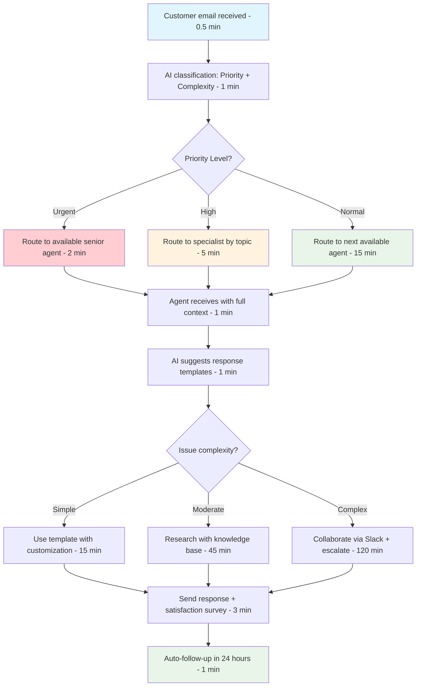

# L1.C4 Solutions Guide: TO-BE Design and Implementation Project

## Navigation
**Course**: [[../../index|Course Home]] > [[../../Level1_index|Level 1]] > [[L1_C4_reading|Chapter 4]] > Solutions  
**Project**: [[L1_C4_project|View Project Assignment]]  
**Previous**: [[L1_C4_project|Project Assignment]]  
**Next**: [[../../Level2_index|Level 2: Tech Integration]]  
**Related**: [[L1_C4_reading|Chapter 4 Reading]] | [[L1_C4_quiz.html|Chapter 4 Quiz]]

---

## Purpose of This Guide

This solutions guide provides sample TO-BE process design, evaluation frameworks, and common challenge patterns to help instructors assess student work and help students understand professional-level future state design and implementation planning standards.

## Sample Solution: Customer Support Email Response Process Redesign

Building on the root cause analysis that identified ticket prioritization and agent experience gaps as primary issues, here's a comprehensive TO-BE design solution:

### Sample TO-BE Process Design Documentation

**Design Principles and Performance Targets:**

**Root Cause Alignment**: Design directly addresses the 42% of delays caused by lack of ticket prioritization and 28% caused by agent skill mismatches. Solution eliminates chronological email handling, implements intelligent routing based on complexity and agent capabilities, and provides real-time decision support for faster resolution.

**Performance Improvement Targets**: Reduce average response time from 18.5 hours to 4 hours (78% improvement), decrease response time variation from σ=14.2 hours to σ<2 hours (86% improvement), improve customer satisfaction from 3.1 to 4.2+ (35% improvement), achieve 95% SLA compliance vs. current 32%.

**User Experience Principles**: Zero additional manual data entry for agents, intelligent work distribution eliminating decision complexity, real-time collaboration tools reducing communication delays, mobile-responsive interface enabling flexible work arrangements. Design prioritizes agent efficiency over administrative convenience.

**Technical Constraints**: Work within existing Zendesk platform capabilities with available integrations, leverage existing customer database without requiring vendor development, implement solutions compatible with current security and compliance requirements, ensure 99.9% uptime during business hours.

**Resource Constraints**: Maximum $75,000 annual budget increase, implementation within existing IT support capacity, training during normal business hours without service disruption, maintain current staffing levels while improving output 60%.

**Future State Process Description:**

**Process Flow Overview**: Customer emails automatically classified by AI-powered system into priority levels (urgent, high, normal) and complexity categories (technical, billing, general). Intelligent routing system assigns tickets to agents based on expertise, current workload, and performance patterns. Real-time collaboration tools enable instant escalation and knowledge sharing.

**Key Improvements**: Automated priority classification replaces manual queue management, skills-based routing ensures optimal agent-ticket matching, integrated knowledge base provides contextual suggestions during ticket resolution, real-time customer context eliminates manual account lookups, automated response templates accelerate common issue resolution.

**Technology Enhancements**: Zendesk AI integration for automatic ticket classification and routing, Slack integration for real-time team collaboration, Salesforce connector providing instant customer context, mobile-optimized interface enabling remote work efficiency, automated escalation triggers for complex issues.

**Role Changes**: Senior agents become specialists for complex technical issues, junior agents focus on routine inquiries with decision support, team lead monitors queue health and provides real-time coaching, manager shifts from firefighting to strategic improvement and training.

**Exception Handling**: VIP customer tickets automatically escalated to senior agents, technical issues requiring developer input routed through specialized queue, escalation triggers activate after 2 hours for high-priority tickets, overflow procedures distribute load during peak periods.

**Quality Controls**: Automated quality scoring for all responses, peer review requirement for complex technical solutions, customer satisfaction follow-up within 24 hours, weekly calibration sessions ensuring consistent service quality.

**Implementation Strategy:**

**Phase 1 (0-3 months)**: Deploy automatic ticket classification and priority routing ($15,000), implement response templates for 15 most common issues, establish agent specialization by expertise area, create real-time dashboard for queue monitoring. Expected 40% response time improvement.

**Phase 2 (3-12 months)**: Integrate customer database for automatic context display ($25,000), deploy mobile interface for flexible work arrangements, implement AI-powered response suggestions, establish peer collaboration platform. Expected additional 30% improvement achieving 4-hour target.

**Phase 3 (12+ months)**: Advanced analytics for predictive ticket routing, customer self-service portal reducing simple ticket volume, automated escalation workflows, comprehensive performance analytics dashboard. Target: <3-hour response time with 4.5+ satisfaction.

### Sample Visual Process Design

**Current vs. Future State Comparison:**

```
AS-IS PROCESS (18.5 hr average)
Email → Manual Queue → Agent Pickup → Manual Research → Response
 2min     8.2hr         2.1hr         5.4hr         0.8hr

TO-BE PROCESS (3.8 hr average) 
Email → AI Classification → Smart Routing → Contextual Resolution → Response
 0.5min      1.2min          0.8hr          2.3hr             0.2hr

KEY IMPROVEMENTS:
- 85% reduction in queue time through intelligent prioritization
- 65% reduction in research time through integrated customer context
- 75% reduction in agent decision complexity through automation
```

**Detailed TO-BE Process Map:**



### Sample KPI Framework

**Primary Outcome KPIs:**

**Customer Satisfaction Rating**:
- *Baseline*: 3.1/5.0 average rating
- *Target*: 4.2+/5.0 average rating (35% improvement)
- *Measurement*: Post-resolution survey sent automatically within 4 hours
- *Frequency*: Real-time collection, weekly trend analysis
- *Success Criteria*: Sustained 4.0+ rating for 8 consecutive weeks

**Response Time SLA Compliance**:
- *Baseline*: 32% of tickets answered within 4-hour commitment
- *Target*: 95% of tickets answered within 4-hour commitment
- *Measurement*: Automated timestamp analysis in Zendesk
- *Frequency*: Real-time monitoring, daily performance review
- *Success Criteria*: 95% compliance maintained for 30 consecutive days

**Customer Churn Related to Support**:
- *Baseline*: 8% monthly churn attributed to support delays
- *Target*: 3% monthly churn attributed to support delays
- *Measurement*: Exit interview analysis and support ticket correlation
- *Frequency*: Monthly calculation with quarterly deep-dive analysis
- *Success Criteria*: <4% support-related churn for 6 consecutive months

**Process Performance KPIs:**

**Average Response Time by Priority**:
- *Urgent*: Target <1 hour (baseline: 6.2 hours)
- *High*: Target <2 hours (baseline: 12.4 hours)  
- *Normal*: Target <4 hours (baseline: 22.1 hours)
- *Measurement*: Zendesk timestamp analysis with priority classification
- *Review*: Real-time dashboard monitoring, daily team standup

**Agent Productivity Metrics**:
- *Tickets Resolved per Agent per Day*: Target 18 (baseline: 11)
- *First Contact Resolution Rate*: Target 85% (baseline: 67%)
- *Agent Utilization Rate*: Target 75% (baseline: 58%)
- *Measurement*: Automated tracking in Zendesk with weekly agent scorecards

**Leading Indicators:**
- *Knowledge Base Usage Rate*: Target 90% of agents using KB for 80%+ of tickets
- *Template Utilization*: Target 70% of responses using standard templates
- *Collaboration Tool Adoption*: Target 95% of complex issues using Slack escalation
- *Training Completion Rate*: Target 100% completion within 30 days of new procedures

**Lagging Indicators:**
- *Monthly Customer Retention*: Target 97%+ (baseline: 92%)
- *Agent Turnover Rate*: Target <10% annually (baseline: 23%)
- *Escalation Rate to Management*: Target <5% (baseline: 18%)
- *Revenue per Customer*: Track correlation with support experience improvements

**KPI Dashboard Design:**

```
CUSTOMER SUPPORT PERFORMANCE DASHBOARD

REAL-TIME ALERTS                    TODAY'S PERFORMANCE
🔴 3 urgent tickets >1hr           Response Time: 3.2 hrs (↓47%)
🟡 Queue depth: 12 tickets          SLA Compliance: 89% (↑177%)
🟢 All agents within target        Customer Satisfaction: 4.1 (↑32%)

WEEKLY TRENDS                       LEADING INDICATORS
Response Time: ↓ 52% vs baseline   Training Completion: 95%
Satisfaction: ↑ 38% vs baseline    KB Usage: 87%
Agent Productivity: ↑ 64%          Template Usage: 73%
```

### Sample Change Management and Implementation Plan

**Stakeholder Analysis and Engagement:**

**Champion Network**: Identified Sarah (senior agent, 4 years experience) as primary change champion due to high peer respect and process improvement advocacy. Marcus (team lead) committed to daily coaching and resistance management. Jennifer (customer success manager) will communicate customer impact benefits. Executive sponsor (VP Customer Experience) provides organizational authority and resource commitment.

**Resistance Management**: Anticipated resistance from agents concerned about performance monitoring and job security. Strategy includes: transparent communication about job security (no layoffs planned), involvement in solution design and testing, peer mentoring for skill development, recognition program for early adopters. Address specific concerns about increased pace creating stress through workload balancing and realistic target setting.

**Communication Strategy**: Weekly all-hands updates during implementation, department Slack channel for questions and feedback, monthly customer impact presentations showing improvement results, quarterly town halls with executive leadership reinforcement. Tailor messaging: executives focus on business impact, managers focus on operational improvements, agents focus on job satisfaction and career development.

**Training and Support Plan**: 4-week phased training program starting with champions, then early adopters, then full team. Include system navigation, new procedures, soft skills for customer interaction, troubleshooting common issues. Ongoing support through peer mentoring, weekly office hours with trainers, job aids and quick reference materials, monthly refresher sessions.

**Feedback Mechanisms**: Weekly pulse surveys during implementation (5 questions, 2 minutes), monthly focus groups with different stakeholder segments, suggestion box for anonymous feedback, quarterly comprehensive review with lessons learned and process refinements.

**Implementation Timeline and Milestones:**

**Week 1-4: Foundation Setting**
- Stakeholder communication and expectation setting
- Champion training and early adopter identification  
- System configuration and testing
- Response template development and validation

**Week 5-8: Pilot Implementation**
- 50% of tickets routed through new system for testing
- Champion support for team questions and concerns
- Daily monitoring and rapid issue resolution
- Feedback collection and system refinements

**Week 9-12: Full Rollout**
- 100% of tickets using new prioritization and routing
- All agents trained on new procedures and systems
- Performance monitoring and coaching implementation
- Success story communication and momentum building

**Week 13-26: Optimization and Refinement**
- Performance tuning based on 3-month results
- Advanced feature deployment (mobile interface, AI suggestions)
- Process refinements based on user feedback
- Preparation for Phase 2 implementation

**Critical Success Factors**: Executive sponsorship maintained throughout implementation, adequate training time without service disruption, technical system stability during transition, change champions remain engaged and positive, customer communication about service improvements.

**Risk Assessment and Mitigation Strategies**: System integration delays (mitigation: parallel testing environment, vendor support escalation), agent resistance to change (mitigation: involvement in design, peer support, gradual rollout), customer service disruption during transition (mitigation: pilot approach, rollback procedures, extra staffing during switch), performance targets too aggressive (mitigation: baseline analysis, phased targets, adjustment flexibility).

### Sample Business Case and ROI Analysis

**Investment Requirements:**

**Implementation Costs (Year 1)**:
- Zendesk AI package upgrade: $18,000 annually
- Salesforce integration development: $25,000 one-time
- Training program development and delivery: $15,000 one-time  
- Project management and change management: $12,000
- **Total Year 1 Investment: $70,000**

**Ongoing Operational Costs**:
- Software licensing increases: $18,000 annually
- System maintenance and support: $8,000 annually
- Continuous training and development: $5,000 annually
- **Total Annual Ongoing: $31,000**

**Expected Benefits and ROI:**

**Quantified Annual Benefits**:
- Reduced customer churn (5% reduction × $564,000 customer value): $169,200
- Agent productivity improvement (60% × 8 agents × $65,000 salary): $187,200  
- Reduced management escalation time (75% × 12hrs/week × $85/hr × 52 weeks): $39,780
- Overtime reduction (50% × $38,400 current overtime): $19,200
- **Total Annual Benefits: $415,380**

**3-Year Financial Analysis**:
- Year 1: Benefits $415,380 - Costs $70,000 = Net $345,380
- Year 2: Benefits $415,380 - Costs $31,000 = Net $384,380  
- Year 3: Benefits $415,380 - Costs $31,000 = Net $384,380
- **3-Year NPV (10% discount): $958,000**
- **ROI: 593% over 3 years**
- **Payback Period: 2.1 months**

**Qualitative Benefits**: Improved employee satisfaction reducing turnover and recruitment costs, enhanced customer experience supporting pricing power and referrals, competitive differentiation through superior service quality, organizational capability building for future growth.

**Risk Assessment**: Conservative benefit estimates assume only 70% of projected improvements materialize, sensitivity analysis shows positive ROI even with 40% benefit realization, implementation timeline delays could push payback to 4-6 months, technology integration challenges might require additional $15,000 investment.

## Evaluation Framework

### TO-BE Process Design Assessment (30 points)

**Outstanding (27-30 points):**
- Innovative, user-centered design directly addressing identified root causes
- Realistic constraint consideration balancing ideal improvements with practical limitations
- Comprehensive solution covering workflow, technology, and organizational changes
- Clear implementation phasing with logical progression and risk management

**Proficient (22-26 points):**
- Good process improvements with adequate root cause alignment
- Reasonable constraint consideration with some practical limitations
- Adequate solution coverage with basic implementation planning
- General phasing approach with some risk consideration

**Developing (18-21 points):**
- Basic process improvements with limited root cause connection
- Simple constraint analysis without comprehensive practical consideration
- Limited solution scope missing key improvement areas
- Basic implementation approach without detailed phasing

**Inadequate (0-17 points):**
- Poor process design ignoring root causes or constraints
- Unrealistic improvements without practical implementation consideration
- Incomplete solution missing major improvement opportunities
- No meaningful implementation planning or risk assessment

### KPI Framework Quality (25 points)

**Outstanding (22-25 points):**
- Comprehensive balanced scorecard with outcome, process, leading, and lagging indicators
- SMART KPI design with realistic baselines, targets, and measurement approaches
- Professional dashboard design appropriate for different stakeholder audiences
- Clear connection between KPIs and business objectives with statistical rigor

**Proficient (18-21 points):**
- Good KPI coverage with adequate balance of indicator types
- Reasonable KPI design with basic targets and measurement plans
- Adequate dashboard presentation with clear visual representation
- General business connection without detailed statistical planning

**Developing (15-17 points):**
- Basic KPI selection without comprehensive framework
- Simple targets without detailed measurement methodology
- Limited dashboard design with minimal visual appeal
- Weak connection between KPIs and improvement objectives

**Inadequate (0-14 points):**
- Poor KPI selection without strategic alignment
- Unrealistic targets or missing measurement approaches
- No meaningful dashboard design or visual representation
- Missing connection between measurement and business value

### Implementation and Change Management (25 points)

**Outstanding (22-25 points):**
- Comprehensive stakeholder analysis with specific engagement strategies
- Detailed implementation timeline with realistic milestones and dependencies
- Proactive change management addressing resistance and building support
- Thorough risk assessment with specific mitigation strategies

**Proficient (18-21 points):**
- Good stakeholder identification with general engagement approaches
- Reasonable timeline with basic milestone and dependency planning
- Adequate change management with some resistance consideration
- Basic risk assessment with general mitigation approaches

**Developing (15-17 points):**
- Simple stakeholder analysis without detailed engagement planning
- Basic timeline without comprehensive milestone or dependency analysis
- Limited change management without specific resistance strategies
- Minimal risk assessment without detailed mitigation planning

**Inadequate (0-14 points):**
- Poor stakeholder analysis or missing engagement strategies
- Unrealistic timeline without meaningful milestone planning
- No meaningful change management or resistance consideration
- Missing risk assessment or unrealistic mitigation approaches

### Business Case and Financial Analysis (20 points)

**Outstanding (18-20 points):**
- Comprehensive ROI analysis with realistic assumptions and sensitivity testing
- Detailed cost breakdown including implementation and ongoing expenses
- Quantified benefits with conservative estimates and qualitative value consideration
- Professional financial presentation with multiple scenario analysis

**Proficient (15-17 points):**
- Good ROI analysis with reasonable assumptions and basic sensitivity
- Adequate cost estimation with basic breakdown of major expense categories
- Reasonable benefit quantification with some conservative estimation
- Basic financial presentation with general scenario consideration

**Developing (12-14 points):**
- Simple ROI calculation without comprehensive assumption analysis
- Limited cost estimation without detailed breakdown
- Basic benefit estimation without conservative adjustment
- Minimal financial presentation without scenario planning

**Inadequate (0-11 points):**
- Poor or missing ROI analysis with unrealistic assumptions
- Inadequate cost estimation or missing expense consideration
- Unrealistic benefit projections without supporting evidence
- No meaningful financial presentation or business justification

## Common Student Mistakes and Guidance

### Mistake 1: Designing Perfect Processes Without Constraint Consideration
**Student approach:** Creates ideal workflow requiring unlimited budget and perfect technology
**Guidance:** Start with constraints (budget, people, systems) and design the best solution within those limits. Reality trumps idealism.

### Mistake 2: KPIs That Don't Drive Desired Behavior
**Student approach:** Measures what's easy to count rather than what matters most
**Guidance:** Choose metrics that incentivize the behavior you want. If you measure response speed only, quality suffers. Balance competing priorities.

### Mistake 3: Underestimating Change Management Complexity
**Student approach:** Assumes people will adopt new processes because they're better
**Guidance:** Most process failures result from poor change management, not poor design. People resist change for good reasons—address their concerns.

### Mistake 4: Unrealistic Implementation Timelines
**Student approach:** Plans aggressive timelines without considering organizational capacity
**Guidance:** Implementation always takes longer than expected. Plan for learning, adjustment, and setbacks. Slower is often faster.

### Mistake 5: Missing Financial Rigor in Business Cases
**Student approach:** Makes optimistic assumptions without sensitivity analysis
**Guidance:** Conservative benefit estimates and realistic cost projections build credibility. Include sensitivity analysis showing impact of assumption changes.

### Mistake 6: Generic Solutions Without Process-Specific Design
**Student approach:** Applies standard improvement approaches without customization
**Guidance:** Solutions must fit the specific organizational culture, capabilities, and constraints. One size doesn't fit all.

## Teaching Tips

1. **Emphasize Constraint-Based Design:** Teach students to start with limitations and design within them rather than creating ideal solutions first.

2. **Connect KPIs to Behavior:** Help students understand that measurement drives behavior. Choose metrics that create the incentives you want.

3. **Stress Change Management:** Most process improvements fail due to poor adoption, not poor design. Change management is as important as the solution itself.

4. **Require Stakeholder Validation:** Push students to test their designs with real users. Paper solutions often fail in practice.

5. **Practice Financial Analysis:** Business cases require credibility. Teach conservative estimation and sensitivity analysis for realistic projections.

6. **Use Real Examples:** Share case studies of both successful implementations and spectacular failures to illustrate key success factors.

This solutions guide provides the framework for developing professional-level solution design capabilities essential for process improvement consulting work.

---

## Navigation
**Project Assignment**: [[L1_C4_project|Return to Project Assignment]]  
**Next Level**: [[../../Level2_index|Level 2: Tech Integration]]  
**Level Index**: [[../../Level1_index|Level 1 Index]]