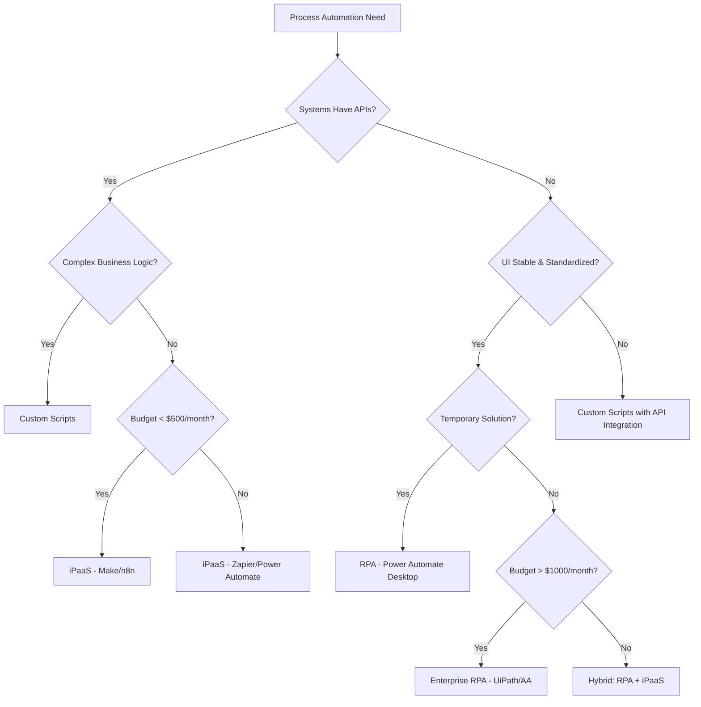

# L2.C1 Automation Landscape

## Navigation
**Course**: [[../../index|Course Home]] > [[../../Level2_index|Level 2]] > Chapter 1  
**Previous**: [[../../Level2_index|Level 2 Index]]  
**Next**: [[L2_C2_reading|Chapter 2: Low-Code Workflow Tools]]

---

## Learning Objectives
- Distinguish between RPA, iPaaS, and custom script approaches to process automation
- Evaluate automation tools based on complexity, cost, and maintenance requirements
- Apply decision frameworks to select optimal automation strategies for specific business scenarios
- Calculate ROI and total cost of ownership for different automation approaches
- Identify when hybrid automation strategies provide maximum business value

## Real-World Scenario

Marcus Rivera, operations director at Southwest Office Supply, a $12M distributor serving 850+ small businesses across Arizona and New Mexico, faced a critical decision. The company processed 2,400 orders monthly, but their current manual systems created expensive bottlenecks: order entry took 8 minutes per order, pricing errors occurred in 12% of transactions, and inventory updates lagged 4-6 hours behind actual sales.

Three consultants had presented vastly different automation solutions. The first recommended UiPath RPA at $420/month plus $15,000 implementation, promising to automate their existing order entry screens. The second proposed migrating to a $180/month iPaaS solution connecting their existing ERP, e-commerce platform, and shipping systems. The third suggested custom Python scripts hosted on AWS for roughly $200/month ongoing costs.

Each vendor provided compelling demonstrations, but Marcus realized he needed a systematic framework to evaluate the options. The UiPath demo showed impressive screen automation—their bot could navigate the legacy ERP system faster than any human operator. However, when Marcus asked about maintenance costs, the vendor mentioned that any ERP interface changes would require bot updates at $1,500 per modification.

The iPaaS solution promised cleaner integration through APIs, but Southwest's 15-year-old ERP system had limited API capabilities. The vendor estimated 3 months of custom connector development at $25,000. The custom script approach offered maximum flexibility and lower ongoing costs, but required hiring a developer or training existing staff.

The breakthrough came when Marcus mapped each solution against Southwest's specific constraints: a lean IT team (2 people), budget limitations, and the reality that their ERP system would be replaced within 18 months. This clarity revealed that the "best" technology wasn't necessarily the best fit for Southwest's unique situation. Marcus learned that successful automation requires matching tool capabilities to organizational realities, not just technical requirements.

## Core Theory

### Understanding the Automation Spectrum

Modern business process automation exists on a spectrum from simple task automation to complex intelligent process orchestration. Understanding where different tools fit helps determine the optimal approach for specific scenarios.

**Task Automation**: Simple, repetitive actions like data entry, file transfers, or notifications
**Workflow Automation**: Multi-step processes connecting different systems or applications  
**Process Orchestration**: Complex business processes involving decision logic, exception handling, and human interaction
**Intelligent Automation**: Advanced processes incorporating AI, machine learning, or cognitive capabilities

### The Three Primary Automation Approaches

#### Robotic Process Automation (RPA)

RPA mimics human interactions with computer interfaces, essentially creating "software robots" that perform repetitive tasks by clicking buttons, entering data, and navigating screens as humans would.

**Best Use Cases**:
- Legacy systems without APIs or integration capabilities
- Highly standardized, rule-based processes
- Temporary automation solutions (bridge to system replacement)
- Processes involving multiple disconnected applications

**Typical Costs (2024)**:
- **UiPath**: $420/month (1 unattended + 2 attended bots)
- **Automation Anywhere**: $750/month (Cloud Starter Pack)
- **Microsoft Power Automate**: $150/month (Process package)

**Limitations**:
- Fragile to interface changes
- Limited decision-making capabilities
- Requires ongoing maintenance for system updates
- Can struggle with exceptions or variations

#### Integration Platform as a Service (iPaaS)

iPaaS solutions connect applications through APIs, enabling real-time data synchronization and workflow automation without relying on user interface interactions.

**Best Use Cases**:
- Applications with robust API capabilities
- Real-time data synchronization requirements
- Cloud-to-cloud integrations
- Scalable, long-term automation solutions

**Typical Costs (2024)**:
- **Zapier Professional**: $19.99/month (2,000 tasks)
- **Make.com Core**: $9/month (10,000 operations)
- **Microsoft Power Automate**: $15/month per user (cloud flows)

**Advantages**:
- More reliable than screen-based automation
- Faster execution speeds
- Better scalability and performance
- Easier maintenance and updates

#### Custom Script Solutions

Custom-coded automation using programming languages like Python, JavaScript, or PowerShell, often hosted on cloud platforms or internal servers.

**Best Use Cases**:
- Unique business logic not available in commercial tools
- Cost-sensitive scenarios with high volume requirements
- Organizations with internal development capabilities
- Complex data transformations or calculations

**Typical Costs (2024)**:
- **AWS Lambda**: $0.20 per 1M requests + compute time
- **Google Cloud Functions**: Similar pay-per-use model
- **Self-hosted**: Server costs ($50-200/month) + development time

**Considerations**:
- Requires programming expertise
- Higher upfront development investment
- Full control over functionality and data
- Potentially lower long-term costs at scale

### Decision Framework for Automation Strategy

#### Technical Evaluation Criteria

**System Compatibility**:
- API availability and quality
- User interface stability
- Data export/import capabilities
- Security and authentication requirements

**Process Characteristics**:
- Volume and frequency of transactions
- Complexity of business rules
- Exception handling requirements
- Human intervention points

**Organizational Factors**:
- Internal technical capabilities
- Budget constraints and approval processes
- Timeline requirements
- Change management capacity

#### ROI Calculation Models

**Cost Components to Consider**:
- **Initial Setup**: Licensing, implementation, training
- **Ongoing Operations**: Monthly fees, maintenance, support
- **Hidden Costs**: Integration work, exception handling, updates

**Benefit Quantification**:
- **Time Savings**: Hours saved × hourly rate × annual volume
- **Error Reduction**: Error rate improvement × cost per error
- **Scalability**: Additional capacity without proportional staff increases
- **Compliance**: Reduced audit costs and regulatory risk

### Automation Tool Comparison Matrix

| Factor | RPA | iPaaS | Custom Scripts |
|--------|-----|--------|----------------|
| **Setup Time** | 2-4 weeks | 1-3 months | 2-6 months |
| **Technical Skill Required** | Low | Medium | High |
| **Ongoing Maintenance** | High | Medium | Low |
| **Scalability** | Limited | High | Very High |
| **Cost at 10K tasks/month** | $400-750 | $50-200 | $100-300 |
| **Best for Legacy Systems** | Excellent | Poor | Good |
| **Exception Handling** | Limited | Good | Excellent |

### Hybrid Automation Strategies

Many successful automation implementations combine multiple approaches to optimize for different process segments.

**Common Hybrid Patterns**:
- **RPA + iPaaS**: Use RPA for legacy system data extraction, iPaaS for modern system integration
- **iPaaS + Custom**: Handle standard workflows with iPaaS, custom code for complex business logic
- **Phased Migration**: Start with RPA for quick wins, migrate to iPaaS as systems modernize

## Tool Demonstration

### Automation Selection Decision Tree

### Cost-Benefit Analysis Template

**Scenario**: 1,000 monthly transactions, 5 minutes manual processing time, $25/hour labor cost

**Manual Process Cost**: 1,000 × 5 minutes × $25/hour ÷ 60 = $2,083/month

**Automation Options**:

1. **RPA Solution** (UiPath):
   - Setup: $15,000 + $420/month ongoing
   - Break-even: 8.2 months
   - 3-year TCO: $30,120

2. **iPaaS Solution** (Zapier Professional):
   - Setup: $5,000 + $60/month ongoing (3,000 tasks)
   - Break-even: 2.5 months  
   - 3-year TCO: $7,160

3. **Custom Scripts** (AWS Lambda):
   - Setup: $20,000 + $150/month ongoing
   - Break-even: 10.3 months
   - 3-year TCO: $25,400

**Recommendation**: iPaaS provides fastest ROI and lowest TCO for this scenario, assuming APIs are available.

## Mini Project

Create an automation strategy recommendation for TechFlow Solutions, a 45-employee IT services company processing:
- 450 service tickets monthly (8 minutes average handling time)
- 180 project proposals (25 minutes each for pricing calculations)  
- 1,200 client billing entries (3 minutes each data entry time)

**Current Systems**:
- ServiceNow (modern ticketing system with REST APIs)
- QuickBooks Desktop (limited integration capabilities)
- Custom pricing spreadsheet (Excel-based calculations)
- Office 365 environment

**Constraints**:
- $1,500 monthly automation budget
- 2-person IT team with basic scripting skills
- Must show ROI within 12 months
- Cannot disrupt current operations

**Deliverable**: Create a 2-page automation strategy document including:
1. Process prioritization with ROI calculations
2. Tool recommendations with justification  
3. Implementation timeline and resource requirements
4. Risk assessment and mitigation strategies

`<QUIZ_LINK will be replaced by generated HTML file>`

---

## Chapter Links
- 🧠 **Quiz**: [[L2_C1_quiz.html|Take the Automation Landscape Quiz]]
- 🎯 **Project**: [[L2_C1_project|Project Assignment]]  
- ✅ **Solutions**: [[L2_C1_solutions|Solutions Guide]]

## Navigation
**Previous**: [[../../Level2_index|Level 2 Index]]  
**Next**: [[L2_C2_reading|Chapter 2: Low-Code Workflow Tools]]  
**Up**: [[../../Level2_index|Level 2 Index]]