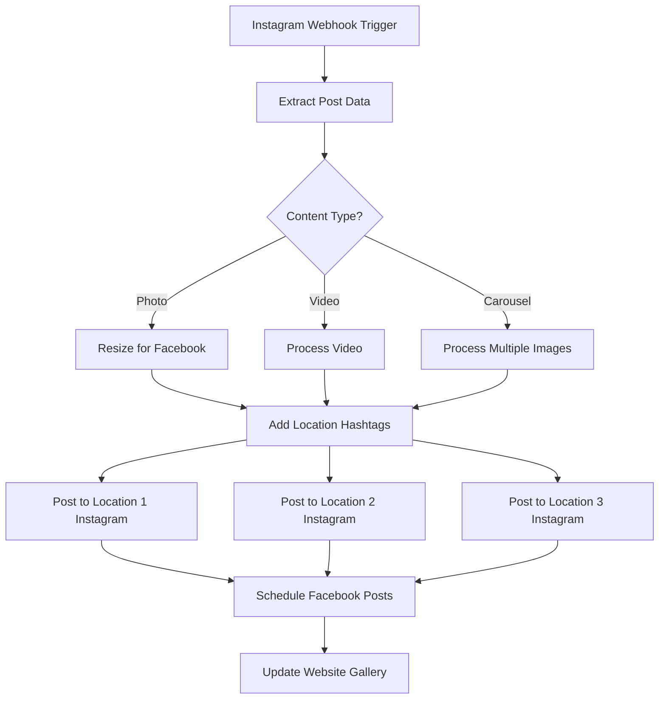

# L2.C2 Project: Multi-Platform Workflow Implementation

## Navigation
**Course**: [[../../index|Course Home]] > [[../../Level2_index|Level 2]] > [[L2_C2_reading|Chapter 2]] > Project  
**Previous**: [[L2_C2_reading|Chapter 2 Reading]]  
**Next**: [[L2_C2_solutions|Solutions Guide]]

---

## Project Overview

**Objective**: Build three functional automation workflows using different iPaaS platforms, demonstrating platform-specific strengths while solving real SME operational challenges.

**Duration**: 8-10 hours across multiple sessions  
**Deliverable**: Portfolio-ready workflow documentation package with business impact analysis

## Project Structure

You'll implement three distinct workflows, each optimized for a different platform's strengths:

1. **Zapier Workflow**: Customer onboarding automation (user-friendly, reliable)
2. **Make.com Workflow**: Social media content distribution (visual, complex logic)
3. **n8n Workflow**: Inventory management system (developer-friendly, unlimited executions)

## Workflow 1: Customer Onboarding Automation (Zapier)

### Business Context: TechStart Solutions

**Company Profile**:
TechStart Solutions provides IT consulting for startups and small businesses. They onboard 15-25 new clients monthly, with each manual onboarding taking 3.5 hours of administrative work across multiple team members.

**Current Pain Points**:
- Client information scattered across email, forms, and handwritten notes
- Contract generation requires manual data entry and customization
- Welcome email sequences sent manually, often delayed or forgotten
- Project setup in Asana happens days after contract signing
- Different processes for enterprise clients vs. small business clients

**Business Requirements**:
- Capture client data through professional TypeForm
- Generate customized contracts automatically via DocuSign
- Create appropriate project structure in Asana based on service tier
- Send personalized welcome email sequence via ConvertKit
- Different workflows for Enterprise (>$5K contracts) vs. SMB (<$5K contracts)

### Implementation Specifications

**Trigger Setup**:
```
Platform: TypeForm
Form Fields Required:
- Company Name (text)
- Contact Name (text)  
- Email Address (email)
- Phone Number (tel)
- Service Tier (dropdown: "SMB Package", "Enterprise Package")
- Contract Value (number)
- Project Start Date (date)
- Special Requirements (long text)
```

**Workflow Logic**:
1. **Form Submission Trigger**: New TypeForm response
2. **Data Validation**: Ensure required fields are complete
3. **Client Categorization**: Enterprise if contract value > $5,000
4. **Contract Generation**: 
   - Enterprise: Custom DocuSign template with detailed SOW
   - SMB: Standard service agreement template
5. **Project Creation**:
   - Enterprise: Full project with custom fields and timeline
   - SMB: Template project with standard milestones
6. **Email Sequence**:
   - Enterprise: 5-email sequence over 2 weeks
   - SMB: 3-email sequence over 1 week

**Expected Outcomes**:
- Reduce onboarding time from 3.5 hours to 30 minutes manual work
- Eliminate data entry errors between systems
- Ensure consistent follow-up regardless of team member availability
- Professional client experience with immediate contract delivery

### Workflow 2: Social Media Content Distribution (Make.com)

### Business Context: Coastal Eats Restaurant Group

**Company Profile**:
Coastal Eats operates 4 seafood restaurants across Southern California. Their marketing team creates content at the flagship location but needs to distribute customized versions to each location's social media accounts.

**Current Pain Points**:
- Content creator posts once, then manually reposts to 12+ social accounts
- Each location needs customized captions with location-specific hashtags
- Images require resizing for different platform requirements (Instagram vs. Facebook)
- Timing posts across time zones for optimal engagement
- Website gallery updates lag behind social media by days

**Business Requirements**:
- Primary trigger: New Instagram post from flagship account (@coastaleats_main)
- Repost to 3 other location Instagram accounts with location-specific hashtags
- Create Facebook posts with resized images and adapted captions
- Update website gallery section with new images
- Schedule optimal posting times for each location's audience
- Handle different content types (photos, videos, carousels)

### Implementation Specifications

**Visual Workflow Design**:


**Location-Specific Customization**:
```
Location Data Store:
- Newport Beach: #newportbeach #balboaisland #oc_eats
- Santa Monica: #santamonica #venice #la_foodie  
- Manhattan Beach: #manhattanbeach #southbay #beach_dining
- Laguna Beach: #lagunabeach #artwalk #coastal_cuisine

Posting Schedule:
- Newport/Manhattan Beach: 12 PM, 6 PM PST
- Santa Monica: 11 AM, 5 PM PST  
- Laguna Beach: 1 PM, 7 PM PST
```

**Expected Outcomes**:
- Reduce content distribution time from 2 hours to 15 minutes
- Increase posting consistency across all locations
- Optimize engagement through location-specific timing
- Maintain website freshness with automated gallery updates

### Workflow 3: Inventory Management System (n8n)

### Business Context: Pacific Northwest Outdoor Gear

**Company Profile**:
PNW Outdoor Gear sells camping and hiking equipment through their WooCommerce store and physical retail location. They manage 500+ SKUs from 8 different suppliers, each with different API capabilities and reorder requirements.

**Current Pain Points**:
- Manual inventory checks consume 6 hours weekly
- Stockouts discovered only when customers complain
- Reorder quantities based on guesswork rather than data
- Supplier pricing changes not reflected promptly
- Seasonal demand fluctuations not factored into reordering

**Business Requirements**:
- Daily automated inventory level checks across all SKUs
- Integration with supplier APIs where available, email parsing for others
- Intelligent reorder quantity calculations based on sales velocity
- Seasonal adjustment factors for camping gear (higher summer demand)
- Alert system for critical stockouts and pricing changes
- Automatic purchase order generation for preferred suppliers

### Implementation Specifications

**Technical Architecture**:
```
Triggers:
- Schedule: Daily at 6 AM PST
- Webhook: Real-time stock updates from POS system
- Email: Supplier notifications via IMAP

Data Sources:
- WooCommerce API: Current stock levels, sales data
- Supplier APIs: Backcountry.com, REI Wholesale, Outdoor Element
- Email Parsing: Smaller suppliers sending CSV updates
- Google Sheets: Manual seasonal adjustment factors

Actions:
- Stock Level Updates: WooCommerce API
- Alert Generation: Slack notifications, email alerts
- Purchase Order Creation: PDF generation, email sending
- Data Logging: PostgreSQL database for trend analysis
```

**Business Logic Implementation**:
```javascript
// Reorder Calculation Function
function calculateReorderQuantity(sku, currentStock, salesVelocity, seasonalFactor) {
    const leadTime = getSupplierLeadTime(sku); // days
    const safetyStock = Math.ceil(salesVelocity * (leadTime / 30) * 1.5); // 50% buffer
    const reorderPoint = Math.ceil(salesVelocity * (leadTime / 30)) + safetyStock;
    
    if (currentStock <= reorderPoint) {
        const baseOrderQty = salesVelocity * 2; // 2 months supply
        const adjustedQty = Math.ceil(baseOrderQty * seasonalFactor);
        const minOrderQty = getMinimumOrderQuantity(sku);
        
        return Math.max(adjustedQty, minOrderQty);
    }
    return 0; // No reorder needed
}
```

**Expected Outcomes**:
- Reduce stockouts by 70% through proactive monitoring
- Optimize inventory carrying costs with data-driven reorder quantities
- Eliminate manual inventory checking (6 hours weekly savings)
- Improve supplier relationships through automated purchase orders

## Deliverable Requirements

For each workflow, create comprehensive documentation including:

### 1. Technical Documentation (40% of grade)

**Setup Instructions**:
- Step-by-step configuration with screenshots
- API key setup and authentication procedures
- Testing procedures with sample data
- Troubleshooting guide for common errors

**Workflow Diagrams**:
- Visual flowchart showing complete logic flow
- Data transformation mappings
- Error handling paths
- Integration touch points

### 2. Business Impact Analysis (30% of grade)

**ROI Calculations**:
- Current manual process time and costs
- Automation setup and ongoing costs
- Time savings quantification
- Break-even analysis with timeline

**Performance Metrics**:
- Accuracy improvement percentages
- Speed improvement measurements
- Error reduction quantification
- User satisfaction indicators

### 3. Platform Justification (20% of grade)

**Tool Selection Reasoning**:
- Why you chose each platform for its specific workflow
- Alternative platform considerations
- Scalability analysis for business growth
- Maintenance requirements assessment

**Comparative Analysis**:
- Could this workflow be built on other platforms?
- What would be gained/lost with different tool choices?
- Cost comparison at different volume levels
- Technical complexity trade-offs

### 4. Implementation Guide (10% of grade)

**Deployment Checklist**:
- Pre-implementation requirements
- Testing and validation procedures
- Rollback plans for critical failures
- User training requirements

**Monitoring and Maintenance**:
- Key performance indicators to track
- Regular maintenance tasks and schedules
- Upgrade paths and version management
- Documentation update procedures

## Submission Format

**File Structure**:
```
[LastName]_iPaaS_Workflows/
├── README.md (project overview and outcomes)
├── Zapier_Onboarding/
│   ├── setup_guide.md
│   ├── screenshots/
│   ├── business_analysis.md
│   └── troubleshooting.md
├── Make_SocialMedia/
│   ├── workflow_diagram.png
│   ├── setup_guide.md
│   ├── configuration_export.json
│   └── roi_calculations.xlsx
├── n8n_Inventory/
│   ├── workflow_export.json
│   ├── custom_functions.js
│   ├── database_schema.sql
│   └── deployment_guide.md
└── comparative_analysis.md
```

**Presentation Requirements**:
- Professional documentation suitable for client delivery
- Clear, concise writing with minimal technical jargon
- Visual elements (flowcharts, screenshots, tables) to support explanations
- Consistent formatting and organization across all workflows

## Evaluation Criteria

**Technical Implementation (40%)**:
- Workflows function correctly with provided test data
- Appropriate use of platform-specific features
- Proper error handling and edge case management
- Code quality and organization (where applicable)

**Business Acumen (30%)**:
- Realistic ROI calculations with justified assumptions
- Clear understanding of business process improvement
- Appropriate tool selection for each use case
- Scalability and maintenance considerations

**Documentation Quality (20%)**:
- Clear, comprehensive setup instructions
- Professional presentation suitable for portfolio use
- Proper use of visual elements and formatting
- Accuracy and completeness of technical details

**Innovation and Optimization (10%)**:
- Creative solutions to business challenges
- Performance optimization techniques
- Additional features beyond minimum requirements
- Demonstration of advanced platform capabilities

## Success Metrics

**Completion Criteria**:
- [ ] All three workflows successfully tested with sample data
- [ ] Complete documentation package submitted
- [ ] Business impact analysis includes realistic financial projections
- [ ] Platform justification demonstrates understanding of tool strengths/limitations

**Portfolio Value**:
These workflows should demonstrate your ability to:
- Select appropriate automation tools for business needs
- Implement complex workflows with multiple decision points
- Calculate and communicate business value of automation initiatives
- Create professional documentation for technical implementations

---

## Chapter Links
- 📚 **Reading**: [[L2_C2_reading|Chapter 2 Reading]]
- 🧠 **Quiz**: [[L2_C2_quiz.html|Take the Low-Code Workflow Tools Quiz]]
- ✅ **Solutions**: [[L2_C2_solutions|Solutions Guide]]

## Navigation
**Previous**: [[L2_C2_reading|Chapter 2 Reading]]  
**Next**: [[L2_C2_solutions|Solutions Guide]]  
**Up**: [[../../Level2_index|Level 2 Index]]