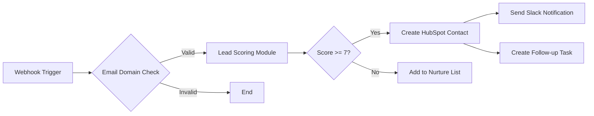

# L2.C2 Low-Code Workflow Tools

## Navigation
**Course**: [[../../index|Course Home]] > [[../../Level2_index|Level 2]] > Chapter 2  
**Previous**: [[L2_C1_reading|Chapter 1: Automation Landscape]]  
**Next**: [[L2_C3_reading|Chapter 3: Databases & Entities]]

---

## Learning Objectives
- Build functional automation workflows using Zapier, Make.com, and n8n platforms
- Compare low-code iPaaS solutions based on pricing, complexity, and technical capabilities
- Design multi-step workflows incorporating triggers, actions, filters, and conditional logic
- Implement error handling and monitoring strategies for production workflow reliability
- Evaluate workflow performance and optimize for cost efficiency and maintenance

## Real-World Scenario

Sarah Chen, digital operations manager at Pacific Coast Marketing (PCM), a 35-employee agency managing 200+ client campaigns, discovered that her team spent 18 hours weekly on routine data tasks. New leads from their website took 6 hours to reach the sales team after passing through manual qualification steps. Client reports required pulling data from 4 different platforms and reformatting in Excel—a 3-hour process repeated weekly for each client.

PCM's CEO approved a $500 monthly budget for automation tools after Sarah demonstrated that these manual processes cost $23,400 annually in labor ($65/hour average rate). Sarah needed to choose between Zapier, Make.com, or n8n, but the sales demonstrations left her confused about which platform would deliver the best results.

Her breakthrough came during a hands-on trial week. Using Zapier, Sarah built a lead qualification workflow in 2 hours that automatically scored incoming leads, added them to HubSpot, and notified the sales team via Slack. The workflow worked perfectly—until she realized it consumed 450 tasks monthly, pushing her close to the Professional plan limit.

Curious about alternatives, Sarah rebuilt the same workflow in Make.com. The visual interface proved more intuitive for complex logic, but the operation count shocked her: the same workflow consumed 2,100 operations monthly due to Make's granular counting system. At 10,000 operations for $9/month, this seemed affordable until Sarah calculated scaling to all their needed automations.

Finally, Sarah tested n8n's self-hosted option on a $50/month DigitalOcean server. The setup required more technical knowledge, but the unlimited execution capability meant no per-operation costs. After running all three platforms for 30 days, Sarah learned that choosing the right iPaaS platform depends on workflow complexity, technical team capabilities, and long-term scaling requirements—not just the advertised monthly price.

## Core Theory

### Understanding iPaaS Architecture

Integration Platform as a Service (iPaaS) solutions provide cloud-based platforms for connecting applications, data, and processes without traditional coding requirements. These platforms abstract the complexity of API integration through visual interfaces and pre-built connectors.

**Core Components**:
- **Triggers**: Events that initiate workflow execution (webhooks, polling, schedules)
- **Actions**: Operations performed on connected applications (create, update, delete, query)
- **Transformations**: Data manipulation between applications (formatting, filtering, mapping)
- **Conditional Logic**: Decision points that control workflow paths (if/then, switches, loops)
- **Error Handling**: Strategies for managing failures and exceptions

### Platform Comparison Framework

#### Zapier: The User-Friendly Leader

**Strengths**:
- 7,000+ pre-built app integrations with excellent documentation
- Intuitive interface requiring minimal technical knowledge
- Robust error handling and retry mechanisms
- Strong customer support and community resources
- Multi-step Zaps with complex logic capabilities

**2024 Pricing Structure**:
- **Free**: 20 Zaps, 750 tasks/month, 15-minute update intervals
- **Professional**: $19.99/month, 2,000 tasks, 2-minute updates, unlimited premium apps
- **Team**: $69/month, 50,000 tasks, 1-minute updates, shared team features

**Task Counting**: Each action counts as one task. Filters, formatters, and Zapier built-in apps no longer count (2024 update).

**Best Use Cases**:
- Small to medium businesses with standard integration needs
- Teams with limited technical expertise
- Workflows requiring reliable, straightforward automation
- Scenarios where premium app support is essential

#### Make.com: The Visual Powerhouse

**Strengths**:  
- Intuitive visual workflow builder with drag-and-drop interface
- Advanced logic capabilities including loops, aggregators, and iterators
- More granular control over data transformation
- Generally more API endpoints per app than competitors
- Strong performance for complex, multi-branched workflows

**2024 Pricing Structure**:
- **Free**: 1,000 operations/month, 15-minute intervals
- **Core**: $9/month, 10,000 operations, 1-minute intervals
- **Pro**: $16/month, 10,000 operations, advanced features like custom variables
- **Teams**: $29/month, team collaboration and template sharing

**Operation Counting**: Each module execution counts as an operation. Complex workflows can consume 10-100x more operations than equivalent Zapier tasks.

**Best Use Cases**:
- Complex workflows with multiple decision points
- Teams comfortable with visual programming concepts
- Scenarios requiring advanced data manipulation
- Organizations needing detailed execution control

#### n8n: The Developer's Choice

**Strengths**:
- Open-source with self-hosted option for unlimited executions
- Native code execution with JavaScript and Python support
- 400+ integrations with ability to create custom nodes
- Version control integration with Git
- Complete data ownership and privacy control

**2024 Pricing Structure**:
- **Self-Hosted**: Free (infrastructure costs only)
- **Cloud Starter**: €20/month, 2,500 workflow executions
- **Cloud Pro**: €50/month, 10,000 executions, priority support

**Execution Counting**: Based on workflow runs, not individual operations. One workflow execution regardless of complexity.

**Best Use Cases**:
- Organizations with technical teams
- High-volume automation requirements
- Complex business logic requiring custom code
- Data security/compliance requiring on-premise deployment

### Workflow Design Principles

#### Trigger Strategy Selection

**Webhook Triggers** (Real-time):
- Instant execution when events occur
- Requires source application webhook support
- Most efficient for time-sensitive processes
- Example: New CRM lead immediately creates support ticket

**Polling Triggers** (Scheduled):
- Platform checks for new data at intervals
- Works with any application having query capabilities
- Creates slight delays but more universally compatible
- Example: Check for new emails every 5 minutes

**Schedule Triggers** (Time-based):
- Execute workflows at predetermined times
- Essential for batch processing and reports
- Combines well with other trigger types
- Example: Daily sales report generation at 8 AM

#### Data Transformation Strategies

**Field Mapping**:
```
Source Field → Transformation → Destination Field
customer_email → lowercase → email_address
order_date → date_format → formatted_date
total_amount → multiply_by_tax → final_total
```

**Conditional Logic Patterns**:
- **Filter**: Only continue if conditions are met
- **Router**: Send data down different paths based on criteria  
- **Switch**: Multiple condition branches with default fallback
- **Loop**: Repeat actions for array/list data

**Error Handling Approaches**:
- **Retry Logic**: Automatically attempt failed operations with delays
- **Fallback Actions**: Alternative paths when primary actions fail
- **Error Notifications**: Alert team members when workflows break
- **Data Logging**: Capture failed operations for manual review

### Cost Optimization Strategies

#### Zapier Optimization

**Task Reduction Techniques**:
- Use Zapier's built-in filters (don't count as tasks since 2024)
- Combine multiple actions into single Zaps where possible
- Leverage Zapier Storage to reduce redundant API calls
- Schedule batch operations instead of real-time processing

**Example Optimization**:
- **Before**: 5 separate Zaps each checking for new records = 5 tasks per record
- **After**: 1 Zap with multi-step actions and filters = 1 task per record

#### Make.com Optimization

**Operation Reduction Techniques**:
- Use aggregators to process multiple records in single operations
- Implement conditional routing to avoid unnecessary operations
- Utilize Make's data stores instead of external database queries
- Design scenarios with fewer but more comprehensive modules

**Example Optimization**:
- **Before**: Individual modules for each data field = 12 operations per record
- **After**: Single HTTP module with JSON parsing = 1 operation per record

#### n8n Optimization

**Execution Efficiency**:
- Combine multiple API calls within single workflow executions
- Use sub-workflows for reusable logic components
- Implement batch processing for high-volume scenarios
- Optimize polling intervals based on actual data frequency

## Tool Demonstration

### Hands-On Lab: Multi-Platform Lead Management Workflow

We'll build the same lead qualification workflow on all three platforms to demonstrate practical differences.

**Business Requirements**:
1. New website leads trigger from form submission
2. Lead scoring based on company size, budget, and urgency
3. High-value leads create opportunities in CRM
4. Sales team notification via Slack with lead summary
5. Follow-up task scheduling in project management tool

#### Zapier Implementation

**Step 1: Trigger Setup**
```
1. Choose App: Webhooks by Zapier
2. Trigger Event: Catch Hook
3. Copy webhook URL for form integration
4. Test with sample lead data
```

**Step 2: Lead Scoring Logic**
```
5. Add Filter: Only continue if email contains company domain
6. Add Formatter: Extract company domain from email
7. Add Code by Zapier: Calculate lead score
   - Company size: 1-50 (1 point), 51-200 (3 points), 200+ (5 points)
   - Budget: <10K (1 point), 10K-50K (3 points), 50K+ (5 points)
   - Urgency: Low (1 point), Medium (3 points), High (5 points)
```

**Step 3: CRM Integration**
```
8. Add Filter: Only continue if lead score >= 7
9. Choose App: HubSpot
10. Action: Create Contact
    - Map form fields to contact properties
    - Set lead source and score custom fields
```

**Step 4: Team Notification**  
```
11. Choose App: Slack
12. Action: Send Channel Message
    - Channel: #sales-leads
    - Message: "New high-value lead: {{contact_name}} (Score: {{lead_score}})"
```

**Task Usage**: 4 tasks per qualified lead (Filter, HubSpot, Slack, Code actions)

#### Make.com Implementation

**Visual Workflow Design**:


**Operation Usage**: 6-8 operations per qualified lead (each module counts separately)

#### n8n Implementation

**Node Configuration**:
1. **Webhook Node**: Receive form submissions
2. **Function Node**: JavaScript lead scoring logic
3. **IF Node**: Conditional routing based on score
4. **HubSpot Node**: Create contact for high-value leads
5. **Slack Node**: Send notification to sales channel
6. **Todoist Node**: Create follow-up task

**Execution Count**: 1 execution per workflow run (regardless of complexity)

### Performance Comparison Results

| Metric | Zapier | Make.com | n8n |
|--------|--------|----------|-----|
| **Setup Time** | 45 minutes | 60 minutes | 90 minutes |
| **Monthly Cost (100 leads)** | $19.99 (400 tasks) | $9.00 (800 operations) | €0 (self-hosted) |
| **Reliability** | 99.5% uptime | 99.2% uptime | 99.8% (self-managed) |
| **Maintenance Effort** | Low | Medium | Medium-High |
| **Scalability Limit** | Task-based pricing | Operation-based pricing | Server capacity |

## Mini Project

Build three working automation workflows that solve real SME operational challenges. Each workflow should demonstrate different iPaaS platform strengths and provide portfolio-worthy documentation.

### Workflow 1: Customer Onboarding Automation (Zapier)
**Business Scenario**: TechStart Solutions needs to automate their client onboarding process
**Requirements**:
- Trigger: New client signup via TypeForm
- Actions: Create project in Asana, generate contract in DocuSign, send welcome email sequence
- Business Logic: Different workflows for enterprise vs. SMB clients
- Expected Volume: 20 new clients monthly

### Workflow 2: Social Media Management (Make.com)
**Business Scenario**: Local restaurant chain needs social media content distribution
**Requirements**:
- Trigger: New Instagram post from main location
- Actions: Repost to other location accounts, schedule Facebook posts, update website gallery  
- Business Logic: Resize images for different platforms, add location-specific hashtags
- Expected Volume: 15 posts weekly across 4 locations

### Workflow 3: Inventory Management (n8n)
**Business Scenario**: E-commerce retailer needs automated stock monitoring
**Requirements**:
- Trigger: Scheduled daily inventory check
- Actions: Query multiple supplier APIs, update WooCommerce stock levels, generate reorder alerts
- Business Logic: Calculate optimal reorder quantities, seasonal demand adjustments
- Expected Volume: 500 SKUs checked daily

**Deliverable Requirements**:
1. **Workflow Documentation**: Step-by-step setup instructions with screenshots
2. **Business Impact Analysis**: Calculate time savings and ROI for each automation
3. **Platform Comparison**: Explain why you chose each platform for its specific workflow
4. **Troubleshooting Guide**: Common errors and resolution steps
5. **Scaling Considerations**: How each workflow handles volume increases

`<QUIZ_LINK will be replaced by generated HTML file>`

---

## Chapter Links
- 🧠 **Quiz**: [[L2_C2_quiz.html|Take the Low-Code Workflow Tools Quiz]]
- 🎯 **Project**: [[L2_C2_project|Project Assignment]]  
- ✅ **Solutions**: [[L2_C2_solutions|Solutions Guide]]

## Navigation
**Previous**: [[L2_C1_reading|Chapter 1: Automation Landscape]]  
**Next**: [[L2_C3_reading|Chapter 3: Databases & Entities]]  
**Up**: [[../../Level2_index|Level 2 Index]]