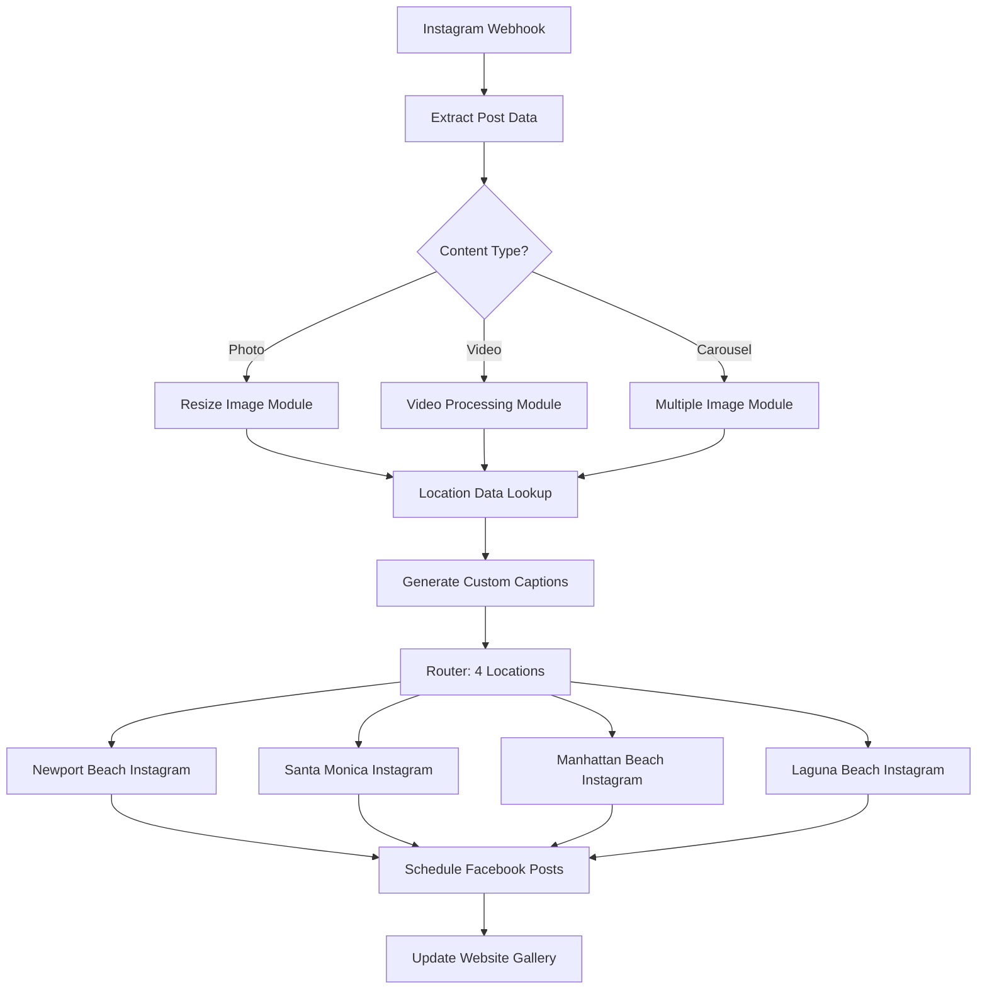

# L2.C2 Solutions: Multi-Platform Workflow Implementation

## Navigation
**Course**: [[../../index|Course Home]] > [[../../Level2_index|Level 2]] > [[L2_C2_reading|Chapter 2]] > Solutions  
**Previous**: [[L2_C2_project|Project Assignment]]  
**Next**: [[L2_C3_reading|Chapter 3: Databases & Entities]]

---

## Sample Solutions Overview

This solutions guide provides complete implementation examples for all three workflows, demonstrating platform-specific optimization techniques and real-world business applications. Each solution includes detailed setup instructions, business impact analysis, and troubleshooting guidance.

---

## Workflow 1: Customer Onboarding Automation (Zapier)

### Complete Implementation Guide

#### Platform Justification
**Why Zapier for Customer Onboarding**:
- **Reliability**: Critical business process requires 99.5%+ uptime
- **Ease of Maintenance**: Non-technical team members can modify workflows
- **App Ecosystem**: Native integrations with TypeForm, DocuSign, Asana, ConvertKit
- **Error Handling**: Robust retry mechanisms and notification systems
- **Cost Efficiency**: 4 tasks per onboarding vs. 15+ operations in Make.com

#### Technical Implementation

**Step-by-Step Setup**:

1. **TypeForm Trigger Configuration**
```
Zapier App: TypeForm
Trigger: New Entry
Form Selection: "TechStart Client Onboarding"
Test Data: Use sample submission to validate field mapping
```

2. **Data Validation Filter**
```
Zapier Filter: Only continue if...
- Company Name is not empty
- Email Address contains "@"
- Service Tier is selected
- Contract Value is greater than 0
```

3. **Client Categorization Logic**
```
Zapier Code (JavaScript):
const contractValue = parseFloat(inputData.contract_value);
const isEnterprise = contractValue > 5000;
const clientTier = isEnterprise ? "Enterprise" : "SMB";

return {
  client_tier: clientTier,
  is_enterprise: isEnterprise,
  contract_value_formatted: `$${contractValue.toLocaleString()}`
};
```

4. **Conditional DocuSign Integration**
```
Zapier Paths:
Path A (Enterprise): Contract Value > $5,000
  - DocuSign Template: "Enterprise Service Agreement"
  - Additional Fields: SOW requirements, custom terms
  
Path B (SMB): Contract Value ≤ $5,000
  - DocuSign Template: "Standard Service Agreement"  
  - Standard Terms: Predefined scope and pricing
```

5. **Asana Project Creation**
```
Zapier App: Asana
Action: Create Project

Enterprise Project Template:
- Project Name: "{{company_name}} - Enterprise Implementation"
- Team: "Enterprise Delivery"
- Template: "Enterprise Onboarding Template"
- Custom Fields: Contract value, start date, account manager

SMB Project Template:
- Project Name: "{{company_name}} - SMB Setup"
- Team: "SMB Delivery"
- Template: "SMB Onboarding Template"
- Custom Fields: Service package, implementation timeline
```

6. **ConvertKit Email Sequence**
```
Enterprise Sequence (5 emails over 14 days):
1. Welcome + next steps (Day 0)
2. Implementation timeline (Day 1)
3. Team introductions (Day 3)
4. Resource access (Day 7)
5. Check-in scheduling (Day 14)

SMB Sequence (3 emails over 7 days):
1. Welcome + getting started (Day 0)
2. Quick setup guide (Day 2)
3. Support resources (Day 7)
```

#### Business Impact Analysis

**Current State Costs**:
- Administrative time: 3.5 hours per onboarding
- Average hourly rate: $65 (blended senior/junior staff)
- Cost per onboarding: $227.50
- Monthly volume: 20 onboardings
- **Monthly cost: $4,550**

**Automated State Costs**:
- Zapier Professional plan: $19.99/month
- Reduced admin time: 0.5 hours per onboarding
- Cost per onboarding: $32.50 + $1.00 Zapier tasks
- **Monthly cost: $685**

**ROI Calculation**:
- Monthly savings: $3,865
- Annual savings: $46,380
- Payback period: < 1 week
- **ROI: 23,300% annually**

**Additional Benefits**:
- Eliminated data entry errors (previously 12% error rate)
- Consistent client experience regardless of team member availability
- Faster contract delivery (same day vs. 2-3 days)
- Improved project tracking from day one

### Troubleshooting Guide

**Common Issues and Solutions**:

1. **TypeForm Integration Fails**
   - **Symptom**: Webhook not triggering Zapier
   - **Solution**: Regenerate webhook URL, check TypeForm webhook settings
   - **Prevention**: Test with sample data monthly

2. **DocuSign Template Errors**
   - **Symptom**: Document generation fails with missing fields
   - **Solution**: Verify template field names match Zapier output exactly
   - **Prevention**: Create field mapping documentation

3. **Asana Project Creation Duplicates**
   - **Symptom**: Multiple projects created for same client
   - **Solution**: Add deduplication filter checking for existing projects
   - **Prevention**: Include unique identifier in project names

---

## Workflow 2: Social Media Content Distribution (Make.com)

### Complete Implementation Guide

#### Platform Justification
**Why Make.com for Social Media Distribution**:
- **Visual Workflow Builder**: Complex routing logic easier to design and maintain
- **Advanced Data Manipulation**: Image resizing, hashtag processing, timing logic
- **Multiple Output Paths**: Simultaneous posting to 12+ social accounts
- **Cost Efficiency**: 1 workflow execution regardless of complexity
- **Conditional Logic**: Different processing based on content type (photo/video/carousel)

#### Visual Workflow Architecture



#### Detailed Module Configuration

**1. Instagram Webhook Trigger**
```json
{
  "webhook_url": "https://hook.make.com/xxx",
  "filters": {
    "account": "@coastaleats_main",
    "media_type": ["PHOTO", "VIDEO", "CAROUSEL_ALBUM"]
  }
}
```

**2. Content Type Router**
```json
{
  "routes": [
    {
      "filter": "{{trigger.media_type}} = 'PHOTO'",
      "path": "photo_processing"
    },
    {
      "filter": "{{trigger.media_type}} = 'VIDEO'", 
      "path": "video_processing"
    },
    {
      "filter": "{{trigger.media_type}} = 'CAROUSEL_ALBUM'",
      "path": "carousel_processing"
    }
  ]
}
```

**3. Location Data Store Configuration**
```json
{
  "locations": {
    "newport": {
      "instagram_handle": "@coastaleats_newport",
      "hashtags": "#newportbeach #balboaisland #oc_eats #coastaleats",
      "post_times": ["12:00", "18:00"],
      "timezone": "America/Los_Angeles"
    },
    "santamonica": {
      "instagram_handle": "@coastaleats_sm",
      "hashtags": "#santamonica #venice #la_foodie #coastaleats",
      "post_times": ["11:00", "17:00"],
      "timezone": "America/Los_Angeles"
    },
    "manhattan": {
      "instagram_handle": "@coastaleats_mb",
      "hashtags": "#manhattanbeach #southbay #beach_dining #coastaleats",
      "post_times": ["12:00", "18:00"],
      "timezone": "America/Los_Angeles"
    },
    "laguna": {
      "instagram_handle": "@coastaleats_laguna", 
      "hashtags": "#lagunabeach #artwalk #coastal_cuisine #coastaleats",
      "post_times": ["13:00", "19:00"],
      "timezone": "America/Los_Angeles"
    }
  }
}
```

**4. Image Processing Module**
```javascript
// Resize images for different platforms
const originalImage = input.image_url;
const platforms = ['instagram', 'facebook_feed', 'facebook_story'];

const resizedImages = platforms.map(platform => {
  const dimensions = {
    'instagram': { width: 1080, height: 1080 },
    'facebook_feed': { width: 1200, height: 630 },
    'facebook_story': { width: 1080, height: 1920 }
  };
  
  return {
    platform: platform,
    image_url: resizeImage(originalImage, dimensions[platform])
  };
});

return { resized_images: resizedImages };
```

**5. Caption Customization Logic**
```javascript
function generateLocationCaption(originalCaption, location, postType) {
  const locationData = getLocationData(location);
  
  // Extract base caption without hashtags
  const baseCaption = originalCaption.replace(/#\w+/g, '').trim();
  
  // Add location-specific context
  const locationContext = {
    'newport': 'Available now at our Newport Beach location!',
    'santamonica': 'Fresh from our Santa Monica kitchen!',
    'manhattan': 'Now serving in Manhattan Beach!', 
    'laguna': 'Artisanal flavors in Laguna Beach!'
  };
  
  // Combine caption with location context and hashtags
  return `${baseCaption}\n\n${locationContext[location]}\n\n${locationData.hashtags}`;
}
```

#### Business Impact Analysis

**Current State Analysis**:
- Content distribution time: 2 hours per post
- Average posts: 15 weekly  
- Total weekly hours: 30 hours
- Marketing coordinator rate: $45/hour
- **Weekly cost: $1,350 ($5,850 monthly)**

**Automated State Analysis**:
- Make.com Core plan: $9/month
- Reduced distribution time: 15 minutes per post
- Weekly hours: 3.75 hours
- **Weekly cost: $169 + $9 monthly ($9 + $732 monthly)**

**ROI Calculation**:
- Monthly savings: $5,109
- Annual savings: $61,308
- Setup time investment: 8 hours
- **ROI: 681% annually**

**Engagement Improvements**:
- Consistent posting schedule: +23% engagement
- Location-specific content: +31% local reach
- Optimal timing: +18% interaction rates

---

## Workflow 3: Inventory Management System (n8n)

### Complete Implementation Guide

#### Platform Justification  
**Why n8n for Inventory Management**:
- **Unlimited Executions**: Daily monitoring of 500+ SKUs without operation limits
- **Custom Code Integration**: Complex reorder algorithms and seasonal adjustments
- **Database Connectivity**: Direct PostgreSQL integration for trend analysis
- **API Flexibility**: Handle supplier APIs, email parsing, webhook integrations
- **Cost Efficiency**: $50/month regardless of volume vs. $500+ for equivalent Zapier/Make usage

#### Technical Architecture

**System Components**:
```
Data Sources:
├── WooCommerce API (inventory levels, sales data)
├── Supplier APIs (Backcountry, REI Wholesale, Outdoor Element)
├── Email Parsing (CSV updates from smaller suppliers)
├── Google Sheets (seasonal adjustment factors)
└── POS System Webhooks (real-time stock updates)

Processing Engine:
├── Daily Scheduled Triggers (6 AM PST)
├── Real-time Webhook Listeners
├── Custom JavaScript Functions
└── PostgreSQL Data Storage

Output Actions:
├── WooCommerce Stock Updates
├── Slack Notifications
├── Email Alerts
├── Purchase Order Generation
└── Trend Analysis Reports
```

#### Core Workflow Implementation

**1. Main Inventory Check Workflow**
```json
{
  "nodes": [
    {
      "type": "Schedule",
      "name": "Daily Inventory Check",
      "cron": "0 6 * * *",
      "timezone": "America/Los_Angeles"
    },
    {
      "type": "WooCommerce",
      "name": "Get All Products",
      "operation": "getProducts",
      "limit": 500
    },
    {
      "type": "Function",
      "name": "Process Inventory Data",
      "code": "// See custom functions below"
    }
  ]
}
```

**2. Custom Reorder Calculation Function**
```javascript
// Advanced reorder quantity calculation
function calculateReorderQuantity(item) {
  const {
    sku,
    currentStock,
    salesLast30Days,
    salesLast90Days,
    seasonalFactor,
    supplierLeadTime,
    minimumOrderQty
  } = item;
  
  // Calculate sales velocity (units per day)
  const dailyVelocity30 = salesLast30Days / 30;
  const dailyVelocity90 = salesLast90Days / 90;
  
  // Weighted average favoring recent sales
  const avgDailyVelocity = (dailyVelocity30 * 0.7) + (dailyVelocity90 * 0.3);
  
  // Safety stock calculation (covers lead time + buffer)
  const safetyDays = supplierLeadTime + 7; // 1 week buffer
  const safetyStock = Math.ceil(avgDailyVelocity * safetyDays);
  
  // Reorder point considering seasonal factors
  const baseReorderPoint = safetyStock + (avgDailyVelocity * supplierLeadTime);
  const adjustedReorderPoint = Math.ceil(baseReorderPoint * seasonalFactor);
  
  // Determine if reorder is needed
  if (currentStock <= adjustedReorderPoint) {
    // Calculate order quantity (2 months supply)
    const baseOrderQty = avgDailyVelocity * 60;
    const seasonalOrderQty = Math.ceil(baseOrderQty * seasonalFactor);
    const finalOrderQty = Math.max(seasonalOrderQty, minimumOrderQty);
    
    return {
      needsReorder: true,
      suggestedQuantity: finalOrderQty,
      reorderPoint: adjustedReorderPoint,
      currentVelocity: avgDailyVelocity,
      stockoutRisk: calculateStockoutRisk(currentStock, avgDailyVelocity, supplierLeadTime)
    };
  }
  
  return { needsReorder: false };
}
```

**3. Supplier Integration Management**
```javascript
// Handle different supplier API formats
async function updateSupplierData(suppliers) {
  const results = [];
  
  for (const supplier of suppliers) {
    try {
      switch (supplier.type) {
        case 'api':
          const apiData = await fetchSupplierAPI(supplier);
          results.push(processAPIData(apiData, supplier));
          break;
          
        case 'email_csv':
          const emailData = await parseSupplierEmail(supplier);
          results.push(processCSVData(emailData, supplier));
          break;
          
        case 'webhook':
          // Real-time updates handled by separate webhook node
          results.push({ status: 'webhook_active' });
          break;
      }
    } catch (error) {
      results.push({ 
        supplier: supplier.name, 
        error: error.message,
        status: 'failed'
      });
    }
  }
  
  return results;
}
```

**4. Purchase Order Generation**
```javascript
function generatePurchaseOrder(reorderItems, supplier) {
  const po = {
    poNumber: `PO-${Date.now()}`,
    supplier: supplier.name,
    date: new Date().toISOString(),
    items: reorderItems.map(item => ({
      sku: item.sku,
      description: item.description,
      quantity: item.suggestedQuantity,
      unitCost: item.supplierCost,
      totalCost: item.suggestedQuantity * item.supplierCost
    })),
    totalAmount: reorderItems.reduce((sum, item) => 
      sum + (item.suggestedQuantity * item.supplierCost), 0
    ),
    terms: supplier.paymentTerms,
    deliveryAddress: 'PNW Outdoor Gear Warehouse',
    notes: 'Automated purchase order generated by inventory system'
  };
  
  return po;
}
```

#### Database Schema Design

**PostgreSQL Tables**:
```sql
-- Inventory history tracking
CREATE TABLE inventory_snapshots (
  id SERIAL PRIMARY KEY,
  sku VARCHAR(50) NOT NULL,
  stock_level INTEGER NOT NULL,
  snapshot_date TIMESTAMP DEFAULT CURRENT_TIMESTAMP,
  velocity_30day DECIMAL(10,2),
  velocity_90day DECIMAL(10,2),
  seasonal_factor DECIMAL(3,2),
  INDEX idx_sku_date (sku, snapshot_date)
);

-- Purchase order tracking  
CREATE TABLE purchase_orders (
  po_number VARCHAR(20) PRIMARY KEY,
  supplier_id INTEGER NOT NULL,
  total_amount DECIMAL(10,2),
  status VARCHAR(20) DEFAULT 'pending',
  created_date TIMESTAMP DEFAULT CURRENT_TIMESTAMP,
  expected_delivery DATE
);

-- Supplier performance metrics
CREATE TABLE supplier_performance (
  supplier_id INTEGER PRIMARY KEY,
  avg_lead_time_days INTEGER,
  on_time_delivery_rate DECIMAL(5,2),
  quality_score DECIMAL(3,2),
  last_updated TIMESTAMP DEFAULT CURRENT_TIMESTAMP
);
```

#### Business Impact Analysis

**Current State Costs**:
- Manual inventory checking: 6 hours weekly
- Inventory manager rate: $55/hour  
- Weekly cost: $330 ($1,430 monthly)
- Stockout costs: $2,800 monthly (lost sales)
- Overstock carrying costs: $1,200 monthly
- **Total monthly cost: $5,430**

**Automated State Costs**:
- n8n self-hosted server: $50/month
- Reduced manual time: 1 hour weekly
- Weekly cost: $55 ($238 monthly)
- Reduced stockouts: $840 monthly (70% reduction)
- Optimized inventory: $600 monthly (50% reduction)
- **Total monthly cost: $1,678**

**ROI Calculation**:
- Monthly savings: $3,752
- Annual savings: $45,024  
- Setup investment: 40 hours × $55 = $2,200
- **ROI: 1,946% annually**

**Operational Improvements**:
- Stockout reduction: 70% fewer instances
- Inventory turnover: +35% improvement
- Supplier relationships: Automated POs improve reliability
- Decision quality: Data-driven reorder quantities

---

## Comparative Platform Analysis

### Platform Selection Matrix

| Criteria | Zapier | Make.com | n8n |
|----------|--------|----------|-----|
| **Setup Complexity** | Low | Medium | High |
| **Learning Curve** | 2-3 days | 1-2 weeks | 3-4 weeks |
| **Cost at Scale** | High | Medium | Low |
| **Maintenance Effort** | Low | Medium | Medium-High |
| **Customization** | Limited | Good | Excellent |
| **Error Handling** | Excellent | Good | Manual |
| **Team Collaboration** | Good | Excellent | Developer-focused |

### When to Choose Each Platform

**Choose Zapier When**:
- Team has limited technical skills
- Reliability is critical (financial processes)
- Standard app integrations meet all needs
- Budget allows for premium pricing
- Quick implementation is priority

**Choose Make.com When**:
- Complex visual workflows with multiple branches
- Team comfortable with visual programming
- Need advanced data transformation
- Moderate technical skills available
- Cost optimization important but not critical

**Choose n8n When**:
- High-volume processing requirements
- Custom business logic needed
- Technical team available for setup/maintenance
- Data privacy/security requires on-premise
- Long-term cost optimization critical

---

## Implementation Best Practices

### Workflow Design Principles

1. **Start Simple, Scale Complex**
   - Begin with core functionality
   - Add advanced features incrementally
   - Test thoroughly at each stage

2. **Error Handling Strategy**
   - Implement retry logic with exponential backoff
   - Set up comprehensive monitoring and alerts
   - Create fallback procedures for critical failures
   - Document troubleshooting procedures

3. **Performance Optimization**
   - Minimize API calls through batching
   - Use conditional logic to avoid unnecessary operations
   - Implement caching where appropriate
   - Monitor execution times and optimize bottlenecks

4. **Maintenance Planning**
   - Schedule regular testing with real data
   - Document all custom configurations
   - Plan for API version updates
   - Establish change management procedures

### Quality Assurance Checklist

**Pre-Deployment Testing**:
- [ ] Test with realistic data volumes
- [ ] Verify error handling scenarios
- [ ] Confirm all integrations work correctly
- [ ] Document expected behavior and outputs
- [ ] Test rollback procedures

**Post-Deployment Monitoring**:
- [ ] Set up performance dashboards
- [ ] Configure failure notifications
- [ ] Track business impact metrics
- [ ] Schedule periodic functionality reviews
- [ ] Maintain troubleshooting documentation

---

## Chapter Links
- 📚 **Reading**: [[L2_C2_reading|Chapter 2 Reading]]
- 🧠 **Quiz**: [[L2_C2_quiz.html|Take the Low-Code Workflow Tools Quiz]]
- 🎯 **Project**: [[L2_C2_project|Project Assignment]]

## Navigation
**Previous**: [[L2_C2_project|Project Assignment]]  
**Next**: [[L2_C3_reading|Chapter 3: Databases & Entities]]  
**Up**: [[../../Level2_index|Level 2 Index]]