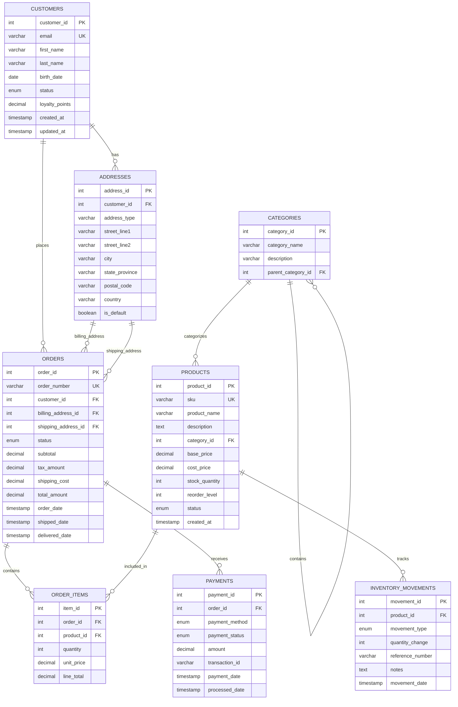

# L2.C3 Databases & Entities

## Navigation
**Course**: [[../../index|Course Home]] > [[../../Level2_index|Level 2]] > Chapter 3  
**Previous**: [[L2_C2_reading|Chapter 2: Low-Code Workflow Tools]]  
**Next**: [[L2_C4_reading|Chapter 4: AI in Processes]]

---

## Learning Objectives
- Design entity-relationship diagrams (ERD) that support efficient business process automation
- Apply database normalization principles to eliminate data redundancy and improve integrity
- Implement CRUD operations that integrate seamlessly with workflow automation platforms
- Optimize database structures for performance in high-transaction automation scenarios
- Select appropriate database technologies based on SME requirements, budget, and technical constraints

## Real-World Scenario

Maria Santos, operations director at Boulder Bikes, a $8M specialty bicycle retailer with 3 locations, discovered that their growth from 1,500 to 4,200 annual sales was breaking their current systems. Customer data lived in separate spreadsheets per location, inventory tracking happened in QuickBooks, and service appointments were managed through a paper calendar system.

The breaking point came during their busy spring season when a customer's $3,500 custom bike order was lost between locations. The customer had placed the order online, made a $1,000 deposit at the downtown store, requested modifications at the mountain location, and expected pickup at the suburban shop. No single system contained the complete order information, leading to a frustrated customer and a 6-hour investigation to piece together the transaction.

Maria knew they needed an integrated database solution but felt overwhelmed by options. A consultant recommended a $150,000 enterprise ERP system, while their part-time IT person suggested building everything in Excel with macros. Neither option felt right for Boulder Bikes' size and budget.

Maria's breakthrough came when she mapped their actual data relationships on a whiteboard. She realized that customers, orders, inventory, services, and locations were all connected in predictable ways. A customer could have multiple orders, each order contained multiple items, and each item came from specific inventory at particular locations. By understanding these relationships, Maria could design a database structure that supported their processes without over-engineering the solution.

Working with a local database consultant, Maria implemented a PostgreSQL database hosted on a $75/month cloud server. The normalized structure eliminated data duplication, enabled real-time inventory tracking across locations, and supported their growing automation needs. Most importantly, the database design supported their business processes rather than forcing process changes to fit system limitations.

## Core Theory

### Understanding Data in Business Processes

Every business process involves data creation, transformation, and consumption. Effective database design ensures that data flows efficiently through automated workflows while maintaining accuracy and accessibility.

**Process-Database Integration Points**:
- **Data Capture**: Forms, sensors, APIs collect information into structured formats
- **Data Validation**: Business rules ensure accuracy and completeness
- **Data Transformation**: Processing changes raw data into useful information
- **Data Storage**: Organized persistence enables retrieval and analysis
- **Data Retrieval**: Queries provide information for decision-making and automation

### Entity-Relationship Modeling for Process Automation

#### Core Entity Types

**Master Data Entities**: Relatively stable reference information
- Customers, Products, Employees, Suppliers, Locations
- Change infrequently, referenced by multiple processes
- Require careful data quality management

**Transaction Entities**: Process-specific data created during operations
- Orders, Invoices, Service Tickets, Inventory Movements
- High volume, time-sensitive data
- Often trigger automation workflows

**Configuration Entities**: System and process parameters  
- Pricing Rules, Workflow States, User Permissions
- Control automation behavior and business logic
- Require careful change management

#### Relationship Patterns in Business Processes

**One-to-Many (1:M)**:
- One Customer has Many Orders
- One Product has Many Inventory Items
- One Employee handles Many Service Tickets

**Many-to-Many (M:M)**:
- Products appear in Many Orders; Orders contain Many Products
- Employees work at Many Locations; Locations have Many Employees
- Implemented through junction/linking tables

**One-to-One (1:1)**:
- One Customer has One Billing Profile
- One Employee has One Security Profile
- Less common, often indicates denormalization opportunities

### Database Normalization for Process Efficiency

#### First Normal Form (1NF): Eliminate Repeating Groups
**Problem**: Storing multiple values in single fields
```
Customer: John Doe | Orders: ORD001,ORD002,ORD003 | Amounts: $150,$300,$200
```

**Solution**: Separate rows for each order
```
Customer: John Doe | Order: ORD001 | Amount: $150
Customer: John Doe | Order: ORD002 | Amount: $300  
Customer: John Doe | Order: ORD003 | Amount: $200
```

#### Second Normal Form (2NF): Eliminate Partial Dependencies
**Problem**: Non-key attributes depend on part of composite key
```
Order_Line: OrderID, ProductID, Quantity, ProductName, ProductPrice
```
ProductName and ProductPrice depend only on ProductID, not the full composite key.

**Solution**: Move product attributes to separate Product table
```
Order_Line: OrderID, ProductID, Quantity
Product: ProductID, ProductName, ProductPrice
```

#### Third Normal Form (3NF): Eliminate Transitive Dependencies
**Problem**: Non-key attributes depend on other non-key attributes
```
Order: OrderID, CustomerID, CustomerName, CustomerCity, OrderDate
```
CustomerName and CustomerCity depend on CustomerID, not OrderID.

**Solution**: Move customer attributes to separate Customer table
```
Order: OrderID, CustomerID, OrderDate
Customer: CustomerID, CustomerName, CustomerCity
```

### CRUD Operations in Automation Context

#### Create Operations: Data Entry Automation
**Workflow Integration Patterns**:
- **Form Submissions**: Web forms trigger database inserts
- **API Integrations**: External systems create records automatically
- **Batch Imports**: Scheduled processes load data from files or other systems
- **Event-Driven Creation**: Business events trigger new record creation

**Data Validation Strategies**:
```sql
-- Example: Order creation with business rules
CREATE OR REPLACE FUNCTION create_order(
    p_customer_id INTEGER,
    p_order_items JSON
) RETURNS INTEGER AS $$
DECLARE
    v_order_id INTEGER;
    v_total_amount DECIMAL(10,2) := 0;
BEGIN
    -- Validate customer exists and is active
    IF NOT EXISTS (SELECT 1 FROM customers WHERE id = p_customer_id AND status = 'active') THEN
        RAISE EXCEPTION 'Invalid or inactive customer';
    END IF;
    
    -- Create order record
    INSERT INTO orders (customer_id, order_date, status)
    VALUES (p_customer_id, CURRENT_TIMESTAMP, 'pending')
    RETURNING id INTO v_order_id;
    
    -- Add order items and calculate total
    INSERT INTO order_items (order_id, product_id, quantity, unit_price)
    SELECT v_order_id, item->>'product_id', item->>'quantity', item->>'unit_price'
    FROM json_array_elements(p_order_items) AS item;
    
    RETURN v_order_id;
END;
$$ LANGUAGE plpgsql;
```

#### Read Operations: Information Retrieval for Workflows
**Query Patterns for Automation**:
- **Single Record Lookup**: Get customer details for order processing
- **List Queries**: Find all pending orders for daily processing
- **Aggregation Queries**: Calculate inventory levels for reorder workflows
- **Join Queries**: Combine related data for comprehensive reporting

#### Update Operations: Process State Management
**Automation-Friendly Update Patterns**:
- **Status Transitions**: Move orders through fulfillment workflow states
- **Timestamp Tracking**: Record when automated processes occur
- **Batch Updates**: Efficiently modify multiple records based on criteria
- **Conditional Updates**: Change data only when business rules are met

#### Delete Operations: Data Lifecycle Management
**Deletion Strategies in Automated Systems**:
- **Soft Deletes**: Mark records as inactive rather than removing them
- **Archival Processes**: Move old data to separate storage for compliance
- **Cascade Deletes**: Automatically remove dependent records
- **Retention Policies**: Automated cleanup based on business rules

### Database Technology Selection for SMEs

#### Relational Databases (SQL)

**PostgreSQL** - Open Source Enterprise Features
- **Strengths**: Advanced features, excellent JSON support, strong consistency
- **Use Cases**: Complex business logic, reporting requirements, mixed data types
- **Cost**: Free software + hosting ($25-200/month depending on scale)
- **SME Fit**: Excellent for growing businesses needing enterprise features

**MySQL** - Popular and Well-Supported  
- **Strengths**: Wide hosting availability, good performance, extensive ecosystem
- **Use Cases**: Web applications, e-commerce, content management
- **Cost**: Free software + hosting ($15-150/month)
- **SME Fit**: Good for straightforward business applications

**Microsoft SQL Server** - Enterprise Integration
- **Strengths**: Excellent Microsoft ecosystem integration, advanced analytics
- **Use Cases**: Windows-centric environments, Power BI integration
- **Cost**: $200-1,500/month depending on features and scale
- **SME Fit**: Good for Microsoft-heavy organizations

#### NoSQL Databases

**MongoDB** - Document-Oriented Flexibility
- **Strengths**: Flexible schema, horizontal scaling, JSON-native
- **Use Cases**: Rapid development, content management, real-time analytics
- **Cost**: Free tier + $57+/month for production
- **SME Fit**: Good for agile development and changing requirements

**Firebase/Firestore** - Google Cloud Platform
- **Strengths**: Real-time updates, automatic scaling, simple authentication
- **Use Cases**: Mobile apps, real-time collaboration, rapid prototyping
- **Cost**: Pay-per-use pricing, free tier available
- **SME Fit**: Excellent for mobile-first businesses

#### Decision Framework for SMEs

**Choose Relational (SQL) When**:
- Complex relationships between data entities
- Strong consistency and ACID compliance required
- Extensive reporting and analytics needs
- Integration with business intelligence tools
- Mature, well-understood data structures

**Choose NoSQL When**:
- Rapid development and changing requirements
- Horizontal scaling requirements
- Document or key-value data naturally fits
- Real-time updates and collaboration features
- Mobile-first application architecture

### Performance Optimization for Automation Workloads

#### Indexing Strategies

**Primary Key Indexes**: Automatic unique identification
```sql
-- Efficient customer lookup by ID
SELECT * FROM customers WHERE id = 12345;
```

**Foreign Key Indexes**: Support relationship queries
```sql
-- Find all orders for a customer
SELECT * FROM orders WHERE customer_id = 12345;
```

**Composite Indexes**: Multi-column query optimization
```sql
-- Optimize date range queries by status
CREATE INDEX idx_orders_status_date ON orders(status, order_date);
SELECT * FROM orders WHERE status = 'pending' AND order_date >= '2024-01-01';
```

**Partial Indexes**: Optimize specific data subsets
```sql
-- Index only active customers for faster lookups
CREATE INDEX idx_active_customers ON customers(email) WHERE status = 'active';
```

#### Query Optimization Techniques

**Avoid N+1 Query Problems**:
```sql
-- Bad: Multiple queries in loops
SELECT * FROM orders WHERE customer_id = ?; -- Run for each customer

-- Good: Single join query
SELECT c.name, o.order_date, o.total_amount
FROM customers c
JOIN orders o ON c.id = o.customer_id
WHERE c.status = 'active';
```

**Use Appropriate Data Types**:
```sql
-- Efficient storage and indexing
customer_id INTEGER NOT NULL,           -- 4 bytes vs 36 for UUID
order_date DATE NOT NULL,              -- 4 bytes vs 19 for VARCHAR
total_amount DECIMAL(10,2) NOT NULL,   -- Exact vs imprecise FLOAT
status VARCHAR(20) NOT NULL            -- Fixed length for known values
```

## Tool Demonstration

### ERD Design for E-commerce Order Management

Let's design a complete database structure for an e-commerce business with automation requirements.

#### Business Requirements Analysis
- **Customers**: Multiple addresses, preferences, loyalty status
- **Products**: Inventory tracking, pricing tiers, categories
- **Orders**: Multi-item transactions, status tracking, fulfillment
- **Payments**: Multiple methods, partial payments, refunds
- **Shipping**: Address validation, carrier integration, tracking

#### Entity-Relationship Diagram



#### Database Implementation

**Table Creation with Constraints**:
```sql
-- Customers table with data quality controls
CREATE TABLE customers (
    customer_id SERIAL PRIMARY KEY,
    email VARCHAR(255) UNIQUE NOT NULL,
    first_name VARCHAR(100) NOT NULL,
    last_name VARCHAR(100) NOT NULL,
    birth_date DATE,
    status customer_status DEFAULT 'active',
    loyalty_points DECIMAL(10,2) DEFAULT 0.00,
    created_at TIMESTAMP DEFAULT CURRENT_TIMESTAMP,
    updated_at TIMESTAMP DEFAULT CURRENT_TIMESTAMP,
    
    CONSTRAINT chk_email_format CHECK (email ~* '^[A-Za-z0-9._%+-]+@[A-Za-z0-9.-]+\.[A-Za-z]{2,}$'),
    CONSTRAINT chk_loyalty_points CHECK (loyalty_points >= 0)
);

-- Products table with inventory controls
CREATE TABLE products (
    product_id SERIAL PRIMARY KEY,
    sku VARCHAR(50) UNIQUE NOT NULL,
    product_name VARCHAR(255) NOT NULL,
    description TEXT,
    category_id INTEGER REFERENCES categories(category_id),
    base_price DECIMAL(10,2) NOT NULL,
    cost_price DECIMAL(10,2),
    stock_quantity INTEGER DEFAULT 0,
    reorder_level INTEGER DEFAULT 10,
    status product_status DEFAULT 'active',
    created_at TIMESTAMP DEFAULT CURRENT_TIMESTAMP,
    
    CONSTRAINT chk_prices CHECK (base_price > 0 AND cost_price >= 0),
    CONSTRAINT chk_stock CHECK (stock_quantity >= 0),
    CONSTRAINT chk_reorder CHECK (reorder_level >= 0)
);

-- Orders table with comprehensive tracking
CREATE TABLE orders (
    order_id SERIAL PRIMARY KEY,
    order_number VARCHAR(20) UNIQUE NOT NULL,
    customer_id INTEGER NOT NULL REFERENCES customers(customer_id),
    billing_address_id INTEGER REFERENCES addresses(address_id),
    shipping_address_id INTEGER REFERENCES addresses(address_id),
    status order_status DEFAULT 'pending',
    subtotal DECIMAL(10,2) NOT NULL,
    tax_amount DECIMAL(10,2) DEFAULT 0.00,
    shipping_cost DECIMAL(10,2) DEFAULT 0.00,
    total_amount DECIMAL(10,2) NOT NULL,
    order_date TIMESTAMP DEFAULT CURRENT_TIMESTAMP,
    shipped_date TIMESTAMP,
    delivered_date TIMESTAMP,
    
    CONSTRAINT chk_amounts CHECK (
        subtotal >= 0 AND 
        tax_amount >= 0 AND 
        shipping_cost >= 0 AND
        total_amount = subtotal + tax_amount + shipping_cost
    ),
    CONSTRAINT chk_dates CHECK (
        shipped_date IS NULL OR shipped_date >= order_date
    )
);
```

**Automation-Supporting Indexes**:
```sql
-- Support customer lookup automation
CREATE INDEX idx_customers_email ON customers(email);
CREATE INDEX idx_customers_status ON customers(status);

-- Support inventory automation
CREATE INDEX idx_products_sku ON products(sku);
CREATE INDEX idx_products_stock ON products(stock_quantity, reorder_level);
CREATE INDEX idx_products_category ON products(category_id, status);

-- Support order processing automation
CREATE INDEX idx_orders_customer ON orders(customer_id);
CREATE INDEX idx_orders_status_date ON orders(status, order_date);
CREATE INDEX idx_orders_number ON orders(order_number);

-- Support reporting and analytics
CREATE INDEX idx_order_items_product ON order_items(product_id);
CREATE INDEX idx_payments_status ON payments(payment_status, payment_date);
```

## Mini Project

Design and implement a complete database structure for a service-based business that supports automated workflow processes. Your database will become the foundation for integration with the automation tools covered in previous chapters.

### Business Context: TechServ Solutions

**Company Profile**:
TechServ Solutions provides IT support and consulting services to small businesses. They need a database system that supports their automation workflows for customer management, ticket handling, project tracking, and billing processes.

**Service Offerings**:
- **Break/Fix Support**: Hourly technical support ($125/hour)
- **Managed Services**: Monthly retainer with included hours ($500-2,500/month)
- **Project Work**: Fixed-price implementations ($2,000-50,000)
- **Training Services**: Group and individual training ($150-300/hour)

**Process Requirements**:
- Customer onboarding with service tier assignment
- Support ticket lifecycle management (open → in-progress → resolved → closed)
- Project milestone tracking with approval workflows
- Time tracking for billing automation
- Contract management with renewal notifications
- Invoice generation and payment tracking

### Database Design Requirements

**Core Entities to Model**:
1. **Customers**: Companies with multiple contacts, service tiers, contract details
2. **Contacts**: Individual people at customer companies with roles and permissions
3. **Service Contracts**: Recurring agreements with terms, pricing, included hours
4. **Support Tickets**: Issues with priority, status, assignment, resolution tracking
5. **Projects**: Fixed-scope work with phases, milestones, deliverables
6. **Time Entries**: Billable and non-billable time tracking by employee
7. **Invoices**: Generated from time entries and contract terms
8. **Employees**: Internal staff with skills, rates, availability

**Automation Integration Points**:
- New customer signup triggers contract setup workflow
- High-priority tickets automatically assign to on-call technician
- Project milestone completion triggers client notification
- Monthly contract hours trigger renewal warnings
- Time entry approval triggers invoice generation
- Payment receipt updates customer account status

### Deliverable Specifications

Create a comprehensive database design package including:

#### 1. Entity-Relationship Diagram (ERD)
- Complete visual diagram showing all entities and relationships
- Include primary keys, foreign keys, and important attributes
- Show cardinality and relationship types clearly
- Identify any weak entities or composite relationships

#### 2. Database Schema Implementation
- SQL CREATE statements for all tables with appropriate data types
- Primary key and foreign key constraints
- Check constraints for business rule enforcement
- Indexes optimized for automation query patterns

#### 3. Sample Data and Queries
- Realistic sample data for testing (minimum 5 records per table)
- CRUD operation examples for each major entity
- Complex queries supporting automation workflows
- Performance optimization examples with execution plans

#### 4. Integration Documentation
- API endpoint specifications for automation platform integration
- Data validation rules for automated data entry
- Error handling strategies for automation failures
- Backup and recovery procedures for automated systems

`<QUIZ_LINK will be replaced by generated HTML file>`

---

## Chapter Links
- 🧠 **Quiz**: [[L2_C3_quiz.html|Take the Databases & Entities Quiz]]
- 🎯 **Project**: [[L2_C3_project|Project Assignment]]  
- ✅ **Solutions**: [[L2_C3_solutions|Solutions Guide]]

## Navigation
**Previous**: [[L2_C2_reading|Chapter 2: Low-Code Workflow Tools]]  
**Next**: [[L2_C4_reading|Chapter 4: AI in Processes]]  
**Up**: [[../../Level2_index|Level 2 Index]]