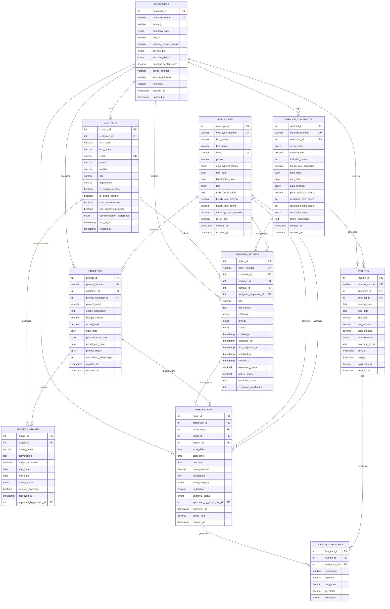

# L2.C3 Solutions: TechServ Solutions Database Design

## Navigation
**Course**: [[../../index|Course Home]] > [[../../Level2_index|Level 2]] > [[L2_C3_reading|Chapter 3]] > Solutions  
**Previous**: [[L2_C3_project|Project Assignment]]  
**Next**: [[L2_C4_reading|Chapter 4: AI in Processes]]

---

## Complete Database Design Solution

This comprehensive solution demonstrates professional database design practices for a service-based SME, incorporating automation-friendly structures and real-world business requirements.

---

## 1. Entity-Relationship Diagram

### Complete ERD for TechServ Solutions



### Relationship Analysis

**Key Design Decisions**:
- **Customer-Contract (1:M)**: Customers can have multiple service tiers over time
- **Contract-Ticket (1:M)**: All support work must be covered by valid contracts
- **Employee-TimeEntry (1:M)**: Clear work attribution for billing and performance
- **Ticket/Project-TimeEntry (1:M)**: Work can be against tickets or projects, not both simultaneously
- **TimeEntry-InvoiceLineItem (1:1)**: One-to-one relationship ensures accurate billing

---

## 2. Database Schema Implementation

### Complete SQL Schema with Business Logic

```sql
-- TechServ Solutions Database Schema
-- Designed for automation workflow integration

-- Create custom data types for business rules
CREATE TYPE service_tier AS ENUM ('breakfix', 'essential', 'professional', 'enterprise');
CREATE TYPE ticket_status AS ENUM ('open', 'assigned', 'in_progress', 'waiting_customer', 'resolved', 'closed');
CREATE TYPE ticket_priority AS ENUM ('low', 'medium', 'high', 'critical');
CREATE TYPE project_status AS ENUM ('planning', 'active', 'on_hold', 'completed', 'cancelled');
CREATE TYPE employment_status AS ENUM ('active', 'inactive', 'terminated');
CREATE TYPE invoice_status AS ENUM ('draft', 'sent', 'paid', 'overdue', 'cancelled');
CREATE TYPE approval_status AS ENUM ('pending', 'approved', 'rejected');

-- Customers table - core business entity
CREATE TABLE customers (
    customer_id SERIAL PRIMARY KEY,
    company_name VARCHAR(255) UNIQUE NOT NULL,
    industry VARCHAR(100),
    company_size ENUM('small', 'medium', 'large') DEFAULT 'small',
    tax_id VARCHAR(20),
    primary_contact_email VARCHAR(255),
    service_tier service_tier DEFAULT 'breakfix',
    account_status ENUM('prospect', 'active', 'inactive', 'suspended') DEFAULT 'prospect',
    account_health_score DECIMAL(3,2) DEFAULT 0.75,
    billing_address TEXT,
    service_address TEXT,
    timezone VARCHAR(50) DEFAULT 'America/Denver',
    created_at TIMESTAMP DEFAULT CURRENT_TIMESTAMP,
    updated_at TIMESTAMP DEFAULT CURRENT_TIMESTAMP,
    
    CONSTRAINT chk_health_score CHECK (account_health_score >= 0 AND account_health_score <= 1),
    CONSTRAINT chk_email_format CHECK (primary_contact_email ~* '^[A-Za-z0-9._%+-]+@[A-Za-z0-9.-]+\.[A-Za-z]{2,}$')
);

-- Contacts table - customer representatives
CREATE TABLE contacts (
    contact_id SERIAL PRIMARY KEY,
    customer_id INTEGER NOT NULL REFERENCES customers(customer_id) ON DELETE CASCADE,
    first_name VARCHAR(100) NOT NULL,
    last_name VARCHAR(100) NOT NULL,
    email VARCHAR(255) UNIQUE NOT NULL,
    phone VARCHAR(20),
    mobile VARCHAR(20),
    title VARCHAR(100),
    department VARCHAR(100),
    is_primary_contact BOOLEAN DEFAULT FALSE,
    is_billing_contact BOOLEAN DEFAULT FALSE,
    can_create_tickets BOOLEAN DEFAULT TRUE,
    can_approve_projects BOOLEAN DEFAULT FALSE,
    communication_preference ENUM('email', 'phone', 'sms') DEFAULT 'email',
    last_login TIMESTAMP,
    created_at TIMESTAMP DEFAULT CURRENT_TIMESTAMP,
    
    CONSTRAINT chk_email_format CHECK (email ~* '^[A-Za-z0-9._%+-]+@[A-Za-z0-9.-]+\.[A-Za-z]{2,}$')
);

-- Service contracts table - defines service agreements
CREATE TABLE service_contracts (
    contract_id SERIAL PRIMARY KEY,
    contract_number VARCHAR(20) UNIQUE NOT NULL,
    customer_id INTEGER NOT NULL REFERENCES customers(customer_id),
    service_tier service_tier NOT NULL,
    monthly_fee DECIMAL(10,2) NOT NULL DEFAULT 0,
    included_hours INTEGER DEFAULT 0,
    hourly_rate_additional DECIMAL(10,2) DEFAULT 125.00,
    start_date DATE NOT NULL,
    end_date DATE NOT NULL,
    auto_renewal BOOLEAN DEFAULT TRUE,
    price_increase_annual DECIMAL(5,2) DEFAULT 3.00,
    response_time_hours INTEGER DEFAULT 24,
    resolution_time_hours INTEGER DEFAULT 72,
    contract_status ENUM('draft', 'active', 'expired', 'terminated') DEFAULT 'draft',
    terms_conditions TEXT,
    created_at TIMESTAMP DEFAULT CURRENT_TIMESTAMP,
    updated_at TIMESTAMP DEFAULT CURRENT_TIMESTAMP,
    
    CONSTRAINT chk_contract_dates CHECK (end_date > start_date),
    CONSTRAINT chk_monthly_fee CHECK (monthly_fee >= 0),
    CONSTRAINT chk_hourly_rate CHECK (hourly_rate_additional > 0),
    CONSTRAINT chk_price_increase CHECK (price_increase_annual >= 0 AND price_increase_annual <= 50)
);

-- Employees table - internal staff
CREATE TABLE employees (
    employee_id SERIAL PRIMARY KEY,
    employee_number VARCHAR(10) UNIQUE NOT NULL,
    first_name VARCHAR(100) NOT NULL,
    last_name VARCHAR(100) NOT NULL,
    email VARCHAR(255) UNIQUE NOT NULL,
    phone VARCHAR(20),
    employment_status employment_status DEFAULT 'active',
    hire_date DATE NOT NULL,
    termination_date DATE,
    role ENUM('technician', 'senior_technician', 'project_manager', 'account_manager', 'admin') NOT NULL,
    skills_certifications TEXT,
    hourly_rate_internal DECIMAL(10,2) NOT NULL,
    hourly_rate_client DECIMAL(10,2) NOT NULL,
    capacity_hours_weekly DECIMAL(4,1) DEFAULT 40.0,
    is_on_call BOOLEAN DEFAULT FALSE,
    created_at TIMESTAMP DEFAULT CURRENT_TIMESTAMP,
    updated_at TIMESTAMP DEFAULT CURRENT_TIMESTAMP,
    
    CONSTRAINT chk_rates CHECK (hourly_rate_internal > 0 AND hourly_rate_client > 0),
    CONSTRAINT chk_capacity CHECK (capacity_hours_weekly > 0 AND capacity_hours_weekly <= 60),
    CONSTRAINT chk_termination_date CHECK (termination_date IS NULL OR termination_date >= hire_date)
);

-- Support tickets table - service requests
CREATE TABLE support_tickets (
    ticket_id SERIAL PRIMARY KEY,
    ticket_number VARCHAR(15) UNIQUE NOT NULL,
    customer_id INTEGER NOT NULL REFERENCES customers(customer_id),
    contract_id INTEGER REFERENCES service_contracts(contract_id),
    contact_id INTEGER REFERENCES contacts(contact_id),
    assigned_employee_id INTEGER REFERENCES employees(employee_id),
    title VARCHAR(255) NOT NULL,
    description TEXT NOT NULL,
    category ENUM('hardware', 'software', 'network', 'security', 'email', 'backup', 'other') NOT NULL,
    priority ticket_priority DEFAULT 'medium',
    status ticket_status DEFAULT 'open',
    created_at TIMESTAMP DEFAULT CURRENT_TIMESTAMP,
    assigned_at TIMESTAMP,
    first_response_at TIMESTAMP,
    resolved_at TIMESTAMP,
    closed_at TIMESTAMP,
    estimated_hours DECIMAL(5,2),
    actual_hours DECIMAL(5,2) DEFAULT 0,
    resolution_notes TEXT,
    customer_satisfaction INTEGER CHECK (customer_satisfaction >= 1 AND customer_satisfaction <= 5),
    
    CONSTRAINT chk_ticket_timestamps CHECK (
        assigned_at IS NULL OR assigned_at >= created_at AND
        first_response_at IS NULL OR first_response_at >= created_at AND
        resolved_at IS NULL OR resolved_at >= created_at AND
        closed_at IS NULL OR closed_at >= created_at
    ),
    CONSTRAINT chk_estimated_hours CHECK (estimated_hours IS NULL OR estimated_hours > 0),
    CONSTRAINT chk_actual_hours CHECK (actual_hours >= 0)
);

-- Projects table - fixed-scope work
CREATE TABLE projects (
    project_id SERIAL PRIMARY KEY,
    project_number VARCHAR(15) UNIQUE NOT NULL,
    customer_id INTEGER NOT NULL REFERENCES customers(customer_id),
    project_manager_id INTEGER REFERENCES employees(employee_id),
    project_name VARCHAR(255) NOT NULL,
    scope_description TEXT,
    budget_amount DECIMAL(12,2) NOT NULL,
    actual_cost DECIMAL(12,2) DEFAULT 0,
    start_date DATE NOT NULL,
    planned_end_date DATE NOT NULL,
    actual_end_date DATE,
    project_status project_status DEFAULT 'planning',
    completion_percentage INTEGER DEFAULT 0,
    created_at TIMESTAMP DEFAULT CURRENT_TIMESTAMP,
    updated_at TIMESTAMP DEFAULT CURRENT_TIMESTAMP,
    
    CONSTRAINT chk_project_dates CHECK (planned_end_date >= start_date),
    CONSTRAINT chk_actual_end_date CHECK (actual_end_date IS NULL OR actual_end_date >= start_date),
    CONSTRAINT chk_budget CHECK (budget_amount > 0),
    CONSTRAINT chk_actual_cost CHECK (actual_cost >= 0),
    CONSTRAINT chk_completion CHECK (completion_percentage >= 0 AND completion_percentage <= 100)
);

-- Project phases table - project breakdown
CREATE TABLE project_phases (
    phase_id SERIAL PRIMARY KEY,
    project_id INTEGER NOT NULL REFERENCES projects(project_id) ON DELETE CASCADE,
    phase_name VARCHAR(255) NOT NULL,
    deliverables TEXT,
    budget_allocation DECIMAL(12,2) NOT NULL,
    start_date DATE NOT NULL,
    end_date DATE NOT NULL,
    phase_status ENUM('planning', 'active', 'completed', 'cancelled') DEFAULT 'planning',
    requires_approval BOOLEAN DEFAULT FALSE,
    approved_at TIMESTAMP,
    approved_by_contact_id INTEGER REFERENCES contacts(contact_id),
    
    CONSTRAINT chk_phase_dates CHECK (end_date >= start_date),
    CONSTRAINT chk_phase_budget CHECK (budget_allocation >= 0)
);

-- Time entries table - work tracking
CREATE TABLE time_entries (
    entry_id SERIAL PRIMARY KEY,
    employee_id INTEGER NOT NULL REFERENCES employees(employee_id),
    customer_id INTEGER NOT NULL REFERENCES customers(customer_id),
    ticket_id INTEGER REFERENCES support_tickets(ticket_id),
    project_id INTEGER REFERENCES projects(project_id),
    work_date DATE NOT NULL,
    start_time TIME,
    end_time TIME,
    hours_worked DECIMAL(4,2) NOT NULL,
    description TEXT NOT NULL,
    work_category ENUM('support', 'project', 'consultation', 'training', 'travel') NOT NULL,
    is_billable BOOLEAN DEFAULT TRUE,
    approval_status approval_status DEFAULT 'pending',
    approved_by_employee_id INTEGER REFERENCES employees(employee_id),
    approved_at TIMESTAMP,
    billing_rate DECIMAL(10,2) NOT NULL,
    created_at TIMESTAMP DEFAULT CURRENT_TIMESTAMP,
    
    CONSTRAINT chk_work_assignment CHECK (
        (ticket_id IS NOT NULL AND project_id IS NULL) OR 
        (ticket_id IS NULL AND project_id IS NOT NULL)
    ),
    CONSTRAINT chk_hours_worked CHECK (hours_worked > 0 AND hours_worked <= 24),
    CONSTRAINT chk_billing_rate CHECK (billing_rate >= 0),
    CONSTRAINT chk_time_range CHECK (end_time IS NULL OR start_time IS NULL OR end_time > start_time)
);

-- Invoices table - billing documents
CREATE TABLE invoices (
    invoice_id SERIAL PRIMARY KEY,
    invoice_number VARCHAR(20) UNIQUE NOT NULL,
    customer_id INTEGER NOT NULL REFERENCES customers(customer_id),
    contract_id INTEGER REFERENCES service_contracts(contract_id),
    invoice_date DATE NOT NULL DEFAULT CURRENT_DATE,
    due_date DATE NOT NULL,
    subtotal DECIMAL(12,2) NOT NULL DEFAULT 0,
    tax_amount DECIMAL(12,2) NOT NULL DEFAULT 0,
    total_amount DECIMAL(12,2) NOT NULL DEFAULT 0,
    invoice_status invoice_status DEFAULT 'draft',
    payment_terms VARCHAR(100) DEFAULT 'Net 30',
    sent_at TIMESTAMP,
    paid_at TIMESTAMP,
    paid_amount DECIMAL(12,2) DEFAULT 0,
    created_at TIMESTAMP DEFAULT CURRENT_TIMESTAMP,
    
    CONSTRAINT chk_invoice_amounts CHECK (
        subtotal >= 0 AND 
        tax_amount >= 0 AND
        total_amount = subtotal + tax_amount AND
        paid_amount >= 0
    ),
    CONSTRAINT chk_invoice_dates CHECK (due_date >= invoice_date)
);

-- Invoice line items table - billing details
CREATE TABLE invoice_line_items (
    line_item_id SERIAL PRIMARY KEY,
    invoice_id INTEGER NOT NULL REFERENCES invoices(invoice_id) ON DELETE CASCADE,
    time_entry_id INTEGER REFERENCES time_entries(entry_id),
    description VARCHAR(500) NOT NULL,
    quantity DECIMAL(8,2) NOT NULL DEFAULT 1,
    unit_price DECIMAL(10,2) NOT NULL,
    line_total DECIMAL(12,2) NOT NULL,
    item_type ENUM('hourly_work', 'monthly_fee', 'expense', 'discount') NOT NULL,
    
    CONSTRAINT chk_line_amounts CHECK (
        quantity > 0 AND 
        unit_price >= 0 AND
        line_total = quantity * unit_price
    )
);
```

### Performance Optimization Indexes

```sql
-- Customer lookup optimization
CREATE INDEX idx_customers_company ON customers(company_name);
CREATE INDEX idx_customers_tier_status ON customers(service_tier, account_status);
CREATE INDEX idx_customers_email ON customers(primary_contact_email);

-- Contact communication optimization
CREATE INDEX idx_contacts_customer ON contacts(customer_id);
CREATE INDEX idx_contacts_email ON contacts(email);
CREATE INDEX idx_contacts_primary ON contacts(customer_id, is_primary_contact) WHERE is_primary_contact = TRUE;

-- Contract management optimization
CREATE INDEX idx_contracts_customer ON service_contracts(customer_id);
CREATE INDEX idx_contracts_status_dates ON service_contracts(contract_status, start_date, end_date);
CREATE INDEX idx_contracts_renewal ON service_contracts(end_date, auto_renewal) WHERE auto_renewal = TRUE;

-- Ticket workflow optimization
CREATE INDEX idx_tickets_customer ON support_tickets(customer_id);
CREATE INDEX idx_tickets_assigned ON support_tickets(assigned_employee_id, status);
CREATE INDEX idx_tickets_status_priority ON support_tickets(status, priority);
CREATE INDEX idx_tickets_contract ON support_tickets(contract_id);
CREATE INDEX idx_tickets_created ON support_tickets(created_at);

-- Project tracking optimization
CREATE INDEX idx_projects_customer ON projects(customer_id);
CREATE INDEX idx_projects_manager ON projects(project_manager_id);
CREATE INDEX idx_projects_status ON projects(project_status);
CREATE INDEX idx_projects_dates ON projects(start_date, planned_end_date);

-- Time tracking optimization
CREATE INDEX idx_time_employee_date ON time_entries(employee_id, work_date);
CREATE INDEX idx_time_customer ON time_entries(customer_id);
CREATE INDEX idx_time_ticket ON time_entries(ticket_id) WHERE ticket_id IS NOT NULL;
CREATE INDEX idx_time_project ON time_entries(project_id) WHERE project_id IS NOT NULL;
CREATE INDEX idx_time_approval ON time_entries(approval_status);
CREATE INDEX idx_time_billable ON time_entries(is_billable, approval_status) WHERE is_billable = TRUE;

-- Invoice processing optimization
CREATE INDEX idx_invoices_customer ON invoices(customer_id);
CREATE INDEX idx_invoices_status ON invoices(invoice_status);
CREATE INDEX idx_invoices_dates ON invoices(invoice_date, due_date);
CREATE INDEX idx_invoices_overdue ON invoices(due_date, invoice_status) WHERE invoice_status IN ('sent', 'overdue');

-- Line items optimization
CREATE INDEX idx_line_items_invoice ON invoice_line_items(invoice_id);
CREATE INDEX idx_line_items_time_entry ON invoice_line_items(time_entry_id) WHERE time_entry_id IS NOT NULL;
```

---

## 3. Sample Data and Business Scenarios

### Realistic Test Data

```sql
-- Insert sample customers
INSERT INTO customers (company_name, industry, company_size, service_tier, account_status, primary_contact_email) VALUES
('Denver Tech Solutions', 'Technology', 'medium', 'professional', 'active', 'admin@denvertech.com'),
('Mountain View Dental', 'Healthcare', 'small', 'essential', 'active', 'office@mvdental.com'),
('Boulder Manufacturing Co', 'Manufacturing', 'large', 'enterprise', 'active', 'it@bouldermfg.com'),
('Peak Performance Fitness', 'Fitness', 'small', 'essential', 'active', 'manager@peakfit.com'),
('Alpine Legal Group', 'Legal', 'medium', 'professional', 'active', 'support@alpinelegal.com');

-- Insert sample contacts
INSERT INTO contacts (customer_id, first_name, last_name, email, title, is_primary_contact, can_approve_projects) VALUES
(1, 'Sarah', 'Johnson', 'sarah.johnson@denvertech.com', 'IT Director', TRUE, TRUE),
(1, 'Mike', 'Chen', 'mike.chen@denvertech.com', 'Developer', FALSE, FALSE),
(2, 'Dr. Lisa', 'Rodriguez', 'dr.rodriguez@mvdental.com', 'Practice Owner', TRUE, TRUE),
(2, 'Jennifer', 'Smith', 'jennifer@mvdental.com', 'Office Manager', FALSE, FALSE),
(3, 'Robert', 'Wilson', 'robert.wilson@bouldermfg.com', 'CTO', TRUE, TRUE);

-- Insert sample employees
INSERT INTO employees (employee_number, first_name, last_name, email, role, hourly_rate_internal, hourly_rate_client, skills_certifications) VALUES
('EMP001', 'John', 'Davis', 'john.davis@techserv.com', 'senior_technician', 75.00, 125.00, 'Microsoft 365, Azure, Security+'),
('EMP002', 'Amanda', 'Lee', 'amanda.lee@techserv.com', 'technician', 55.00, 100.00, 'Windows Server, Network+'),
('EMP003', 'Carlos', 'Martinez', 'carlos.martinez@techserv.com', 'project_manager', 85.00, 150.00, 'PMP, ITIL, VMware'),
('EMP004', 'Jessica', 'Brown', 'jessica.brown@techserv.com', 'account_manager', 65.00, 120.00, 'Sales, Customer Success');

-- Insert sample service contracts
INSERT INTO service_contracts (contract_number, customer_id, service_tier, monthly_fee, included_hours, start_date, end_date) VALUES
('CON-2024-001', 1, 'professional', 1200.00, 20, '2024-01-01', '2024-12-31'),
('CON-2024-002', 2, 'essential', 500.00, 8, '2024-02-01', '2025-01-31'),
('CON-2024-003', 3, 'enterprise', 2500.00, 50, '2024-01-15', '2025-01-14'),
('CON-2024-004', 4, 'essential', 500.00, 8, '2024-03-01', '2025-02-28'),
('CON-2024-005', 5, 'professional', 1200.00, 20, '2024-01-01', '2024-12-31');
```

### Business-Critical Queries for Automation

```sql
-- 1. Monthly Recurring Revenue (MRR) Calculation
SELECT 
    DATE_TRUNC('month', CURRENT_DATE) as report_month,
    SUM(monthly_fee) as total_mrr,
    COUNT(*) as active_contracts,
    AVG(monthly_fee) as avg_contract_value
FROM service_contracts 
WHERE contract_status = 'active' 
    AND start_date <= CURRENT_DATE 
    AND end_date >= CURRENT_DATE;

-- 2. Contract Renewal Pipeline (90-day window)
SELECT 
    c.company_name,
    sc.contract_number,
    sc.end_date,
    sc.monthly_fee,
    EXTRACT(DAYS FROM sc.end_date - CURRENT_DATE) as days_until_expiration,
    CASE 
        WHEN EXTRACT(DAYS FROM sc.end_date - CURRENT_DATE) <= 30 THEN 'Critical'
        WHEN EXTRACT(DAYS FROM sc.end_date - CURRENT_DATE) <= 60 THEN 'High'
        ELSE 'Medium'
    END as renewal_priority
FROM service_contracts sc
JOIN customers c ON sc.customer_id = c.customer_id
WHERE sc.contract_status = 'active'
    AND sc.end_date BETWEEN CURRENT_DATE AND CURRENT_DATE + INTERVAL '90 days'
ORDER BY sc.end_date ASC;

-- 3. Technician Utilization Report
SELECT 
    e.first_name || ' ' || e.last_name as technician_name,
    e.capacity_hours_weekly,
    COALESCE(SUM(te.hours_worked), 0) as hours_worked_this_week,
    ROUND(
        (COALESCE(SUM(te.hours_worked), 0) / e.capacity_hours_weekly) * 100, 1
    ) as utilization_percentage,
    COUNT(DISTINCT te.customer_id) as customers_served
FROM employees e
LEFT JOIN time_entries te ON e.employee_id = te.employee_id 
    AND te.work_date >= DATE_TRUNC('week', CURRENT_DATE)
    AND te.work_date < DATE_TRUNC('week', CURRENT_DATE) + INTERVAL '7 days'
WHERE e.employment_status = 'active'
    AND e.role IN ('technician', 'senior_technician')
GROUP BY e.employee_id, e.first_name, e.last_name, e.capacity_hours_weekly
ORDER BY utilization_percentage DESC;

-- 4. SLA Compliance Tracking
SELECT 
    c.company_name,
    t.ticket_number,
    t.priority,
    sc.response_time_hours as sla_response_hours,
    EXTRACT(HOURS FROM t.first_response_at - t.created_at) as actual_response_hours,
    CASE 
        WHEN t.first_response_at IS NULL THEN 'No Response'
        WHEN EXTRACT(HOURS FROM t.first_response_at - t.created_at) <= sc.response_time_hours THEN 'Met'
        ELSE 'Missed'
    END as sla_status
FROM support_tickets t
JOIN customers c ON t.customer_id = c.customer_id
JOIN service_contracts sc ON t.contract_id = sc.contract_id
WHERE t.created_at >= CURRENT_DATE - INTERVAL '30 days'
    AND t.status != 'closed'
ORDER BY t.created_at DESC;

-- 5. Customer Profitability Analysis
SELECT 
    c.company_name,
    sc.monthly_fee * 12 as annual_contract_value,
    COALESCE(SUM(te.hours_worked * te.billing_rate), 0) as annual_billable_revenue,
    COALESCE(SUM(te.hours_worked * e.hourly_rate_internal), 0) as annual_internal_cost,
    (COALESCE(SUM(te.hours_worked * te.billing_rate), 0) - 
     COALESCE(SUM(te.hours_worked * e.hourly_rate_internal), 0)) as gross_profit
FROM customers c
JOIN service_contracts sc ON c.customer_id = sc.customer_id
LEFT JOIN time_entries te ON c.customer_id = te.customer_id 
    AND te.work_date >= CURRENT_DATE - INTERVAL '12 months'
    AND te.approval_status = 'approved'
    AND te.is_billable = TRUE
LEFT JOIN employees e ON te.employee_id = e.employee_id
WHERE sc.contract_status = 'active'
GROUP BY c.customer_id, c.company_name, sc.monthly_fee
ORDER BY gross_profit DESC;

-- 6. Overdue Invoice Management
SELECT 
    c.company_name,
    i.invoice_number,
    i.total_amount,
    i.due_date,
    CURRENT_DATE - i.due_date as days_overdue,
    CASE 
        WHEN CURRENT_DATE - i.due_date <= 7 THEN 'Recently Overdue'
        WHEN CURRENT_DATE - i.due_date <= 30 THEN 'Overdue'
        WHEN CURRENT_DATE - i.due_date <= 60 THEN 'Seriously Overdue'
        ELSE 'Collections Required'
    END as collection_status,
    con.email as primary_contact
FROM invoices i
JOIN customers c ON i.customer_id = c.customer_id
JOIN contacts con ON c.customer_id = con.customer_id AND con.is_billing_contact = TRUE
WHERE i.invoice_status IN ('sent', 'overdue')
    AND i.due_date < CURRENT_DATE
ORDER BY days_overdue DESC;

-- 7. Project Budget Monitoring
SELECT 
    p.project_name,
    c.company_name,
    p.budget_amount,
    COALESCE(SUM(te.hours_worked * te.billing_rate), 0) as current_cost,
    p.budget_amount - COALESCE(SUM(te.hours_worked * te.billing_rate), 0) as remaining_budget,
    ROUND(
        (COALESCE(SUM(te.hours_worked * te.billing_rate), 0) / p.budget_amount) * 100, 1
    ) as budget_consumed_percentage
FROM projects p
JOIN customers c ON p.customer_id = c.customer_id
LEFT JOIN time_entries te ON p.project_id = te.project_id 
    AND te.approval_status = 'approved'
WHERE p.project_status IN ('active', 'planning')
GROUP BY p.project_id, p.project_name, c.company_name, p.budget_amount
HAVING COALESCE(SUM(te.hours_worked * te.billing_rate), 0) / p.budget_amount > 0.8
ORDER BY budget_consumed_percentage DESC;
```

---

## 4. Integration Documentation

### REST API Specifications for Automation

#### Customer Management Endpoints

```http
# Create new customer
POST /api/customers
Content-Type: application/json

{
    "company_name": "New Tech Startup",
    "industry": "Technology",
    "service_tier": "professional",
    "primary_contact": {
        "first_name": "John",
        "last_name": "Doe", 
        "email": "john@newtech.com",
        "title": "CTO"
    }
}

# Get customer details with contracts
GET /api/customers/{customer_id}?include=contracts,contacts

# Update customer service tier
PATCH /api/customers/{customer_id}
Content-Type: application/json

{
    "service_tier": "enterprise",
    "account_status": "active"
}
```

#### Support Ticket Workflow

```http
# Create support ticket from email automation
POST /api/tickets
Content-Type: application/json

{
    "customer_email": "admin@company.com",
    "title": "Email server down",
    "description": "Users cannot send/receive emails",
    "category": "email",
    "priority": "critical"
}

# Update ticket status (automation workflow)
PATCH /api/tickets/{ticket_id}
Content-Type: application/json

{
    "status": "in_progress",
    "assigned_employee_id": 2,
    "estimated_hours": 3.0
}

# Get tickets requiring SLA attention
GET /api/tickets/sla-alerts?days=1
```

#### Time Entry and Billing Integration

```http
# Submit time entry for approval
POST /api/time-entries
Content-Type: application/json

{
    "employee_id": 1,
    "ticket_id": 12345,
    "work_date": "2024-06-22",
    "hours_worked": 2.5,
    "description": "Configured new email security policies",
    "work_category": "support"
}

# Approve time entries (batch operation)
POST /api/time-entries/approve
Content-Type: application/json

{
    "entry_ids": [101, 102, 103, 104],
    "approved_by_employee_id": 5
}

# Generate invoice from approved time entries
POST /api/invoices/generate
Content-Type: application/json

{
    "customer_id": 1,
    "billing_period_start": "2024-06-01",
    "billing_period_end": "2024-06-30",
    "include_monthly_fees": true
}
```

### Database Trigger Functions for Automation

```sql
-- Automatically update ticket actual hours when time entries change
CREATE OR REPLACE FUNCTION update_ticket_hours()
RETURNS TRIGGER AS $$
BEGIN
    UPDATE support_tickets 
    SET actual_hours = (
        SELECT COALESCE(SUM(hours_worked), 0)
        FROM time_entries 
        WHERE ticket_id = COALESCE(NEW.ticket_id, OLD.ticket_id)
        AND approval_status = 'approved'
    )
    WHERE ticket_id = COALESCE(NEW.ticket_id, OLD.ticket_id);
    
    RETURN COALESCE(NEW, OLD);
END;
$$ LANGUAGE plpgsql;

CREATE TRIGGER trg_update_ticket_hours
    AFTER INSERT OR UPDATE OR DELETE ON time_entries
    FOR EACH ROW
    EXECUTE FUNCTION update_ticket_hours();

-- Automatically set ticket first response timestamp
CREATE OR REPLACE FUNCTION set_first_response()
RETURNS TRIGGER AS $$
BEGIN
    IF OLD.status = 'open' AND NEW.status != 'open' AND NEW.first_response_at IS NULL THEN
        NEW.first_response_at = CURRENT_TIMESTAMP;
    END IF;
    RETURN NEW;
END;
$$ LANGUAGE plpgsql;

CREATE TRIGGER trg_set_first_response
    BEFORE UPDATE ON support_tickets
    FOR EACH ROW
    EXECUTE FUNCTION set_first_response();

-- Update invoice totals when line items change
CREATE OR REPLACE FUNCTION update_invoice_totals()
RETURNS TRIGGER AS $$
DECLARE
    invoice_subtotal DECIMAL(12,2);
BEGIN
    SELECT COALESCE(SUM(line_total), 0) INTO invoice_subtotal
    FROM invoice_line_items 
    WHERE invoice_id = COALESCE(NEW.invoice_id, OLD.invoice_id);
    
    UPDATE invoices 
    SET subtotal = invoice_subtotal,
        total_amount = invoice_subtotal + tax_amount
    WHERE invoice_id = COALESCE(NEW.invoice_id, OLD.invoice_id);
    
    RETURN COALESCE(NEW, OLD);
END;
$$ LANGUAGE plpgsql;

CREATE TRIGGER trg_update_invoice_totals
    AFTER INSERT OR UPDATE OR DELETE ON invoice_line_items
    FOR EACH ROW
    EXECUTE FUNCTION update_invoice_totals();
```

### Automation Webhook Integration Points

```json
{
    "webhook_endpoints": {
        "new_ticket_created": {
            "url": "/webhooks/tickets/created",
            "method": "POST",
            "payload": {
                "ticket_id": "integer",
                "customer_id": "integer", 
                "priority": "string",
                "assigned_employee_id": "integer|null"
            },
            "triggers": ["ticket_assignment", "sla_monitoring"]
        },
        "contract_expiring": {
            "url": "/webhooks/contracts/expiring",
            "method": "POST", 
            "payload": {
                "contract_id": "integer",
                "customer_id": "integer",
                "end_date": "date",
                "days_until_expiration": "integer"
            },
            "triggers": ["renewal_automation", "account_manager_notification"]
        },
        "invoice_overdue": {
            "url": "/webhooks/invoices/overdue",
            "method": "POST",
            "payload": {
                "invoice_id": "integer",
                "customer_id": "integer",
                "total_amount": "decimal",
                "days_overdue": "integer"
            },
            "triggers": ["collection_workflow", "account_status_review"]
        }
    }
}
```

---

## Implementation Best Practices

### Security Considerations

1. **Data Encryption**: Encrypt sensitive fields (SSN, payment info) at rest
2. **Access Control**: Role-based permissions for different user types
3. **Audit Trails**: Log all data changes with user attribution
4. **API Security**: OAuth 2.0 authentication for all endpoints

### Performance Monitoring

1. **Query Performance**: Monitor slow queries (>100ms)
2. **Index Usage**: Regular analysis of index effectiveness
3. **Connection Pooling**: Optimize database connection management
4. **Backup Strategy**: Automated daily backups with point-in-time recovery

### Scaling Considerations

1. **Read Replicas**: Implement for reporting workloads
2. **Partitioning**: Consider date-based partitioning for time_entries
3. **Caching**: Redis cache for frequently accessed customer data
4. **Database Sizing**: Plan for 3x growth over 24 months

This complete database solution provides TechServ Solutions with a robust foundation for automation workflows while maintaining data integrity and supporting business growth.

---

## Chapter Links
- 📚 **Reading**: [[L2_C3_reading|Chapter 3 Reading]]
- 🧠 **Quiz**: [[L2_C3_quiz.html|Take the Databases & Entities Quiz]]
- 🎯 **Project**: [[L2_C3_project|Project Assignment]]

## Navigation
**Previous**: [[L2_C3_project|Project Assignment]]  
**Next**: [[L2_C4_reading|Chapter 4: AI in Processes]]  
**Up**: [[../../Level2_index|Level 2 Index]]