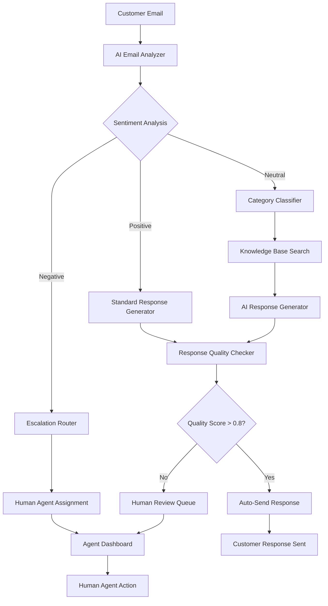

# L2.C4 AI in Processes

## Navigation
**Course**: [[../../index|Course Home]] > [[../../Level2_index|Level 2]] > Chapter 4  
**Previous**: [[L2_C3_reading|Chapter 3: Databases & Entities]]  
**Next**: [[../../Level3_index|Level 3: Strategy & Change]]

---

## Learning Objectives
- Integrate Large Language Models (LLMs) into business process automation workflows
- Design prompt engineering strategies that produce consistent, business-appropriate outputs
- Implement retrieval-augmented generation (RAG) systems for knowledge-based process automation
- Evaluate AI automation opportunities using cost-benefit analysis and risk assessment frameworks
- Build AI-enhanced workflows that maintain human oversight and quality control mechanisms

## Real-World Scenario

David Park, customer success manager at Northwest Legal Services, a 25-attorney firm handling 450+ cases annually, faced a mounting crisis. Client intake interviews generated 15-20 pages of notes per case, but attorneys needed structured summaries within 24 hours to make informed decisions about case acceptance. The manual summarization process consumed 3-4 hours per case and created a bottleneck that delayed client responses and frustrated potential clients.

Traditional automation couldn't solve this challenge—the intake notes contained unstructured narrative text, emotional context, and complex legal considerations that required human-level comprehension. David had tried document templates and standardized forms, but they missed crucial nuances that experienced attorneys captured during conversations.

David's breakthrough came when he discovered that modern AI could read, understand, and summarize legal intake notes with 90%+ accuracy when properly prompted. Using OpenAI's GPT-4 API integrated with their case management system, David built an automated workflow that:

1. **Extracted** key information from narrative intake notes
2. **Categorized** cases by practice area and complexity  
3. **Identified** potential conflicts of interest automatically
4. **Generated** structured summaries following firm templates
5. **Flagged** cases requiring immediate attorney review

The AI system reduced summarization time from 3 hours to 15 minutes while maintaining quality standards. More importantly, it enabled consistent analysis regardless of which paralegal conducted the intake interview. However, David learned that successful AI implementation required careful prompt engineering, robust error handling, and clear human oversight protocols.

The key insight: AI doesn't replace human judgment in complex processes—it augments human capabilities by handling routine analysis and ensuring nothing important gets overlooked. David's success came from understanding AI's strengths (pattern recognition, consistent analysis) and limitations (lack of contextual judgment, potential for hallucination).

## Core Theory

### Understanding AI in Business Process Context

Artificial Intelligence in business processes serves as an intelligent layer that can read, analyze, and generate content at human-like quality levels. Modern Large Language Models (LLMs) excel at understanding context, following instructions, and producing structured outputs from unstructured inputs.

**AI Process Enhancement Patterns**:
- **Content Analysis**: Extract insights from documents, emails, and conversations
- **Decision Support**: Provide recommendations based on data analysis and business rules
- **Content Generation**: Create documents, emails, and reports following templates and guidelines
- **Data Transformation**: Convert unstructured data into structured formats for further processing
- **Quality Assurance**: Review outputs for completeness, accuracy, and compliance requirements

### Prompt Engineering for Business Applications

Effective prompt engineering ensures AI systems produce consistent, accurate, and business-appropriate outputs. This involves crafting instructions that guide AI behavior while incorporating business context and quality standards.

#### Prompt Structure Framework

**1. Role Definition**:
```
You are an experienced [job title] at a [company type] with expertise in [domain area].
```

**2. Context Setting**:
```
You are analyzing [data type] from [source] to [business objective].
The analysis will be used by [stakeholders] to make decisions about [business process].
```

**3. Task Specification**:
```
Your task is to [specific action] by:
- [step 1 with criteria]
- [step 2 with criteria]  
- [step 3 with criteria]
```

**4. Output Format**:
```
Format your response as:
## [Section 1]
- [specific format requirements]

## [Section 2]  
- [specific format requirements]
```

**5. Quality Guidelines**:
```
Ensure your analysis:
- Follows [company standards/regulations]
- Maintains [tone/style requirements]
- Includes [mandatory elements]
- Excludes [prohibited content]
```

#### Business-Focused Prompt Examples

**Customer Service Email Response**:
```
You are a professional customer service representative at TechFlow Solutions, 
an IT services company serving small businesses.

Analyze this customer email and draft a response that:
- Acknowledges their concern professionally
- Provides a clear next step or solution
- Maintains our helpful, expert tone
- Includes relevant service information if applicable

Customer Email: [EMAIL_CONTENT]

Format your response as:
SUBJECT: [Professional subject line]
BODY: [Professional email response]
INTERNAL_NOTES: [Any follow-up actions needed]
```

**Contract Analysis**:
```
You are a legal analyst reviewing service agreements for compliance issues.

Review this contract section and identify:
- Any terms that deviate from our standard language
- Potential liability concerns
- Missing standard protections
- Recommended modifications

Contract Section: [CONTRACT_TEXT]

Format as:
## Compliance Review
- Standard/Non-standard: [assessment]
- Risk Level: [Low/Medium/High]

## Issues Identified
1. [Issue with explanation]
2. [Issue with explanation]

## Recommendations
1. [Specific change with rationale]
2. [Specific change with rationale]
```

### Retrieval-Augmented Generation (RAG) Systems

RAG systems combine AI language models with specific knowledge bases, enabling AI to provide accurate information about company policies, procedures, and domain expertise.

#### RAG Architecture Components

**Knowledge Base Preparation**:
1. **Document Collection**: Gather policies, procedures, FAQs, and domain knowledge
2. **Text Chunking**: Break documents into searchable segments (500-1500 characters)
3. **Vector Embedding**: Convert text into numerical representations for similarity search
4. **Index Creation**: Build searchable database of embedded content

**Query Processing**:
1. **Intent Analysis**: Understand what information the user needs
2. **Similarity Search**: Find relevant knowledge base content
3. **Context Assembly**: Combine retrieved information with user query
4. **Response Generation**: Use AI to create answer based on retrieved context

**Quality Assurance**:
1. **Source Citation**: Include references to original documents
2. **Confidence Scoring**: Indicate certainty level of responses
3. **Fallback Handling**: Graceful responses when information isn't available
4. **Human Escalation**: Route complex queries to subject matter experts

#### RAG Implementation Example

**Knowledge Base Structure**:
```
documents/
├── hr_policies/
│   ├── employee_handbook.pdf
│   ├── benefits_guide.pdf
│   └── time_off_policy.pdf
├── it_procedures/
│   ├── system_access.md
│   ├── security_protocols.md
│   └── software_requests.md
└── client_documentation/
    ├── service_agreements.pdf
    ├── pricing_guide.pdf
    └── escalation_procedures.md
```

**Query Processing Workflow**:
```python
def process_rag_query(user_question, knowledge_base):
    # 1. Embed the user question
    question_embedding = embed_text(user_question)
    
    # 2. Find relevant knowledge base entries
    relevant_docs = similarity_search(question_embedding, knowledge_base, top_k=3)
    
    # 3. Construct context-aware prompt
    context = "\n".join([doc.content for doc in relevant_docs])
    prompt = f"""
    Based on the following company documentation, answer the user's question:
    
    Documentation:
    {context}
    
    Question: {user_question}
    
    Provide an accurate answer based only on the documentation provided.
    If the documentation doesn't contain sufficient information, 
    state that clearly and recommend contacting [appropriate department].
    
    Include source references for any specific policies or procedures mentioned.
    """
    
    # 4. Generate response with citations
    response = llm.generate(prompt)
    return response, relevant_docs
```

### AI Integration Patterns for SME Processes

#### Document Processing Automation

**Use Cases**:
- Invoice data extraction from PDF/email attachments
- Contract review for standard clause compliance
- Customer feedback analysis and categorization
- Legal document summarization and indexing

**Implementation Pattern**:
```
Document Input → AI Analysis → Structured Data → Workflow Action
```

**Example: Invoice Processing**:
```
PDF Invoice → Extract (Amount, Date, Vendor, Line Items) → Validate Against PO → Auto-Approve or Flag for Review
```

#### Customer Communication Enhancement

**Use Cases**:
- Draft responses to common customer inquiries
- Escalation routing based on sentiment and complexity
- Follow-up email generation for service appointments
- Knowledge base article suggestions for support agents

**Implementation Pattern**:
```
Customer Message → AI Analysis → Response Draft → Human Review → Send/Approve
```

#### Decision Support Systems

**Use Cases**:
- Lead scoring and qualification recommendations
- Risk assessment for credit/service applications
- Pricing optimization suggestions
- Resource allocation recommendations

**Implementation Pattern**:
```
Business Data → AI Analysis → Recommendation + Confidence Score → Human Decision
```

### Cost-Benefit Analysis for AI Implementation

#### Cost Components

**Development Costs**:
- AI model API usage fees ($0.01-0.10 per 1K tokens)
- Integration development time (40-120 hours)
- Training data preparation and prompt engineering
- Testing and quality assurance procedures

**Operational Costs**:
- Monthly API usage fees (volume-dependent)
- Monitoring and maintenance effort
- Human oversight and quality control
- Error correction and system improvements

**Example Cost Calculation**:
```
AI-Enhanced Customer Service (500 emails/month):
- API costs: 500 emails × 2K tokens × $0.02 = $20/month
- Development: 60 hours × $125/hour = $7,500 one-time
- Monthly maintenance: 4 hours × $125/hour = $500/month
- Total Year 1: $7,500 + ($20 + $500) × 12 = $13,740
```

#### Benefit Quantification

**Time Savings**:
- Process acceleration (3 hours → 15 minutes)
- Error reduction (manual mistakes eliminated)
- Consistency improvement (standardized quality)
- Scalability enhancement (handle volume increases)

**Quality Improvements**:
- More comprehensive analysis (AI doesn't miss details)
- Consistent application of business rules
- 24/7 availability for processing
- Reduced human cognitive load

**ROI Calculation Example**:
```
Manual Process: 500 emails × 30 minutes × $55/hour = $13,750/month
AI-Enhanced: 500 emails × 5 minutes × $55/hour = $2,292/month
Monthly Savings: $11,458
Annual Savings: $137,496
ROI: ($137,496 - $13,740) / $13,740 = 900%
```

### Risk Assessment and Mitigation

#### Common AI Implementation Risks

**Accuracy Risks**:
- **Hallucination**: AI generates plausible but incorrect information
- **Context Misunderstanding**: AI misinterprets business context or requirements
- **Bias Amplification**: AI perpetuates or amplifies existing business biases

**Operational Risks**:
- **Over-Dependence**: Business processes become too reliant on AI systems
- **Quality Degradation**: Gradual decline in output quality without monitoring
- **Security Concerns**: AI systems accessing sensitive business data

**Compliance Risks**:
- **Regulatory Violations**: AI decisions that violate industry regulations
- **Audit Trail Issues**: Difficulty explaining AI decision-making process
- **Data Privacy**: AI processing of personally identifiable information

#### Risk Mitigation Strategies

**Technical Safeguards**:
```python
def ai_response_with_safeguards(prompt, business_context):
    # 1. Input validation
    if not validate_input(prompt):
        return "Error: Invalid input format"
    
    # 2. Generate response with confidence scoring
    response, confidence = llm.generate_with_confidence(prompt)
    
    # 3. Apply business rule validation
    if not passes_business_rules(response, business_context):
        return "Requires human review: Business rule validation failed"
    
    # 4. Confidence threshold check
    if confidence < 0.8:
        return f"Low confidence ({confidence}): {response}\n[HUMAN REVIEW REQUIRED]"
    
    # 5. Log for audit trail
    log_ai_decision(prompt, response, confidence, business_context)
    
    return response
```

**Process Controls**:
- **Human-in-the-Loop**: Critical decisions require human approval
- **Staged Rollout**: Implement AI gradually across process areas
- **Regular Auditing**: Review AI outputs for quality and bias
- **Fallback Procedures**: Manual processes available when AI fails

**Monitoring and Quality Assurance**:
- **Output Sampling**: Regular review of AI-generated content
- **Performance Metrics**: Track accuracy, speed, and user satisfaction
- **Error Pattern Analysis**: Identify and correct systematic issues
- **Continuous Improvement**: Regular prompt refinement and model updates

## Tool Demonstration

### Building an AI-Enhanced Customer Support Workflow

Let's implement a complete AI-powered customer support system that demonstrates practical AI integration principles.

#### System Architecture



#### Implementation Components

**1. Email Analysis and Classification**:
```python
def analyze_customer_email(email_content):
    analysis_prompt = """
    You are a customer service analyst. Analyze this email and provide:
    
    Email: {email_content}
    
    Analysis Format:
    SENTIMENT: [Positive/Negative/Neutral]
    URGENCY: [Low/Medium/High/Critical]  
    CATEGORY: [Technical Support/Billing/Sales/General Inquiry]
    KEY_ISSUES: [List main concerns]
    CUSTOMER_TYPE: [New/Existing/VIP]
    SUGGESTED_PRIORITY: [1-5 scale]
    
    Base your analysis only on the email content provided.
    """
    
    response = openai.chat.completions.create(
        model="gpt-4",
        messages=[{"role": "user", "content": analysis_prompt.format(email_content=email_content)}],
        temperature=0.1  # Low temperature for consistent analysis
    )
    
    return parse_analysis_response(response.choices[0].message.content)

def parse_analysis_response(response_text):
    # Extract structured data from AI response
    lines = response_text.strip().split('\n')
    analysis = {}
    
    for line in lines:
        if ':' in line:
            key, value = line.split(':', 1)
            analysis[key.strip()] = value.strip()
    
    return analysis
```

**2. Knowledge Base RAG System**:
```python
class CustomerSupportRAG:
    def __init__(self, knowledge_base_path):
        self.documents = self.load_knowledge_base(knowledge_base_path)
        self.embeddings = self.create_embeddings()
    
    def search_knowledge_base(self, query, top_k=3):
        query_embedding = self.embed_text(query)
        similarities = cosine_similarity([query_embedding], self.embeddings)[0]
        
        # Get top matching documents
        top_indices = similarities.argsort()[-top_k:][::-1]
        relevant_docs = [self.documents[i] for i in top_indices]
        
        return relevant_docs
    
    def generate_response(self, customer_email, customer_analysis):
        # Search for relevant information
        relevant_docs = self.search_knowledge_base(customer_email)
        
        context = "\n".join([doc['content'] for doc in relevant_docs])
        
        response_prompt = f"""
        You are a professional customer service representative at TechFlow Solutions.
        
        Customer Email Analysis:
        - Sentiment: {customer_analysis['SENTIMENT']}
        - Category: {customer_analysis['CATEGORY']}
        - Key Issues: {customer_analysis['KEY_ISSUES']}
        
        Relevant Company Information:
        {context}
        
        Customer Email:
        {customer_email}
        
        Generate a professional response that:
        - Addresses each concern mentioned
        - Uses information from company documentation
        - Maintains appropriate tone for the sentiment level
        - Includes next steps or resolution timeline
        - Follows company communication standards
        
        Format as a professional email response.
        """
        
        response = openai.chat.completions.create(
            model="gpt-4",
            messages=[{"role": "user", "content": response_prompt}],
            temperature=0.3
        )
        
        return response.choices[0].message.content, relevant_docs
```

**3. Quality Assurance and Human Oversight**:
```python
def quality_check_response(ai_response, customer_email, business_rules):
    quality_prompt = f"""
    You are a quality assurance supervisor reviewing a customer service response.
    
    Customer Email: {customer_email}
    
    AI Generated Response: {ai_response}
    
    Evaluate this response on a scale of 0-10 for:
    - ACCURACY: Does it correctly address customer concerns?
    - PROFESSIONALISM: Is the tone appropriate and professional?
    - COMPLETENESS: Are all customer questions answered?
    - COMPLIANCE: Does it follow company policies?
    
    Format:
    ACCURACY: [score]/10
    PROFESSIONALISM: [score]/10  
    COMPLETENESS: [score]/10
    COMPLIANCE: [score]/10
    OVERALL_SCORE: [average]/10
    
    ISSUES: [List any problems found]
    RECOMMENDATIONS: [Suggest improvements if score < 8]
    """
    
    quality_response = openai.chat.completions.create(
        model="gpt-4",
        messages=[{"role": "user", "content": quality_prompt}],
        temperature=0.1
    )
    
    quality_data = parse_quality_response(quality_response.choices[0].message.content)
    
    # Business rule validation
    if contains_restricted_content(ai_response, business_rules):
        quality_data['COMPLIANCE'] = 0
        quality_data['ISSUES'].append("Contains restricted content")
    
    return quality_data

def should_require_human_review(quality_data, customer_analysis):
    # Require human review if:
    return (
        quality_data['OVERALL_SCORE'] < 8.0 or
        customer_analysis['SENTIMENT'] == 'Negative' or
        customer_analysis['URGENCY'] in ['High', 'Critical'] or
        'VIP' in customer_analysis.get('CUSTOMER_TYPE', '')
    )
```

#### Integration with Existing Workflows

**Zapier Integration Example**:
```python
# Webhook endpoint for Zapier integration
@app.route('/api/analyze-email', methods=['POST'])
def analyze_email_endpoint():
    email_data = request.json
    
    # Extract email content
    email_content = email_data.get('body', '')
    customer_email = email_data.get('from', '')
    
    # AI analysis
    analysis = analyze_customer_email(email_content)
    
    # Generate response if appropriate
    if analysis['URGENCY'] not in ['High', 'Critical']:
        ai_response, sources = rag_system.generate_response(email_content, analysis)
        quality = quality_check_response(ai_response, email_content, business_rules)
        
        if not should_require_human_review(quality, analysis):
            # Auto-send response via Zapier
            return {
                'action': 'send_response',
                'response': ai_response,
                'confidence': quality['OVERALL_SCORE']
            }
    
    # Route to human agent
    return {
        'action': 'human_review',
        'analysis': analysis,
        'priority': analysis['SUGGESTED_PRIORITY']
    }
```

## Mini Project

Design and implement an AI-enhanced process automation solution that addresses a specific business challenge while maintaining appropriate human oversight and quality controls.

### Project Scenario Selection

Choose one of these scenarios based on your industry interest:

#### Scenario A: Legal Document Review
**Company**: Regional law firm with 15 attorneys
**Challenge**: Contract review takes 2-3 hours per document, creating bottlenecks
**AI Application**: Automated clause analysis, risk identification, and compliance checking
**Human Oversight**: Attorney approval for all flagged issues

#### Scenario B: Real Estate Lead Qualification  
**Company**: Real estate brokerage with 25 agents
**Challenge**: Lead qualification takes 45 minutes per inquiry, many leads go cold
**AI Application**: Automated lead scoring, qualification, and routing to appropriate agents
**Human Oversight**: Agent verification before first client contact

#### Scenario C: Medical Practice Insurance Authorization
**Company**: Multi-specialty medical practice with 8 providers
**Challenge**: Insurance pre-authorization requests take 30-60 minutes each
**AI Application**: Automated form completion, medical code verification, and submission tracking
**Human Oversight**: Provider approval for all clinical decisions

### Implementation Requirements

Your AI-enhanced solution must include:

#### 1. Process Analysis and Design (25% of grade)
- Current state process mapping with pain points identified
- AI integration points with clear human handoff procedures
- Error handling and fallback mechanisms
- Success metrics and monitoring procedures

#### 2. AI Implementation (35% of grade)
- Prompt engineering for specific business context
- Quality assurance mechanisms with confidence scoring
- Integration with existing workflow tools (Zapier/Make/n8n)
- Database design for AI-generated data storage

#### 3. Human Oversight Framework (25% of grade)
- Clear escalation criteria and procedures
- Quality control sampling and review processes
- Training materials for human reviewers
- Performance monitoring and improvement protocols

#### 4. Business Case and ROI (15% of grade)
- Cost-benefit analysis with realistic assumptions
- Risk assessment and mitigation strategies
- Implementation timeline with milestones
- Success metrics and measurement procedures

### Deliverable Specifications

Create a comprehensive AI automation package including:

**Technical Documentation**:
- Complete prompt templates with examples
- API integration specifications
- Database schema for AI-enhanced data
- Error handling and monitoring procedures

**Business Documentation**:
- Process workflow diagrams (current vs. future state)
- ROI calculations with sensitivity analysis
- Risk register with mitigation strategies
- Training and adoption plan

**Implementation Guide**:
- Step-by-step setup instructions
- Testing procedures and validation criteria
- Rollback procedures for system failures
- Maintenance and optimization guidelines

`<QUIZ_LINK will be replaced by generated HTML file>`

---

## Chapter Links
- 🧠 **Quiz**: [[L2_C4_quiz.html|Take the AI in Processes Quiz]]
- 🎯 **Project**: [[L2_C4_project|Project Assignment]]  
- ✅ **Solutions**: [[L2_C4_solutions|Solutions Guide]]

## Navigation
**Previous**: [[L2_C3_reading|Chapter 3: Databases & Entities]]  
**Next**: [[../../Level3_index|Level 3: Strategy & Change]]  
**Up**: [[../../Level2_index|Level 2 Index]]