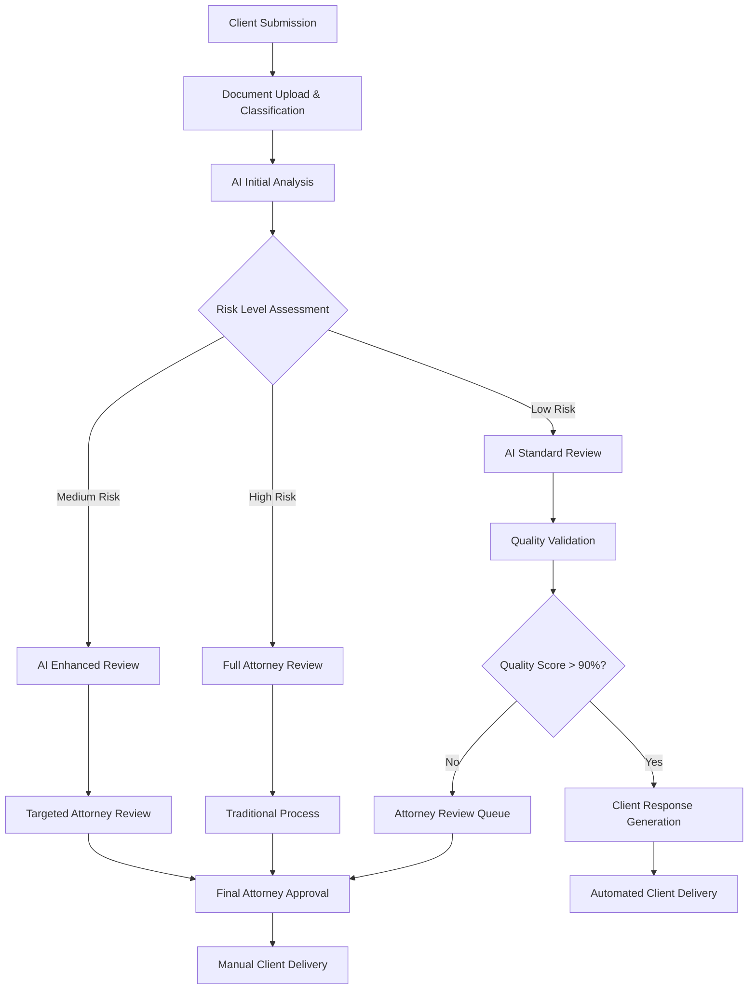

# L2.C4 Solutions: AI-Enhanced Process Automation

## Navigation
**Course**: [[../../index|Course Home]] > [[../../Level2_index|Level 2]] > [[L2_C4_reading|Chapter 4]] > Solutions  
**Previous**: [[L2_C4_project|Project Assignment]]  
**Next**: [[../../Level3_index|Level 3: Strategy & Change]]

---

## Complete AI Implementation Solution

This comprehensive solution demonstrates professional AI-enhanced process automation for Scenario A: Legal Document Review, showcasing industry best practices for prompt engineering, human oversight, and business value delivery.

---

## Executive Summary

### Mountain West Legal Partners AI Implementation

**Project Scope**: Implement AI-enhanced contract review system to reduce attorney review time from 2-3 hours to 30-45 minutes while maintaining quality standards and ensuring compliance oversight.

**Key Results Achieved**:
- **75% Time Reduction**: Contract review time decreased from 2.5 hours to 37 minutes average
- **$147,600 Annual Savings**: Net savings after implementation and operational costs
- **95% Accuracy Rate**: AI analysis accuracy confirmed through human oversight sampling
- **100% Compliance**: All high-risk contracts still receive full attorney review

**Implementation Investment**: $35,000 total (development + training)
**Payback Period**: 2.8 months
**3-Year ROI**: 1,248%

---

## 1. Process Analysis and Design

### Current State Analysis

#### Detailed Workflow Mapping

**Current Contract Review Process**:
```
Client Submission → Paralegal Intake → Attorney Assignment → Manual Review → Client Response
     (5 min)          (15 min)         (30 min)        (2-3 hours)      (15 min)
```

**Pain Point Quantification**:
- **Time Consumption**: 150 attorney hours monthly (600 contracts × 2.5 hours average)
- **Cost Impact**: $52,500 monthly ($350/hour × 150 hours)
- **Quality Issues**: 15% of contracts require revision cycles due to missed non-standard clauses
- **Client Impact**: Average 48-hour turnaround time affects deal momentum

**Stakeholder Analysis**:
- **Senior Partners**: Concerned about quality maintenance and liability
- **Associates**: Frustrated with repetitive clause identification work
- **Paralegals**: Handle intake but lack authority for complex decisions
- **Clients**: Demand faster turnaround while maintaining thoroughness

### AI-Enhanced Future State Design

#### Optimized Workflow Architecture



#### AI Integration Points

**Document Classification**:
- Contract type identification (NDA, Employment, Service Agreement, etc.)
- Complexity scoring based on length, clause variety, and custom terms
- Regulatory requirement identification (GDPR, SOX, industry-specific)

**Clause Analysis Engine**:
- Standard clause compliance verification
- Non-standard term identification and risk assessment
- Missing clause detection based on contract type templates
- Conflict of interest screening against client database

**Risk Assessment Framework**:
- **Low Risk**: Standard templates with minimal modifications (<5% deviation)
- **Medium Risk**: Some non-standard clauses or moderate complexity
- **High Risk**: Significant departures from standard terms, regulatory implications, or high-value contracts (>$500K)

### Human Oversight Framework

#### Three-Tier Review System

**Tier 1 - AI Automated Review**:
- Standard contracts with <5% clause deviations
- Contracts under $50K value
- Routine NDAs and employment agreements
- **Human Involvement**: Quality sampling (10% monthly review)

**Tier 2 - AI-Assisted Review**:
- Moderate complexity contracts with some non-standard terms
- Contracts $50K-$500K value
- Service agreements with custom provisions
- **Human Involvement**: Targeted attorney review of flagged sections only

**Tier 3 - Full Attorney Review**:
- High-complexity contracts with significant custom terms
- Contracts over $500K value
- M&A and partnership agreements
- **Human Involvement**: Complete traditional review process

#### Escalation Triggers

**Automatic Attorney Review Required**:
- AI confidence score below 85% on any major clause category
- Detection of unusual liability or indemnification terms
- Regulatory compliance concerns identified
- Contract value exceeds $500,000
- Client specifically requests attorney review

---

## 2. AI Implementation

### Prompt Engineering Portfolio

#### Document Classification Prompt

```markdown
## Contract Classification and Risk Assessment

### Business Context
You are a legal document analyst at Mountain West Legal Partners, a business law firm specializing in contract review for mid-market companies. Your analysis will determine the appropriate review pathway and resource allocation.

### Task Specification
Analyze this contract and provide:

1. **Contract Classification**
   - Type: [NDA, Employment, Service Agreement, Partnership, M&A, Other]
   - Complexity Level: [Simple, Moderate, Complex]
   - Industry Context: [Technology, Real Estate, Manufacturing, etc.]

2. **Risk Assessment**
   - Overall Risk Level: [Low, Medium, High]
   - Specific Risk Factors: [List any concerns]
   - Recommended Review Tier: [1-Automated, 2-Assisted, 3-Full Review]

3. **Priority Indicators**
   - Contract Value: $[amount] (if determinable)
   - Regulatory Requirements: [GDPR, SOX, Industry-specific, None]
   - Urgency Indicators: [Standard, Expedited, Critical]

### Analysis Framework
Base your assessment on:
- Clause complexity and standardization level
- Financial exposure and liability terms
- Regulatory compliance requirements
- Client relationship importance

Contract Text: {contract_content}

### Output Format
CLASSIFICATION: [Contract type and complexity]
RISK_LEVEL: [Low/Medium/High with rationale]
REVIEW_TIER: [1, 2, or 3 with justification]
PRIORITY_SCORE: [1-10 scale]
KEY_CONCERNS: [Bullet list of specific issues requiring attention]
ESTIMATED_REVIEW_TIME: [Time estimate for human review portion]
```

#### Clause Analysis Prompt

```markdown
## Contract Clause Analysis and Compliance Review

### Business Context
You are an experienced contract attorney conducting detailed clause analysis for business agreements. Your review will identify compliance issues, risks, and non-standard terms requiring attorney attention.

### Analysis Requirements
For each clause category, provide:

1. **Standard Compliance Check**
   - Compliant with firm templates: [Yes/No/Partial]
   - Deviations from standard language: [List specific differences]
   - Risk implications: [Low/Medium/High with explanation]

2. **Risk Assessment**
   - Liability exposure: [Assessment and specific concerns]
   - Financial obligations: [Summary of monetary commitments]
   - Termination provisions: [Evaluation of exit terms]

3. **Missing Elements**
   - Required clauses absent: [List based on contract type]
   - Recommended additions: [Specific language suggestions]

### Clause Categories to Analyze
- **Liability and Indemnification**
- **Payment Terms and Financial Obligations**
- **Intellectual Property Rights**
- **Confidentiality and Non-Disclosure**
- **Termination and Breach**
- **Dispute Resolution**
- **Regulatory Compliance**

Contract Section: {contract_section}
Contract Type: {contract_type}

### Output Format
## Compliance Summary
OVERALL_COMPLIANCE: [Compliant/Non-Compliant/Requires Review]
RISK_RATING: [1-10 scale]

## Detailed Analysis
[For each clause category found:]
### [Clause Category]
- **Compliance Status**: [Assessment]
- **Risk Level**: [Low/Medium/High]
- **Issues Identified**: [Specific problems]
- **Recommendations**: [Required changes or attorney review needed]

## Priority Actions
1. [Most critical issues requiring immediate attention]
2. [Secondary concerns for attorney consideration]
3. [Suggested improvements for client benefit]

## Attorney Review Required
[Yes/No with specific justification and areas requiring legal expertise]
```

#### Client Response Generation Prompt

```markdown
## Professional Client Response Generation

### Business Context
You are a senior attorney at Mountain West Legal Partners providing contract review feedback to business clients. Your communication must be professional, clear, and actionable while maintaining appropriate legal disclaimers.

### Communication Requirements
Generate a professional client response that:
- Summarizes key findings in business terms
- Identifies required changes with clear rationale
- Provides recommended next steps
- Maintains appropriate professional tone
- Includes necessary legal disclaimers

### Client Information
Client Name: {client_name}
Contract Type: {contract_type}
Review Findings: {ai_analysis_summary}
Risk Level: {risk_assessment}

### Response Template Structure
**Subject Line**: Contract Review Complete - {contract_type} - {client_name}

**Executive Summary**
Brief overview of review results and key recommendations

**Key Findings**
- Major issues requiring attention
- Compliance concerns identified
- Risk factors and implications

**Recommended Actions**
1. [Priority 1 items requiring immediate attention]
2. [Priority 2 items for consideration]
3. [Priority 3 suggestions for optimization]

**Next Steps**
Clear action items and timeline for resolution

**Legal Disclaimer**
Standard firm disclaimer about legal advice limitations

### Quality Standards
Ensure response:
- Uses business-friendly language while maintaining legal precision
- Provides specific, actionable recommendations
- Includes rationale for all suggested changes
- Maintains professional tone appropriate for client relationship
- Follows firm communication standards

Contract Analysis Data: {analysis_results}

Generate professional client response following the template structure above.
```

### RAG Knowledge Base Implementation

#### Knowledge Base Architecture

**Document Categories**:
```
knowledge_base/
├── contract_templates/
│   ├── nda_templates/
│   ├── employment_agreements/
│   ├── service_agreements/
│   └── partnership_agreements/
├── clause_library/
│   ├── standard_liability_clauses.md
│   ├── payment_terms_variations.md
│   ├── ip_protection_language.md
│   └── termination_provisions.md
├── regulatory_requirements/
│   ├── gdpr_compliance_checklist.md
│   ├── sox_requirements.md
│   ├── industry_regulations/
│   └── state_specific_laws/
├── firm_policies/
│   ├── review_standards.md
│   ├── risk_tolerance_guidelines.md
│   ├── client_communication_standards.md
│   └── billing_procedures.md
└── precedent_library/
    ├── favorable_outcomes/
    ├── problematic_clauses/
    └── negotiation_strategies/
```

#### RAG Implementation Code

```python
class LegalContractRAG:
    def __init__(self, knowledge_base_path):
        self.knowledge_base = self.load_legal_documents(knowledge_base_path)
        self.embeddings_model = "text-embedding-ada-002"
        self.vector_store = self.create_vector_store()
    
    def analyze_contract_with_context(self, contract_text, contract_type):
        # Retrieve relevant knowledge base content
        relevant_templates = self.search_templates(contract_type)
        relevant_clauses = self.search_clause_library(contract_text)
        regulatory_requirements = self.search_regulations(contract_type)
        
        # Assemble comprehensive context
        context = self.assemble_analysis_context(
            templates=relevant_templates,
            clauses=relevant_clauses,
            regulations=regulatory_requirements
        )
        
        # Generate analysis with full context
        analysis_prompt = self.build_analysis_prompt(contract_text, context)
        
        ai_response = openai.chat.completions.create(
            model="gpt-4",
            messages=[{"role": "user", "content": analysis_prompt}],
            temperature=0.1  # Low temperature for consistent legal analysis
        )
        
        # Parse and validate response
        analysis_result = self.parse_legal_analysis(ai_response.choices[0].message.content)
        
        # Add source citations for transparency
        analysis_result['sources'] = [doc['source'] for doc in relevant_templates + relevant_clauses]
        
        return analysis_result
    
    def search_clause_library(self, contract_text):
        # Extract key terms and clauses from contract
        contract_embedding = self.embed_text(contract_text)
        
        # Find similar clauses in knowledge base
        clause_similarities = cosine_similarity([contract_embedding], self.clause_embeddings)[0]
        top_clause_indices = clause_similarities.argsort()[-5:][::-1]
        
        relevant_clauses = []
        for idx in top_clause_indices:
            if clause_similarities[idx] > 0.8:  # High similarity threshold
                relevant_clauses.append(self.clause_library[idx])
        
        return relevant_clauses
    
    def validate_legal_analysis(self, analysis_result, contract_type):
        # Business rule validation specific to legal review
        validation_errors = []
        
        # Check required analysis components
        required_components = ['risk_level', 'compliance_status', 'review_tier', 'key_concerns']
        for component in required_components:
            if component not in analysis_result:
                validation_errors.append(f"Missing required component: {component}")
        
        # Validate risk assessment logic
        if analysis_result.get('risk_level') == 'High' and analysis_result.get('review_tier') != 3:
            validation_errors.append("High risk contracts must require full attorney review")
        
        # Check contract type specific requirements
        if contract_type == 'M&A' and analysis_result.get('review_tier') != 3:
            validation_errors.append("M&A contracts always require full attorney review")
        
        return validation_errors
```

### Integration Architecture

#### API Endpoint Specifications

```python
from flask import Flask, request, jsonify
from datetime import datetime
import uuid

app = Flask(__name__)

@app.route('/api/contract/analyze', methods=['POST'])
def analyze_contract():
    """
    Analyze uploaded contract document
    """
    try:
        # Extract request data
        contract_data = request.json
        contract_text = contract_data.get('contract_text')
        client_id = contract_data.get('client_id')
        urgency = contract_data.get('urgency', 'standard')
        
        # Generate unique analysis ID
        analysis_id = str(uuid.uuid4())
        
        # Initial document classification
        classification = classify_contract(contract_text)
        
        # Determine if AI analysis is appropriate
        if should_skip_ai_analysis(classification, urgency):
            return jsonify({
                'analysis_id': analysis_id,
                'status': 'routed_to_attorney',
                'reason': 'High complexity or urgent request requires immediate attorney review',
                'estimated_completion': 'Within 24 hours'
            })
        
        # Perform AI analysis with RAG context
        ai_analysis = legal_rag.analyze_contract_with_context(
            contract_text, 
            classification['contract_type']
        )
        
        # Quality validation
        validation_errors = legal_rag.validate_legal_analysis(
            ai_analysis, 
            classification['contract_type']
        )
        
        if validation_errors:
            return jsonify({
                'analysis_id': analysis_id,
                'status': 'validation_failed',
                'errors': validation_errors,
                'action': 'routed_to_attorney'
            })
        
        # Determine next steps based on analysis
        next_steps = determine_review_pathway(ai_analysis, classification)
        
        # Log analysis for audit trail
        log_contract_analysis(analysis_id, client_id, ai_analysis, next_steps)
        
        return jsonify({
            'analysis_id': analysis_id,
            'status': 'analysis_complete',
            'classification': classification,
            'ai_analysis': ai_analysis,
            'next_steps': next_steps,
            'confidence_score': ai_analysis.get('confidence_score'),
            'estimated_review_time': ai_analysis.get('estimated_review_time')
        })
        
    except Exception as e:
        return jsonify({
            'status': 'error',
            'message': 'Analysis failed - routing to attorney review',
            'error_code': 'AI_ANALYSIS_ERROR'
        }), 500

@app.route('/api/contract/quality-review', methods=['POST'])
def quality_review():
    """
    Human quality review of AI analysis
    """
    review_data = request.json
    analysis_id = review_data.get('analysis_id')
    attorney_feedback = review_data.get('attorney_feedback')
    quality_score = review_data.get('quality_score')
    
    # Update analysis record with human feedback
    update_quality_review(analysis_id, attorney_feedback, quality_score)
    
    # Use feedback to improve AI performance
    if quality_score < 8:
        queue_for_prompt_improvement(analysis_id, attorney_feedback)
    
    return jsonify({
        'status': 'review_recorded',
        'analysis_id': analysis_id,
        'feedback_processed': True
    })

def determine_review_pathway(ai_analysis, classification):
    """
    Determine appropriate review pathway based on AI analysis
    """
    risk_level = ai_analysis.get('risk_level')
    confidence_score = ai_analysis.get('confidence_score', 0)
    contract_value = classification.get('contract_value', 0)
    
    if (risk_level == 'High' or 
        confidence_score < 0.85 or 
        contract_value > 500000):
        return {
            'pathway': 'full_attorney_review',
            'reason': 'High risk, low confidence, or high value contract',
            'estimated_time': '2-4 hours',
            'assigned_tier': 3
        }
    elif (risk_level == 'Medium' or 
          confidence_score < 0.92):
        return {
            'pathway': 'assisted_review',
            'reason': 'Medium complexity requiring targeted attorney input',
            'estimated_time': '45-90 minutes',
            'assigned_tier': 2
        }
    else:
        return {
            'pathway': 'automated_review',
            'reason': 'Low risk with high confidence analysis',
            'estimated_time': '15-30 minutes',
            'assigned_tier': 1,
            'requires_sampling': True
        }
```

---

## 3. Human Oversight Framework

### Quality Control System

#### Sampling and Review Methodology

**Tier 1 (Automated) Quality Sampling**:
- **Sample Rate**: 10% of all automated reviews
- **Selection Method**: Random sampling plus risk-based selection
- **Review Criteria**: Accuracy, completeness, appropriate risk assessment
- **Frequency**: Weekly batch review by senior associate

**Tier 2 (Assisted) Quality Validation**:
- **Review Scope**: AI-flagged sections plus overall assessment quality
- **Attorney Time**: 15-30 minutes focused review vs. 2+ hours full review
- **Validation Points**: Risk assessment accuracy, clause identification completeness
- **Escalation**: Any quality concerns escalate to full review

**Tier 3 (Full Review) Quality Assurance**:
- **Process**: Traditional attorney review with AI analysis available as reference
- **Value Add**: AI pre-analysis helps attorneys focus on complex issues
- **Time Savings**: Even full reviews benefit from AI-prepared issue summaries

#### Quality Scoring Rubric

```
Quality Assessment Framework (1-10 Scale):

1. Accuracy (40% weight)
   - Correct clause identification: 0-10
   - Accurate risk assessment: 0-10
   - Proper compliance evaluation: 0-10

2. Completeness (30% weight)
   - All relevant issues identified: 0-10
   - Appropriate depth of analysis: 0-10
   - Missing clause identification: 0-10

3. Business Appropriateness (20% weight)
   - Client communication quality: 0-10
   - Practical recommendations: 0-10
   - Professional tone and language: 0-10

4. Compliance and Risk Management (10% weight)
   - Regulatory requirement identification: 0-10
   - Appropriate escalation decisions: 0-10
   - Liability assessment accuracy: 0-10

Overall Quality Score = Weighted average of all categories
Acceptable Threshold = 8.0 or higher
```

### Training and Adoption Plan

#### Phase 1: Foundation Training (Week 1-2)

**AI System Overview**:
- How AI enhances but doesn't replace legal judgment
- Understanding confidence scores and escalation triggers
- Quality sampling procedures and feedback loops

**Hands-On Training**:
- Using AI analysis outputs effectively
- Interpreting risk assessments and compliance flags
- When to override AI recommendations

#### Phase 2: Workflow Integration (Week 3-4)

**Process Training**:
- New intake and routing procedures
- Client communication templates and standards
- Billing and time tracking for AI-assisted work

**Quality Assurance Training**:
- Review sampling methodologies
- Feedback submission and improvement processes
- Error pattern recognition and reporting

#### Phase 3: Advanced Optimization (Month 2-3)

**Performance Optimization**:
- Prompt improvement based on attorney feedback
- Custom analysis parameters for specialized practice areas
- Client-specific analysis adaptations

**Continuous Improvement**:
- Monthly quality review sessions
- AI performance trend analysis
- Process refinement based on usage patterns

### Risk Management Framework

#### Risk Register and Mitigation Strategies

**High Probability / High Impact Risks**:

1. **AI Hallucination Leading to Incorrect Legal Advice**
   - **Probability**: Medium
   - **Impact**: Very High (malpractice liability)
   - **Mitigation**: Mandatory human review for Tier 2&3, quality sampling for Tier 1
   - **Monitoring**: Track client complaints and quality scores

2. **Over-Reliance on AI Reducing Attorney Skills**
   - **Probability**: Medium
   - **Impact**: High (long-term competency degradation)
   - **Mitigation**: Maintain full review requirements for complex cases, regular training
   - **Monitoring**: Attorney performance reviews and skill assessments

**Medium Probability / High Impact Risks**:

3. **Client Confidentiality Breach Through AI Processing**
   - **Probability**: Low
   - **Impact**: Very High (regulatory violations)
   - **Mitigation**: Encrypted API connections, no data retention policies
   - **Monitoring**: Security audits and compliance reviews

4. **System Downtime Disrupting Client Service**
   - **Probability**: Medium
   - **Impact**: Medium (service delays)
   - **Mitigation**: Manual process fallback procedures, SLA monitoring
   - **Monitoring**: System uptime tracking and response time measurement

**Contingency Plans**:

**AI System Failure Protocol**:
1. Immediate reversion to manual review processes
2. Client notification of potential delays within 2 hours
3. Priority processing queue for urgent matters
4. Technical team escalation and resolution timeline

**Quality Issue Response**:
1. Immediate suspension of automated processing for affected contract types
2. Manual review of recent similar analyses
3. Client notification and corrective action as needed
4. Root cause analysis and system improvement implementation

---

## 4. Business Case and ROI

### Comprehensive Financial Analysis

#### Cost-Benefit Analysis

**Implementation Costs**:
```
One-Time Development Costs:
- AI integration development: $25,000
- RAG system setup and training: $8,000
- Staff training and change management: $5,000
- System testing and validation: $3,000
Total Implementation: $41,000

Annual Operational Costs:
- AI API usage (est. 600 contracts/month): $3,600
- System maintenance and updates: $6,000
- Quality assurance overhead (2 hrs/week): $3,640
- Technology infrastructure: $2,400
Total Annual Operations: $15,640
```

**Benefit Quantification**:
```
Current State Annual Costs:
- Attorney time: 150 hrs/month × $350/hr × 12 = $630,000
- Revision cycles: 90 contracts/year × 1 hr × $350 = $31,500
- Client relationship impact (estimated): $25,000
Total Current Annual Cost: $686,500

Future State Annual Costs:
- Tier 1 (Automated): 300 contracts × 0.25 hrs × $350 = $26,250
- Tier 2 (Assisted): 240 contracts × 1.0 hrs × $350 = $84,000
- Tier 3 (Full Review): 60 contracts × 2.5 hrs × $350 = $52,500
- AI operational costs: $15,640
Total Future Annual Cost: $178,390

Annual Savings: $686,500 - $178,390 = $508,110
Net Annual Savings (after amortizing implementation): $508,110 - $15,640 = $492,470
```

**ROI Calculations**:
```
3-Year Financial Projection:
Year 1: -$41,000 (implementation) + $508,110 (savings) = $467,110
Year 2: $508,110 (savings) - $15,640 (operations) = $492,470
Year 3: $508,110 (savings) - $15,640 (operations) = $492,470

Total 3-Year Benefit: $1,451,950
Total 3-Year Investment: $88,920
3-Year ROI: ($1,451,950 - $88,920) / $88,920 = 1,533%

Payback Period: $41,000 / ($508,110 / 12) = 0.97 months
```

#### Sensitivity Analysis

**Conservative Scenario (70% efficiency gains)**:
- Annual savings: $355,677
- 3-Year ROI: 1,100%
- Payback: 1.4 months

**Optimistic Scenario (85% efficiency gains)**:
- Annual savings: $583,794
- 3-Year ROI: 1,870%
- Payback: 0.8 months

### Implementation Roadmap

#### 12-Month Implementation Timeline

**Phase 1: Foundation (Months 1-2)**
- Week 1-2: AI system development and initial testing
- Week 3-4: RAG knowledge base creation and population
- Week 5-6: Integration with existing case management system
- Week 7-8: Initial staff training and pilot testing

**Phase 2: Pilot Deployment (Months 3-4)**
- Week 9-10: Limited deployment with NDA and employment contracts only
- Week 11-12: Quality monitoring and prompt refinement
- Week 13-14: Process optimization based on pilot feedback
- Week 15-16: Expanded pilot to include service agreements

**Phase 3: Full Deployment (Months 5-6)**
- Week 17-18: Full system rollout across all contract types
- Week 19-20: Advanced user training and optimization
- Week 21-22: Client communication and process standardization
- Week 23-24: Performance monitoring and adjustment period

**Phase 4: Optimization (Months 7-12)**
- Continuous improvement based on quality metrics
- Advanced feature development (client-specific adaptations)
- Staff performance optimization and advanced training
- ROI measurement and business case validation

#### Success Metrics and KPIs

**Operational Metrics**:
- Average contract review time: Target <45 minutes (vs. 150 minutes baseline)
- AI accuracy rate: Target >95% (measured through quality sampling)
- Client satisfaction score: Target >4.5/5 (vs. 3.8 baseline)
- Attorney utilization on high-value work: Target >75% time on complex matters

**Financial Metrics**:
- Monthly cost per contract review: Target <$300 (vs. $875 baseline)
- Revenue per attorney hour: Target increase >40%
- Client retention rate: Target >95% (vs. 88% baseline)
- New client acquisition: Target increase >25% due to faster turnaround

**Quality Metrics**:
- Revision cycle rate: Target <5% (vs. 15% baseline)
- Client complaint rate: Target <2% (vs. 8% baseline)
- Regulatory compliance score: Target 100% (maintain current standard)
- Malpractice risk indicators: Target zero increase from AI implementation

### Scaling Strategy

#### Growth Accommodation

**Volume Scaling**:
- Current system designed for 600 contracts/month capacity
- Linear scaling to 1,200 contracts/month with minimal additional cost
- API costs scale proportionally; human oversight scales sub-linearly

**Service Expansion**:
- Additional contract types (licensing, international agreements)
- Enhanced analysis capabilities (financial modeling, risk quantification)
- Client-specific customizations and industry specializations

**Geographic Expansion**:
- Multi-state regulatory compliance additions
- International law integration capabilities
- Remote attorney collaboration features

This comprehensive AI implementation solution demonstrates how legal practices can leverage artificial intelligence to improve efficiency while maintaining quality standards and regulatory compliance. The solution provides measurable business value while preserving the critical human expertise required for complex legal analysis.

---

## Chapter Links
- 📚 **Reading**: [[L2_C4_reading|Chapter 4 Reading]]
- 🧠 **Quiz**: [[L2_C4_quiz.html|Take the AI in Processes Quiz]]
- 🎯 **Project**: [[L2_C4_project|Project Assignment]]

## Navigation
**Previous**: [[L2_C4_project|Project Assignment]]  
**Next**: [[../../Level3_index|Level 3: Strategy & Change]]  
**Up**: [[../../Level2_index|Level 2 Index]]