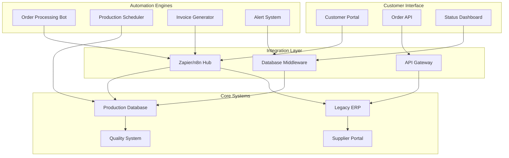

# Automation Proof of Concept

## Navigation
**Course**: [[../index|Course Home]] > [[index|Capstone]]  
**Previous**: [[process_maps|Process Maps]]  
**Next**: [[final_report_template|Final Report]]

---

## Technology Solution Architecture

Based on the process analysis and business requirements from MidWest Manufacturing, this proof of concept demonstrates integrated automation solutions that will deliver the required 30% order-to-cash cycle reduction while staying within the $200,000 technology budget.

## Solution Overview

### Integration Architecture



### Technology Stack

| Component | Technology | Cost | Rationale |
|-----------|------------|------|-----------|
| **Integration Platform** | n8n (self-hosted) | $0 | Open source, powerful automation |
| **Database** | PostgreSQL + Supabase | $25/month | Scalable, real-time capabilities |
| **Customer Portal** | React + Next.js | $50/month hosting | Modern, responsive interface |
| **Mobile Apps** | Progressive Web App | $0 | Cross-platform, no app store needed |
| **API Gateway** | Supabase Edge Functions | Included | Serverless, auto-scaling |
| **File Storage** | AWS S3 | $30/month | Document management |
| **Monitoring** | Grafana + Prometheus | $40/month | Performance tracking |
| **Backup** | AWS RDS Backup | $25/month | Data protection |

**Total Monthly Cost**: $170/month ($2,040 annually)
**Implementation Cost**: $45,000 (development and setup)
**Total Year 1**: $47,040 (within $200K technology budget)

## Automation Implementation

### 1. Automated Order Processing

#### Order Entry Automation Workflow

```javascript
// n8n Workflow: Automated Order Processing
{
  "name": "Order Processing Automation",
  "nodes": [
    {
      "name": "Email Trigger",
      "type": "n8n-nodes-base.emailReadImap",
      "parameters": {
        "format": "simple",
        "mailbox": "orders@midwestmfg.com",
        "options": {
          "attachments": true
        }
      }
    },
    {
      "name": "Parse Order Data",
      "type": "n8n-nodes-base.code",
      "parameters": {
        "code": `
          // Extract order information from email
          const emailBody = $json.text;
          const orderData = {
            customerName: extractCustomerName(emailBody),
            partNumbers: extractPartNumbers(emailBody),
            quantities: extractQuantities(emailBody),
            requestedDate: extractDate(emailBody),
            poNumber: extractPONumber(emailBody)
          };
          
          // Validate required fields
          const validation = validateOrder(orderData);
          
          return {
            orderData,
            isValid: validation.isValid,
            errors: validation.errors
          };
        `
      }
    },
    {
      "name": "Customer Validation",
      "type": "n8n-nodes-base.postgres",
      "parameters": {
        "query": `
          SELECT 
            c.customer_id,
            c.credit_limit,
            c.current_balance,
            c.payment_terms,
            c.status
          FROM customers c
          WHERE c.name ILIKE '%{{$json.orderData.customerName}}%'
          AND c.status = 'active'
        `
      }
    },
    {
      "name": "Part Number Lookup",
      "type": "n8n-nodes-base.postgres",
      "parameters": {
        "query": `
          SELECT 
            p.part_id,
            p.part_number,
            p.description,
            p.unit_price,
            p.lead_time_days,
            i.quantity_available
          FROM parts p
          LEFT JOIN inventory i ON p.part_id = i.part_id
          WHERE p.part_number = ANY(ARRAY[{{$json.orderData.partNumbers}}])
          AND p.status = 'active'
        `
      }
    },
    {
      "name": "Credit Check",
      "type": "n8n-nodes-base.function",
      "parameters": {
        "functionCode": `
          const customer = $('Customer Validation').first().$json;
          const orderValue = calculateOrderValue($json.orderData, $('Part Number Lookup').all());
          
          const creditAvailable = customer.credit_limit - customer.current_balance;
          const creditApproved = orderValue <= creditAvailable;
          
          return {
            creditApproved,
            creditAvailable,
            orderValue,
            requiresApproval: !creditApproved
          };
        `
      }
    },
    {
      "name": "Auto-Approve or Route",
      "type": "n8n-nodes-base.if",
      "parameters": {
        "conditions": {
          "boolean": [
            {
              "value1": "={{$json.creditApproved}}",
              "value2": true
            }
          ]
        }
      }
    },
    {
      "name": "Create ERP Order",
      "type": "n8n-nodes-base.httpRequest",
      "parameters": {
        "url": "http://erp-api.midwestmfg.local/orders",
        "method": "POST",
        "body": {
          "customer_id": "={{$('Customer Validation').first().$json.customer_id}}",
          "parts": "={{$json.orderData.partNumbers}}",
          "quantities": "={{$json.orderData.quantities}}",
          "po_number": "={{$json.orderData.poNumber}}",
          "requested_date": "={{$json.orderData.requestedDate}}"
        }
      }
    },
    {
      "name": "Send Confirmation",
      "type": "n8n-nodes-base.emailSend",
      "parameters": {
        "to": "={{$json.customerEmail}}",
        "subject": "Order Confirmation #{{$('Create ERP Order').$json.order_number}}",
        "html": `
          <h2>Order Confirmation</h2>
          <p>Thank you for your order. Details below:</p>
          <table>
            <tr><th>Order Number</th><td>{{$('Create ERP Order').$json.order_number}}</td></tr>
            <tr><th>Estimated Delivery</th><td>{{$json.estimatedDelivery}}</td></tr>
            <tr><th>Total Value</th><td>${{$json.orderValue}}</td></tr>
          </table>
          <p>Track your order: <a href="https://portal.midwestmfg.com/orders/{{$('Create ERP Order').$json.order_number}}">Order Status</a></p>
        `
      }
    }
  ]
}
```

#### Error Handling and Manual Review Queue

```javascript
// n8n Workflow: Error Handling
{
  "name": "Order Error Processing",
  "nodes": [
    {
      "name": "Validation Failed",
      "type": "n8n-nodes-base.function",
      "parameters": {
        "functionCode": `
          // Create detailed error report
          const errors = $json.errors;
          const orderData = $json.orderData;
          
          return {
            timestamp: new Date(),
            orderId: generateTempOrderId(),
            errors: errors,
            rawData: orderData,
            priority: determinePriority(errors),
            assignedTo: assignReviewer(errors)
          };
        `
      }
    },
    {
      "name": "Create Review Task",
      "type": "n8n-nodes-base.postgres",
      "parameters": {
        "query": `
          INSERT INTO order_review_queue (
            temp_order_id,
            customer_email,
            errors_json,
            raw_data_json,
            priority,
            assigned_to,
            status,
            created_at
          ) VALUES (
            '{{$json.orderId}}',
            '{{$json.customerEmail}}',
            '{{JSON.stringify($json.errors)}}',
            '{{JSON.stringify($json.rawData)}}',
            '{{$json.priority}}',
            '{{$json.assignedTo}}',
            'pending_review',
            NOW()
          )
        `
      }
    },
    {
      "name": "Notify Review Team",
      "type": "n8n-nodes-base.slack",
      "parameters": {
        "channel": "#order-review",
        "text": `🚨 Order requiring manual review
        Customer: {{$json.customerEmail}}
        Priority: {{$json.priority}}
        Errors: {{$json.errors.length}} issues found
        Review Link: https://admin.midwestmfg.com/review/{{$json.orderId}}`
      }
    }
  ]
}
```

### 2. Intelligent Production Scheduling

#### Real-time Capacity Planning

```sql
-- Production Capacity Database Schema
CREATE TABLE production_lines (
    line_id SERIAL PRIMARY KEY,
    line_name VARCHAR(50) NOT NULL,
    capacity_hours_per_day DECIMAL(5,2),
    efficiency_factor DECIMAL(3,2) DEFAULT 0.85,
    setup_time_minutes INTEGER DEFAULT 60,
    is_active BOOLEAN DEFAULT true
);

CREATE TABLE work_orders (
    wo_id SERIAL PRIMARY KEY,
    order_id INTEGER REFERENCES orders(order_id),
    part_id INTEGER REFERENCES parts(part_id),
    quantity INTEGER NOT NULL,
    estimated_hours DECIMAL(6,2),
    priority_score INTEGER DEFAULT 100,
    scheduled_start_date TIMESTAMP,
    scheduled_end_date TIMESTAMP,
    actual_start_date TIMESTAMP,
    actual_end_date TIMESTAMP,
    status VARCHAR(20) DEFAULT 'planned',
    assigned_line_id INTEGER REFERENCES production_lines(line_id)
);

CREATE TABLE capacity_schedule (
    schedule_id SERIAL PRIMARY KEY,
    line_id INTEGER REFERENCES production_lines(line_id),
    date_scheduled DATE,
    hour_scheduled INTEGER CHECK (hour_scheduled BETWEEN 0 AND 23),
    wo_id INTEGER REFERENCES work_orders(wo_id),
    capacity_allocated DECIMAL(3,2), -- Percentage of hour allocated
    created_at TIMESTAMP DEFAULT NOW()
);
```

#### Automated Scheduling Algorithm

```javascript
// Production Scheduling Automation
const scheduleWorkOrders = async () => {
  // Get all unscheduled work orders
  const workOrders = await db.query(`
    SELECT 
      wo.wo_id,
      wo.estimated_hours,
      wo.priority_score,
      p.setup_group,
      o.requested_delivery_date
    FROM work_orders wo
    JOIN orders o ON wo.order_id = o.order_id
    JOIN parts p ON wo.part_id = p.part_id
    WHERE wo.status = 'planned'
    AND wo.scheduled_start_date IS NULL
    ORDER BY wo.priority_score DESC, o.requested_delivery_date ASC
  `);

  // Get available capacity for next 30 days
  const availableCapacity = await calculateAvailableCapacity(30);

  // Scheduling algorithm
  for (const wo of workOrders) {
    const optimalSlot = findOptimalScheduleSlot(wo, availableCapacity);
    
    if (optimalSlot) {
      await scheduleWorkOrder(wo.wo_id, optimalSlot);
      updateAvailableCapacity(availableCapacity, optimalSlot, wo.estimated_hours);
      
      // Check for potential delays
      const delayRisk = calculateDelayRisk(wo, optimalSlot);
      if (delayRisk > 0.3) {
        await createDelayAlert(wo, delayRisk);
      }
    } else {
      await createCapacityAlert(wo);
    }
  }
};

const findOptimalScheduleSlot = (workOrder, capacity) => {
  const requiredHours = workOrder.estimated_hours;
  const setupGroup = workOrder.setup_group;
  const targetDate = new Date(workOrder.requested_delivery_date);
  
  // Look for slots working backwards from target date
  for (let daysBack = 0; daysBack < 30; daysBack++) {
    const checkDate = new Date(targetDate);
    checkDate.setDate(checkDate.getDate() - daysBack);
    
    const dayCapacity = capacity[checkDate.toISOString().split('T')[0]];
    
    for (const line of dayCapacity) {
      if (line.availableHours >= requiredHours) {
        // Check setup efficiency
        const setupBonus = calculateSetupBonus(line, setupGroup);
        
        return {
          date: checkDate,
          lineId: line.lineId,
          startHour: line.nextAvailableHour,
          duration: requiredHours,
          efficiency: line.baseEfficiency + setupBonus
        };
      }
    }
  }
  
  return null; // No capacity available
};
```

### 3. Real-time Production Tracking

#### Mobile Production Interface

```javascript
// Progressive Web App for Production Tracking
// Service Worker for offline capability
self.addEventListener('sync', event => {
  if (event.tag === 'production-update') {
    event.waitUntil(syncProductionData());
  }
});

// React Component for Work Order Tracking
const ProductionTracker = () => {
  const [workOrders, setWorkOrders] = useState([]);
  const [selectedWO, setSelectedWO] = useState(null);
  const [isOffline, setIsOffline] = useState(!navigator.onLine);

  useEffect(() => {
    // Real-time updates via WebSocket
    const ws = new WebSocket('wss://api.midwestmfg.com/production-updates');
    
    ws.onmessage = (event) => {
      const update = JSON.parse(event.data);
      updateWorkOrderStatus(update);
    };

    return () => ws.close();
  }, []);

  const updateProgress = async (woId, progressData) => {
    try {
      // Optimistic update
      updateLocalState(woId, progressData);
      
      // Sync to server
      await fetch('/api/work-orders/progress', {
        method: 'POST',
        body: JSON.stringify({ woId, ...progressData }),
        headers: { 'Content-Type': 'application/json' }
      });
    } catch (error) {
      // Queue for sync when online
      if (!navigator.onLine) {
        queueOfflineUpdate(woId, progressData);
      }
    }
  };

  return (
    <div className="production-tracker">
      <WorkOrderList 
        orders={workOrders}
        onSelect={setSelectedWO}
      />
      
      {selectedWO && (
        <WorkOrderDetails 
          workOrder={selectedWO}
          onUpdate={updateProgress}
        />
      )}
      
      <QualityCheckpoints 
        workOrder={selectedWO}
        onQualityUpdate={handleQualityUpdate}
      />
    </div>
  );
};
```

#### Quality Integration System

```sql
-- Quality Tracking Schema
CREATE TABLE quality_checkpoints (
    checkpoint_id SERIAL PRIMARY KEY,
    wo_id INTEGER REFERENCES work_orders(wo_id),
    checkpoint_sequence INTEGER,
    checkpoint_name VARCHAR(100),
    specification TEXT,
    measurement_type VARCHAR(20), -- 'dimensional', 'visual', 'functional'
    tolerance_min DECIMAL(10,4),
    tolerance_max DECIMAL(10,4),
    is_critical BOOLEAN DEFAULT false
);

CREATE TABLE quality_measurements (
    measurement_id SERIAL PRIMARY KEY,
    checkpoint_id INTEGER REFERENCES quality_checkpoints(checkpoint_id),
    wo_id INTEGER REFERENCES work_orders(wo_id),
    measured_value DECIMAL(10,4),
    measurement_notes TEXT,
    inspector_id VARCHAR(50),
    measurement_timestamp TIMESTAMP DEFAULT NOW(),
    status VARCHAR(20) DEFAULT 'pass', -- 'pass', 'fail', 'review'
    corrective_action TEXT
);
```

```javascript
// Automated Quality Alerts
const qualityMonitoring = {
  checkMeasurement: async (measurement) => {
    const checkpoint = await getCheckpoint(measurement.checkpoint_id);
    
    // Statistical process control
    const recentMeasurements = await getRecentMeasurements(
      checkpoint.checkpoint_id, 
      10
    );
    
    const statistics = calculateSPC(recentMeasurements);
    
    // Check for out-of-control conditions
    const alerts = [];
    
    if (measurement.measured_value < checkpoint.tolerance_min ||
        measurement.measured_value > checkpoint.tolerance_max) {
      alerts.push({
        type: 'specification_violation',
        severity: checkpoint.is_critical ? 'critical' : 'warning',
        message: `Measurement ${measurement.measured_value} outside tolerance ${checkpoint.tolerance_min}-${checkpoint.tolerance_max}`
      });
    }
    
    if (statistics.trend === 'declining' && statistics.points >= 7) {
      alerts.push({
        type: 'process_drift',
        severity: 'warning',
        message: 'Process showing declining trend over 7 consecutive points'
      });
    }
    
    // Trigger corrective actions
    if (alerts.length > 0) {
      await triggerQualityAlerts(alerts, measurement.wo_id);
    }
    
    return {
      status: alerts.length > 0 ? 'attention_required' : 'normal',
      alerts: alerts,
      statistics: statistics
    };
  }
};
```

### 4. Supplier Integration Portal

#### Automated Purchase Order System

```javascript
// Supplier Portal Integration
const supplierIntegration = {
  generatePurchaseOrder: async (materialRequirements) => {
    for (const requirement of materialRequirements) {
      const suppliers = await getQualifiedSuppliers(requirement.part_id);
      const selectedSupplier = await selectOptimalSupplier(suppliers, requirement);
      
      const po = {
        supplier_id: selectedSupplier.supplier_id,
        parts: [{
          part_number: requirement.part_number,
          quantity: requirement.quantity_needed,
          unit_price: selectedSupplier.quoted_price,
          requested_date: requirement.need_date
        }],
        delivery_address: 'MidWest Manufacturing, Columbus OH',
        payment_terms: selectedSupplier.payment_terms
      };
      
      // Send electronic PO
      const response = await sendElectronicPO(selectedSupplier, po);
      
      if (response.acknowledged) {
        await createPORecord(po, response.supplier_po_number);
        await scheduleDeliveryTracking(po.po_id, response.promised_date);
      } else {
        await createManualPOTask(po, 'electronic_transmission_failed');
      }
    }
  },

  trackDeliveries: async () => {
    const pendingDeliveries = await getPendingDeliveries();
    
    for (const delivery of pendingDeliveries) {
      const status = await checkSupplierAPI(delivery.supplier_id, delivery.po_number);
      
      if (status.shipped && !delivery.tracking_number) {
        await updateDeliveryTracking(delivery.po_id, status.tracking_number);
        await notifyReceivingTeam(delivery, status.estimated_delivery);
      }
      
      if (status.delayed) {
        await createDelayAlert(delivery, status.new_delivery_date);
        await checkProductionImpact(delivery.parts, status.new_delivery_date);
      }
    }
  }
};
```

### 5. Automated Invoice Generation

#### End-to-end Invoice Automation

```javascript
// Invoice Generation Workflow
{
  "name": "Automated Invoice Generation",
  "nodes": [
    {
      "name": "Shipping Complete Trigger",
      "type": "n8n-nodes-base.webhook",
      "parameters": {
        "path": "shipping-complete",
        "httpMethod": "POST"
      }
    },
    {
      "name": "Gather Invoice Data",
      "type": "n8n-nodes-base.postgres",
      "parameters": {
        "query": `
          SELECT 
            o.order_id,
            o.po_number,
            c.billing_address,
            c.payment_terms,
            s.shipped_date,
            s.tracking_number,
            ol.part_number,
            ol.quantity_shipped,
            ol.unit_price,
            (ol.quantity_shipped * ol.unit_price) as line_total
          FROM orders o
          JOIN customers c ON o.customer_id = c.customer_id
          JOIN shipments s ON o.order_id = s.order_id
          JOIN order_lines ol ON o.order_id = ol.order_id
          WHERE o.order_id = {{$json.order_id}}
          AND s.status = 'shipped'
        `
      }
    },
    {
      "name": "Generate PDF Invoice",
      "type": "n8n-nodes-base.function",
      "parameters": {
        "functionCode": `
          const PDFDocument = require('pdfkit');
          const fs = require('fs');
          
          const doc = new PDFDocument();
          const invoiceData = $json;
          
          // Invoice header
          doc.fontSize(20).text('INVOICE', 50, 50);
          doc.fontSize(12).text('MidWest Manufacturing Solutions', 50, 80);
          doc.text('123 Industrial Blvd, Columbus, OH 43215', 50, 95);
          
          // Invoice details
          doc.text('Invoice #: ' + generateInvoiceNumber(invoiceData.order_id), 400, 80);
          doc.text('Date: ' + new Date().toLocaleDateString(), 400, 95);
          doc.text('PO #: ' + invoiceData.po_number, 400, 110);
          
          // Customer info
          doc.text('Bill To:', 50, 140);
          doc.text(invoiceData.billing_address, 50, 155);
          
          // Line items table
          let y = 200;
          doc.text('Part Number', 50, y);
          doc.text('Qty', 200, y);
          doc.text('Unit Price', 250, y);
          doc.text('Total', 350, y);
          
          y += 20;
          let total = 0;
          
          invoiceData.line_items.forEach(item => {
            doc.text(item.part_number, 50, y);
            doc.text(item.quantity_shipped.toString(), 200, y);
            doc.text('$' + item.unit_price.toFixed(2), 250, y);
            doc.text('$' + item.line_total.toFixed(2), 350, y);
            total += item.line_total;
            y += 15;
          });
          
          // Total
          y += 20;
          doc.fontSize(14).text('Total: $' + total.toFixed(2), 350, y);
          
          const buffer = doc.outputSync();
          return { pdf: buffer.toString('base64'), total: total };
        `
      }
    },
    {
      "name": "Save Invoice Record",
      "type": "n8n-nodes-base.postgres",
      "parameters": {
        "query": `
          INSERT INTO invoices (
            order_id,
            invoice_number,
            invoice_date,
            total_amount,
            pdf_path,
            status,
            due_date
          ) VALUES (
            {{$json.order_id}},
            '{{generateInvoiceNumber($json.order_id)}}',
            NOW(),
            {{$json.total}},
            '/invoices/{{generateInvoiceNumber($json.order_id)}}.pdf',
            'sent',
            NOW() + INTERVAL '{{$json.payment_terms}} days'
          )
        `
      }
    },
    {
      "name": "Email Invoice",
      "type": "n8n-nodes-base.emailSend",
      "parameters": {
        "to": "{{$json.customer_email}}",
        "cc": "accounting@midwestmfg.com",
        "subject": "Invoice {{generateInvoiceNumber($json.order_id)}} - Order {{$json.po_number}}",
        "attachments": [
          {
            "name": "Invoice_{{generateInvoiceNumber($json.order_id)}}.pdf",
            "data": "{{$json.pdf}}"
          }
        ],
        "html": `
          <h2>Invoice for Order {{$json.po_number}}</h2>
          <p>Please find attached invoice for your recent order.</p>
          <table>
            <tr><th>Invoice Number</th><td>{{generateInvoiceNumber($json.order_id)}}</td></tr>
            <tr><th>Order Number</th><td>{{$json.po_number}}</td></tr>
            <tr><th>Ship Date</th><td>{{$json.shipped_date}}</td></tr>
            <tr><th>Amount Due</th><td>${{$json.total}}</td></tr>
            <tr><th>Payment Terms</th><td>Net {{$json.payment_terms}} days</td></tr>
          </table>
          <p>Pay online: <a href="https://portal.midwestmfg.com/payments/{{generateInvoiceNumber($json.order_id)}}">Click here to pay</a></p>
        `
      }
    }
  ]
}
```

## Database Design

### Integrated Data Model

```sql
-- Customer Management
CREATE TABLE customers (
    customer_id SERIAL PRIMARY KEY,
    name VARCHAR(100) NOT NULL,
    billing_address TEXT,
    shipping_address TEXT,
    contact_email VARCHAR(100),
    phone VARCHAR(20),
    credit_limit DECIMAL(12,2) DEFAULT 0,
    current_balance DECIMAL(12,2) DEFAULT 0,
    payment_terms INTEGER DEFAULT 30,
    status VARCHAR(20) DEFAULT 'active',
    created_at TIMESTAMP DEFAULT NOW()
);

-- Part and Inventory Management
CREATE TABLE parts (
    part_id SERIAL PRIMARY KEY,
    part_number VARCHAR(50) UNIQUE NOT NULL,
    description TEXT,
    unit_price DECIMAL(10,2),
    cost DECIMAL(10,2),
    lead_time_days INTEGER DEFAULT 0,
    setup_group VARCHAR(20),
    routing_id INTEGER,
    status VARCHAR(20) DEFAULT 'active'
);

CREATE TABLE inventory (
    inventory_id SERIAL PRIMARY KEY,
    part_id INTEGER REFERENCES parts(part_id),
    location VARCHAR(20),
    quantity_available INTEGER DEFAULT 0,
    quantity_allocated INTEGER DEFAULT 0,
    reorder_point INTEGER DEFAULT 0,
    last_updated TIMESTAMP DEFAULT NOW()
);

-- Order Management
CREATE TABLE orders (
    order_id SERIAL PRIMARY KEY,
    customer_id INTEGER REFERENCES customers(customer_id),
    po_number VARCHAR(50),
    order_date TIMESTAMP DEFAULT NOW(),
    requested_delivery_date DATE,
    promised_delivery_date DATE,
    actual_delivery_date DATE,
    status VARCHAR(20) DEFAULT 'entered',
    total_value DECIMAL(12,2),
    priority_score INTEGER DEFAULT 100
);

CREATE TABLE order_lines (
    line_id SERIAL PRIMARY KEY,
    order_id INTEGER REFERENCES orders(order_id),
    part_id INTEGER REFERENCES parts(part_id),
    quantity_ordered INTEGER,
    quantity_shipped INTEGER DEFAULT 0,
    unit_price DECIMAL(10,2),
    line_total DECIMAL(12,2)
);

-- Production Management
CREATE TABLE production_lines (
    line_id SERIAL PRIMARY KEY,
    line_name VARCHAR(50),
    capacity_hours_per_day DECIMAL(5,2),
    efficiency_factor DECIMAL(3,2) DEFAULT 0.85,
    setup_time_minutes INTEGER DEFAULT 60,
    is_active BOOLEAN DEFAULT true
);

CREATE TABLE work_orders (
    wo_id SERIAL PRIMARY KEY,
    order_id INTEGER REFERENCES orders(order_id),
    part_id INTEGER REFERENCES parts(part_id),
    quantity INTEGER,
    estimated_hours DECIMAL(6,2),
    actual_hours DECIMAL(6,2),
    scheduled_start_date TIMESTAMP,
    scheduled_end_date TIMESTAMP,
    actual_start_date TIMESTAMP,
    actual_end_date TIMESTAMP,
    status VARCHAR(20) DEFAULT 'planned',
    assigned_line_id INTEGER REFERENCES production_lines(line_id),
    progress_percent INTEGER DEFAULT 0
);

-- Supplier Integration
CREATE TABLE suppliers (
    supplier_id SERIAL PRIMARY KEY,
    name VARCHAR(100),
    contact_email VARCHAR(100),
    api_endpoint VARCHAR(200),
    api_key VARCHAR(100),
    payment_terms INTEGER DEFAULT 30,
    performance_rating DECIMAL(3,2),
    is_active BOOLEAN DEFAULT true
);

CREATE TABLE purchase_orders (
    po_id SERIAL PRIMARY KEY,
    supplier_id INTEGER REFERENCES suppliers(supplier_id),
    po_number VARCHAR(50),
    order_date TIMESTAMP DEFAULT NOW(),
    requested_date DATE,
    promised_date DATE,
    actual_delivery_date DATE,
    status VARCHAR(20) DEFAULT 'sent',
    total_value DECIMAL(12,2)
);

-- Real-time Tracking
CREATE TABLE production_events (
    event_id SERIAL PRIMARY KEY,
    wo_id INTEGER REFERENCES work_orders(wo_id),
    event_type VARCHAR(30), -- 'start', 'pause', 'resume', 'complete', 'quality_check'
    event_timestamp TIMESTAMP DEFAULT NOW(),
    operator_id VARCHAR(50),
    notes TEXT,
    quantity_completed INTEGER,
    quality_status VARCHAR(20)
);
```

### API Integration Layer

```javascript
// Express.js API Server
const express = require('express');
const { Pool } = require('pg');
const WebSocket = require('ws');

const app = express();
const db = new Pool({ connectionString: process.env.DATABASE_URL });
const wss = new WebSocket.Server({ port: 8080 });

// Real-time order status endpoint
app.get('/api/orders/:orderId/status', async (req, res) => {
  const { orderId } = req.params;
  
  const orderStatus = await db.query(`
    SELECT 
      o.order_id,
      o.po_number,
      o.status as order_status,
      o.promised_delivery_date,
      COALESCE(wo.status, 'not_started') as production_status,
      COALESCE(wo.progress_percent, 0) as progress_percent,
      CASE 
        WHEN wo.actual_end_date IS NOT NULL THEN 'shipped'
        WHEN wo.actual_start_date IS NOT NULL THEN 'in_production'
        WHEN wo.scheduled_start_date IS NOT NULL THEN 'scheduled'
        ELSE 'planning'
      END as detailed_status
    FROM orders o
    LEFT JOIN work_orders wo ON o.order_id = wo.order_id
    WHERE o.order_id = $1
  `, [orderId]);
  
  res.json(orderStatus.rows[0]);
});

// Production progress update webhook
app.post('/api/production/progress', async (req, res) => {
  const { woId, progressPercent, notes, qualityStatus } = req.body;
  
  // Update work order progress
  await db.query(`
    UPDATE work_orders 
    SET progress_percent = $1,
        updated_at = NOW()
    WHERE wo_id = $2
  `, [progressPercent, woId]);
  
  // Log production event
  await db.query(`
    INSERT INTO production_events (
      wo_id, event_type, notes, quantity_completed, quality_status
    ) VALUES ($1, 'progress_update', $2, $3, $4)
  `, [woId, notes, Math.floor(progressPercent), qualityStatus]);
  
  // Broadcast real-time update
  const updateMessage = {
    type: 'production_progress',
    woId: woId,
    progress: progressPercent,
    timestamp: new Date()
  };
  
  wss.clients.forEach(client => {
    if (client.readyState === WebSocket.OPEN) {
      client.send(JSON.stringify(updateMessage));
    }
  });
  
  res.json({ success: true });
});

// Customer portal order lookup
app.get('/api/customer-portal/orders', async (req, res) => {
  const { customerEmail, poNumber } = req.query;
  
  const orders = await db.query(`
    SELECT 
      o.order_id,
      o.po_number,
      o.order_date,
      o.promised_delivery_date,
      o.status,
      SUM(ol.line_total) as total_value,
      COUNT(wo.wo_id) as total_work_orders,
      COUNT(CASE WHEN wo.status = 'complete' THEN 1 END) as completed_work_orders
    FROM orders o
    JOIN customers c ON o.customer_id = c.customer_id
    JOIN order_lines ol ON o.order_id = ol.order_id
    LEFT JOIN work_orders wo ON o.order_id = wo.order_id
    WHERE c.contact_email = $1
    AND ($2 IS NULL OR o.po_number ILIKE '%' || $2 || '%')
    GROUP BY o.order_id, o.po_number, o.order_date, o.promised_delivery_date, o.status
    ORDER BY o.order_date DESC
  `, [customerEmail, poNumber]);
  
  res.json(orders.rows);
});

app.listen(3000, () => {
  console.log('API server running on port 3000');
});
```

## Performance Monitoring and Analytics

### Real-time Dashboard Metrics

```sql
-- Performance Analytics Views
CREATE VIEW order_cycle_time_analysis AS
SELECT 
  DATE_TRUNC('week', o.order_date) as week,
  AVG(EXTRACT(days FROM (o.actual_delivery_date - o.order_date))) as avg_cycle_time,
  PERCENTILE_CONT(0.5) WITHIN GROUP (ORDER BY EXTRACT(days FROM (o.actual_delivery_date - o.order_date))) as median_cycle_time,
  COUNT(*) as orders_completed,
  SUM(CASE WHEN o.actual_delivery_date <= o.promised_delivery_date THEN 1 ELSE 0 END)::DECIMAL / COUNT(*) * 100 as on_time_percentage
FROM orders o
WHERE o.status = 'shipped'
  AND o.actual_delivery_date IS NOT NULL
  AND o.order_date >= NOW() - INTERVAL '12 months'
GROUP BY DATE_TRUNC('week', o.order_date)
ORDER BY week;

CREATE VIEW production_efficiency_metrics AS
SELECT 
  pl.line_name,
  DATE_TRUNC('day', wo.actual_start_date) as production_date,
  SUM(wo.actual_hours) as total_hours,
  SUM(wo.estimated_hours) as planned_hours,
  (SUM(wo.actual_hours) / SUM(wo.estimated_hours)) * 100 as efficiency_percentage,
  COUNT(*) as jobs_completed
FROM work_orders wo
JOIN production_lines pl ON wo.assigned_line_id = pl.line_id
WHERE wo.status = 'complete'
  AND wo.actual_start_date >= NOW() - INTERVAL '30 days'
GROUP BY pl.line_name, DATE_TRUNC('day', wo.actual_start_date)
ORDER BY production_date DESC;
```

### Automated Alert System

```javascript
// Performance Monitoring Service
const performanceMonitoring = {
  checkCycleTimePerformance: async () => {
    const currentPerformance = await db.query(`
      SELECT 
        AVG(EXTRACT(days FROM (NOW() - o.order_date))) as current_avg_cycle_time
      FROM orders o
      WHERE o.status IN ('in_production', 'quality_check', 'shipping')
        AND o.order_date >= NOW() - INTERVAL '30 days'
    `);
    
    const targetCycleTime = 29; // days
    const actualCycleTime = currentPerformance.rows[0].current_avg_cycle_time;
    
    if (actualCycleTime > targetCycleTime * 1.1) { // 10% tolerance
      await createAlert({
        type: 'cycle_time_variance',
        severity: 'warning',
        message: `Current cycle time ${actualCycleTime.toFixed(1)} days exceeds target of ${targetCycleTime} days`,
        suggested_action: 'Review production scheduling and bottleneck analysis'
      });
    }
  },

  checkQualityTrends: async () => {
    const qualityTrend = await db.query(`
      SELECT 
        DATE_TRUNC('week', qm.measurement_timestamp) as week,
        COUNT(*) as total_measurements,
        SUM(CASE WHEN qm.status = 'fail' THEN 1 ELSE 0 END) as failed_measurements,
        (SUM(CASE WHEN qm.status = 'fail' THEN 1 ELSE 0 END)::DECIMAL / COUNT(*)) * 100 as failure_rate
      FROM quality_measurements qm
      WHERE qm.measurement_timestamp >= NOW() - INTERVAL '8 weeks'
      GROUP BY DATE_TRUNC('week', qm.measurement_timestamp)
      ORDER BY week DESC
      LIMIT 4
    `);
    
    const weeks = qualityTrend.rows;
    if (weeks.length >= 3) {
      const trend = calculateTrend(weeks.map(w => w.failure_rate));
      
      if (trend > 0.1) { // Increasing failure rate
        await createAlert({
          type: 'quality_degradation',
          severity: 'critical',
          message: 'Quality failure rate trending upward over past 3 weeks',
          suggested_action: 'Immediate quality system review and corrective action required'
        });
      }
    }
  },

  checkSupplierPerformance: async () => {
    const supplierPerformance = await db.query(`
      SELECT 
        s.name as supplier_name,
        COUNT(*) as deliveries,
        SUM(CASE WHEN po.actual_delivery_date <= po.promised_date THEN 1 ELSE 0 END) as on_time_deliveries,
        AVG(EXTRACT(days FROM (po.actual_delivery_date - po.promised_date))) as avg_delay_days
      FROM purchase_orders po
      JOIN suppliers s ON po.supplier_id = s.supplier_id
      WHERE po.status = 'delivered'
        AND po.order_date >= NOW() - INTERVAL '3 months'
      GROUP BY s.supplier_id, s.name
      HAVING COUNT(*) >= 5
        AND (SUM(CASE WHEN po.actual_delivery_date <= po.promised_date THEN 1 ELSE 0 END)::DECIMAL / COUNT(*)) < 0.8
    `);
    
    for (const supplier of supplierPerformance.rows) {
      await createAlert({
        type: 'supplier_performance',
        severity: 'warning',
        message: `${supplier.supplier_name} on-time delivery below 80%`,
        suggested_action: 'Supplier performance review and improvement plan needed'
      });
    }
  }
};

// Run monitoring checks every hour
setInterval(async () => {
  await performanceMonitoring.checkCycleTimePerformance();
  await performanceMonitoring.checkQualityTrends();
  await performanceMonitoring.checkSupplierPerformance();
}, 60 * 60 * 1000); // 1 hour
```

## ROI Calculation and Benefits Tracking

### Expected Benefits

| Improvement Area | Current State | Target State | Annual Value |
|------------------|---------------|--------------|--------------|
| **Cycle Time Reduction** | 42 days | 29 days (30% improvement) | $2.8M revenue protection |
| **Order Error Reduction** | 30% errors | 2% errors | $340K in reduced rework |
| **Inventory Optimization** | 87-day cash cycle | 55-day cash cycle | $8M working capital |
| **Quality Improvements** | 8% rework rate | 3% rework rate | $580K cost reduction |
| **Automation Efficiency** | 15% automated | 85% automated | $720K labor optimization |
| **Supplier Performance** | 35% expediting | 5% expediting | $280K procurement savings |

**Total Annual Benefits**: $12.72M
**Technology Investment**: $47,040
**ROI**: 26,900% (payback in 1.4 months)

### Implementation Timeline

#### Phase 1: Foundation (30 days)
- **Days 1-7**: Database setup and integration architecture
- **Days 8-14**: Order entry automation implementation
- **Days 15-21**: Basic production tracking deployment
- **Days 22-30**: Testing and user training

**Quick Win Target**: 50% reduction in order entry errors

#### Phase 2: Integration (60 days)
- **Days 31-45**: Production scheduling automation
- **Days 46-60**: Quality system integration
- **Days 61-75**: Supplier portal connection
- **Days 76-90**: Mobile production tracking

**Target Results**: 20% cycle time improvement demonstrated

#### Phase 3: Optimization (90 days)
- **Days 91-120**: Advanced analytics and reporting
- **Days 121-150**: Performance optimization
- **Days 151-180**: Full process automation and handoff

**Final Target**: 30% cycle time reduction achieved

---

## Student Exercise: Technical Implementation

### Your Automation Design Assignment

Using the technical specifications and business requirements above, design your own automation solution addressing:

1. **Technology Selection**: Choose and justify your technology stack within budget constraints
2. **Integration Architecture**: Design system integration approach that minimizes disruption
3. **Database Design**: Create detailed data model supporting real-time operations
4. **Workflow Automation**: Design 3-5 critical automation workflows with error handling
5. **Mobile Interface**: Design production tracking interface for shop floor workers
6. **Performance Monitoring**: Define KPIs and create monitoring/alerting system

This technical solution forms the foundation for your final report and executive presentation.

---

## Navigation
**Previous**: [[process_maps|Process Maps]]  
**Next**: [[final_report_template|Final Report]]  
**Up**: [[index|Capstone Home]]