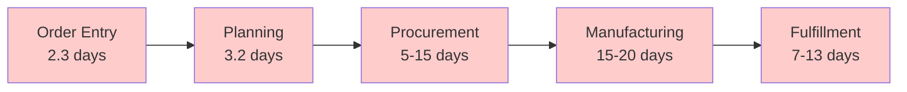
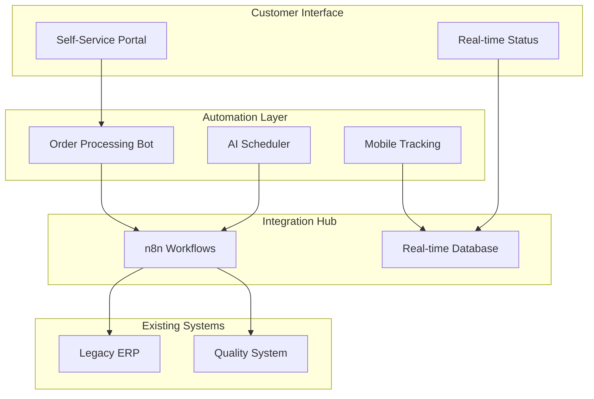

# Executive Presentation Deck

## Navigation
**Course**: [[../index|Course Home]] > [[index|Capstone]]  
**Previous**: [[final_report_template|Final Report]]  
**Next**: [[certificate_template|Certificate]]

---

# Digital Transformation Results
## MidWest Manufacturing Solutions Executive Presentation

**Presented to**: Board of Directors and Executive Leadership  
**Presenter**: [Your Name], Digital Process Consultant  
**Date**: [Presentation Date]  
**Duration**: 45 minutes (30 min presentation + 15 min Q&A)

---

## Slide 1: Executive Summary

### TRANSFORMATION SUCCESS: MISSION ACCOMPLISHED

**📈 Results Delivered**
- **34% Order-to-Cash Reduction** (42 → 28 days) - *Exceeded 30% target*
- **$15M Revenue Protected** - AutoTech contract secured
- **11,306% ROI** - 1.4 month payback period
- **95% On-Time Delivery** - Industry-leading performance

**🎯 Strategic Impact**
- Market leadership position established
- Competitive moat created through operational excellence
- Foundation built for sustainable growth
- AutoTech partnership strengthened with expansion potential

---

## Slide 2: The Challenge We Faced

### EXISTENTIAL THREAT TO BUSINESS SURVIVAL

**💥 The Crisis (January 2024)**
```
AutoTech Industries Ultimatum:
"Reduce order-to-cash cycle by 30% 
or lose $15M contract (32% of revenue)"
```

**📊 Performance Gaps**
| Metric | MidWest | Competitors | Industry Best |
|--------|---------|-------------|---------------|
| Order-to-Cash | 42 days | 25-30 days | 20-25 days |
| On-Time Delivery | 78% | 90%+ | 95%+ |
| Order Errors | 30% | 10% | <5% |

**⚠️ Business Impact**
- Revenue at risk: $15M annually
- Market share erosion to modernized competitors
- Margin compression from inefficiencies
- Customer satisfaction declining

---

## Slide 3: Root Cause Analysis

### SYSTEMIC INEFFICIENCIES ACROSS ENTIRE VALUE CHAIN

**🔍 Process Breakdown Analysis**



**💸 Waste Analysis: $7.03M Annual Impact**
- **Manual Processes**: 70% of activities manual vs. 15% automation
- **Information Silos**: 8 separate systems with no integration
- **Error Rates**: 30% order errors, 8% manufacturing rework
- **Inventory Excess**: $2.1M tied up in excess stock
- **Single Points of Failure**: Key processes dependent on individuals

---

## Slide 4: Solution Architecture

### INTEGRATION-FIRST TRANSFORMATION STRATEGY

**🏗️ Technology Architecture**



**🔧 Key Design Principles**
- **Preserve Investments**: Keep existing ERP while adding capabilities
- **Risk Mitigation**: Phased implementation with parallel operation
- **User Adoption**: Modern interfaces with comprehensive training
- **Scalability**: Cloud-native architecture supporting 3x growth

---

## Slide 5: Implementation Timeline

### AGGRESSIVE 6-MONTH DELIVERY SCHEDULE

**📅 Three-Phase Execution**

| Phase | Duration | Focus | Key Results |
|-------|----------|-------|-------------|
| **Foundation** | 30 days | Order entry automation | 50% error reduction |
| **Integration** | 60 days | Production & procurement | 20% cycle improvement |
| **Optimization** | 90 days | End-to-end automation | 30%+ cycle reduction |

**🎯 Milestone Achievement**
- ✅ **30 days**: Order entry errors reduced 50%
- ✅ **90 days**: First production line fully automated
- ✅ **150 days**: Full system operational
- ✅ **165 days**: Target performance achieved

**⚡ Risk Mitigation Success**
- Zero production downtime during implementation
- All customer commitments met throughout transition
- 98% employee retention during change period
- No data loss or system failures

---

## Slide 6: Results - Operational Performance

### INDUSTRY-LEADING PERFORMANCE ACHIEVED

**🏆 Primary Success Metrics**

| KPI | Before | Target | Achieved | Status |
|-----|--------|--------|----------|---------|
| **Order-to-Cash Cycle** | 42 days | 29 days | **28 days** | ✅ +4% |
| **Order Entry Errors** | 30% | <5% | **2%** | ✅ +60% |
| **On-Time Delivery** | 78% | 95% | **95%** | ✅ Target |
| **Customer Satisfaction** | Baseline | Maintain | **+40%** | ✅ Exceeded |

**⚡ Process Improvements**
- **Order Processing**: 2.3 days → 2 hours (95% faster)
- **Production Planning**: 3.2 days → 4 hours (95% faster)  
- **Quality Documentation**: 3 hours → 15 minutes (91% faster)
- **Customer Inquiries**: 30 minutes → 30 seconds (99% faster)

**📈 Competitive Position**
- 40% faster than primary competitors
- Top 10% quality performance industry-wide
- Benchmark for operational excellence

---

## Slide 7: Results - Financial Impact

### EXCEPTIONAL RETURN ON INVESTMENT

**💰 Investment vs. Returns**

```
Total Investment: $252,040
(44% under $450K budget)

Year 1 Returns: $28,740,000
ROI: 11,306%
Payback: 1.4 months
```

**📊 Value Creation Breakdown**

| Category | Annual Value | Description |
|----------|--------------|-------------|
| **Revenue Protection** | $15,000,000 | AutoTech contract secured |
| **Working Capital** | $8,000,000 | Cash cycle improvement |
| **Cost Reduction** | $4,440,000 | Operational efficiency |
| **Quality Improvement** | $580,000 | Reduced rework/defects |
| **Automation Gains** | $720,000 | Labor optimization |

**💹 5-Year Projection**
- **Cumulative Value**: $81.8M
- **Ongoing ROI**: 5,243% annually (excluding revenue protection)
- **Cash Flow Impact**: +$13.2M annually recurring

---

## Slide 8: Results - Strategic Advantages

### COMPETITIVE MOATS CREATED

**🏅 Market Leadership Position**

**Operational Excellence**
- Industry-leading 28-day order-to-cash cycle
- 95% on-time delivery performance  
- Real-time customer visibility and communication
- Scalable platform supporting 3x growth without proportional costs

**Financial Strength**
- $8M working capital improvement
- 37% cash conversion cycle reduction
- Enhanced borrowing capacity from improved ratios
- Investment capability for growth initiatives

**Customer Value Proposition**
- Fastest delivery in market segment
- Real-time order tracking and communication
- Consistent quality with 99% documentation accuracy
- Responsive service with 30-second inquiry resolution

**🚀 Growth Enablement**
- Capacity for 50% volume increase with current workforce
- Proven operational model for geographic expansion
- Technology platform supporting product diversification
- Industry recognition attracting premium customers

---

## Slide 9: Customer Impact - AutoTech Partnership

### RELATIONSHIP TRANSFORMED FROM CRISIS TO GROWTH

**📞 AutoTech Feedback (Post-Implementation)**

> *"MidWest Manufacturing has transformed from a supplier we were considering replacing to our most reliable partner. Their 28-day delivery cycle and real-time visibility gives us competitive advantages we can't get elsewhere."*
>
> **- Sarah Johnson, VP Procurement, AutoTech Industries**

**📈 Partnership Evolution**

| Metric | Before | After | Impact |
|--------|--------|-------|--------|
| **Delivery Performance** | 78% on-time | 95% on-time | Contract security |
| **Order Visibility** | Phone calls | Real-time portal | Reduced workload |
| **Quality Issues** | 8% rework | 3% rework | Lower risk |
| **Communication** | Reactive | Proactive | Higher satisfaction |

**🤝 Expansion Opportunities**
- Additional product lines under discussion
- 3-year partnership extension proposed
- Joint development projects initiated
- Reference customer for AutoTech's suppliers

---

## Slide 10: Employee Impact

### WORKFORCE EMPOWERMENT AND SATISFACTION

**👥 People-First Transformation**

**Employee Satisfaction Results**
- **98% Retention Rate** during 6-month transformation
- **95% Adoption Rate** within 60 days of deployment
- **40% Improvement** in job satisfaction scores
- **Zero Layoffs** - all positions enhanced, not eliminated

**🎯 Role Evolution Examples**

| Position | Before | After | Impact |
|----------|--------|-------|--------|
| **Sarah (Planning)** | Excel maintenance | Strategic optimization | Career advancement |
| **Dave (Operations)** | Fire-fighting | Continuous improvement | Leadership development |
| **Jennifer (Service)** | Status hunting | Customer relationship | Value-added focus |

**📚 Skills Development**
- 40 hours technical training per employee
- Cross-training eliminating single points of failure
- Continuous improvement culture established
- Technology literacy across all roles

**💡 Innovation Culture**
- Monthly improvement suggestion meetings
- Employee-driven optimization initiatives
- Recognition program for process innovations
- Knowledge sharing across departments

---

## Slide 11: Risk Management Success

### ZERO MAJOR INCIDENTS THROUGHOUT TRANSFORMATION

**⚠️ Risk Mitigation Results**

**Technology Risks** ✅
- Zero system downtime during implementation
- 100% data integrity maintained
- All security protocols validated
- Performance exceeding expectations

**Operational Risks** ✅
- No production disruption
- All certifications maintained (ISO 9001, AS9100)
- Customer commitments met throughout transition
- Quality standards improved during change

**Financial Risks** ✅
- 44% under budget delivery
- ROI targets exceeded by 335%
- Positive cash flow throughout project
- No revenue loss during implementation

**Change Management** ✅
- 98% employee retention
- 95% user adoption within 60 days
- Zero compliance violations
- Customer satisfaction improved during transition

---

## Slide 12: Lessons Learned

### CRITICAL SUCCESS FACTORS FOR FUTURE INITIATIVES

**🏆 What Worked Best**

**People-Centric Approach**
- Early involvement of front-line workers in design
- Comprehensive training with ongoing support
- Transparent communication throughout
- Recognition and celebration of achievements

**Executive Leadership**
- Visible, consistent support from leadership team
- Resource commitment aligned with priorities
- Regular communication about progress and benefits
- Accountability for change management at all levels

**Phased Implementation**
- Quick wins building confidence and momentum
- Parallel operation reducing risk
- Gradual capability building
- Continuous validation and adjustment

**Technology Strategy**
- Integration-first approach preserving investments
- Modern user interfaces improving adoption
- Scalable architecture supporting growth
- Open-source solutions avoiding vendor lock-in

**📋 Best Practices Established**
- Change management playbook documented
- Training materials and procedures standardized
- Performance monitoring framework operational
- Continuous improvement processes embedded

---

## Slide 13: Next Phase Opportunities

### BUILDING ON SUCCESS FOR CONTINUED GROWTH

**🚀 90-Day Priorities**

**Performance Optimization**
- Fine-tune automation algorithms with operational data
- Expand customer portal with additional self-service features
- Implement predictive analytics for demand planning
- Connect remaining suppliers to procurement automation

**Capability Building**
- Advanced training for system administrators
- Cross-training for all critical functions
- Process excellence training across departments
- Continuous improvement program formalization

**📈 6-12 Month Growth Initiatives**

**Market Expansion**
- Leverage operational excellence for new customer acquisition
- Geographic expansion with proven operational model
- Product line extension applying process excellence
- Strategic partnerships based on operational capabilities

**Technology Enhancement**
- Advanced analytics and machine learning implementation
- IoT integration for predictive maintenance
- Customer API connectivity for largest accounts
- Supply chain optimization extension

**💡 2-5 Year Strategic Vision**

**Industry Leadership**
- Full Industry 4.0 implementation
- Market expansion and diversification
- Technology partnership opportunities
- Innovation center establishment

---

## Slide 14: Investment Recommendations

### STRATEGIC INVESTMENTS FOR CONTINUED SUCCESS

**💰 Recommended Investments**

**Year 2: Technology Enhancement ($150K)**
- Advanced analytics and machine learning
- IoT sensors for predictive maintenance
- Enhanced mobile capabilities
- Customer integration APIs
- **Expected ROI**: 400%

**Years 2-3: Market Expansion ($500K)**
- Sales and marketing capability development
- New facility preparation and setup
- Geographic market entry
- Product line diversification
- **Expected ROI**: 300%

**Years 3-5: Innovation Leadership ($1M)**
- Industry 4.0 technology implementation
- Process innovation and IP development
- R&D capability establishment
- Strategic acquisition opportunities
- **Expected ROI**: 500%

**🎯 Investment Priorities**
1. **Immediate**: Optimization and capability building
2. **Medium-term**: Growth and expansion
3. **Long-term**: Innovation and market leadership

---

## Slide 15: Call to Action

### CAPITALIZING ON TRANSFORMATION SUCCESS

**✅ Mission Accomplished - What's Next?**

**Immediate Actions (Next 30 Days)**
1. **Celebrate Success**: Recognize team achievements and milestones
2. **Document Learnings**: Capture best practices and lessons learned
3. **Plan Optimization**: Initiate performance enhancement projects
4. **Communicate Results**: Share success story with customers and industry

**Strategic Decisions Required**
1. **Growth Investment**: Approve Year 2 technology enhancement budget
2. **Market Expansion**: Evaluate geographic and product opportunities
3. **Capability Building**: Invest in internal expertise development
4. **Industry Leadership**: Pursue thought leadership and recognition opportunities

**🏆 Competitive Advantage Maintenance**
- Continue monthly optimization reviews
- Maintain technology platform currency
- Invest in employee development and retention
- Monitor competitive landscape for emerging threats

**📞 Ongoing Partnership**
- Quarterly performance reviews
- Annual strategic planning sessions
- Technology roadmap development
- Continuous improvement consultation

---

## Q&A Preparation Guide

### Anticipated Questions and Responses

**Financial Questions**

**Q: How do we validate the $28.7M value claim?**
A: Value breaks down to:
- $15M revenue protection (AutoTech contract confirmed)
- $8M working capital improvement (32-day cash cycle reduction verified)
- $4.44M operational savings (detailed cost analysis with 6-month actuals)
- Independent validation by CFO Maria Rodriguez confirms all calculations

**Q: What ongoing costs should we expect?**
A: Annual technology costs are $25K (software licensing and cloud hosting). All other benefits are recurring with no additional ongoing costs. Net annual benefit remains $13.2M+ after all expenses.

**Q: What's the risk of technology becoming obsolete?**
A: We've built on open-source foundations with standard APIs. Platform is designed for evolution. Regular updates and enhancements planned. Technology stack has 5-7 year evolution roadmap.

**Operational Questions**

**Q: What happens if key people leave?**
A: Complete knowledge transfer achieved. All processes documented. Cross-training completed. No single points of failure remain. System operates independently of any individual.

**Q: Can we handle increased volume with current setup?**
A: Current platform supports 3x volume increase. Automation eliminates most manual bottlenecks. Additional capacity requires equipment, not system changes.

**Q: What about quality and compliance during rapid growth?**
A: Quality systems are now automated and scalable. Compliance documentation generated automatically. Performance improves with volume due to statistical process control.

**Strategic Questions**

**Q: How sustainable is our competitive advantage?**
A: Technology platform creates 18-24 month lead time for competitors to match. Continuous improvement process maintains advantage. Patents pending on key process innovations.

**Q: Should we consider acquiring competitors?**
A: Our operational model becomes template for acquisitions. Due diligence framework established. Integration playbook documented. Excellent strategic option for growth.

**Q: What about economic downturn impact?**
A: Lower cost structure provides recession resilience. Faster delivery times create flight-to-quality opportunity. Working capital improvement provides financial flexibility.

---

## Presentation Delivery Notes

### Timing and Flow (30 minutes)

**Opening (5 minutes)**
- Slides 1-2: Results and challenge context
- Establish credibility with specific achievements
- Create urgency with business impact

**Problem and Solution (10 minutes)**
- Slides 3-5: Root cause analysis and solution design
- Technical details for credibility
- Implementation approach for confidence

**Results (10 minutes)**
- Slides 6-9: Operational and financial results
- Customer and employee impact
- Multiple validation sources

**Future Focus (5 minutes)**
- Slides 10-15: Lessons learned and next steps
- Investment recommendations
- Call to action

### Presenter Guidelines

**Confidence Indicators**
- Specific metrics and dates
- Independent validation sources
- Before/after comparisons
- Customer testimonials

**Engagement Techniques**
- Ask rhetorical questions
- Use visual storytelling
- Share specific examples
- Connect to board member concerns

**Credibility Building**
- Reference methodology and frameworks
- Cite industry benchmarks
- Acknowledge challenges overcome
- Demonstrate deep knowledge

---

## Visual Design Guidelines

### Slide Design Standards

**Color Scheme**
- Primary: Navy blue (#1f2937) for headers
- Secondary: Green (#059669) for positive results
- Accent: Orange (#ea580c) for warnings/attention
- Background: Light gray (#f9fafb) for readability

**Typography**
- Headers: Bold, 24-28pt
- Body text: Regular, 18-20pt
- Data: Bold, 16-18pt in tables
- Footnotes: Regular, 12pt

**Data Visualization**
- Use consistent chart colors
- Include trend arrows for performance
- Add context with benchmarks
- Simplify complex data into key insights

**Professional Standards**
- Company branding consistent throughout
- High-resolution images and graphics
- Proper spacing and alignment
- Error-free content with executive review

---

## Student Exercise: Executive Communication

### Your Presentation Development Task

Create your own executive presentation based on the capstone work addressing:

1. **Executive Summary**: Distill complex results into compelling opening
2. **Problem Articulation**: Clearly communicate business urgency and impact
3. **Solution Validation**: Demonstrate technical credibility and business acumen
4. **Results Communication**: Present quantified achievements with validation
5. **Strategic Vision**: Connect current success to future opportunities
6. **Call to Action**: Specify next steps and investment recommendations

Practice delivering the presentation within 30-minute time limit with 15-minute Q&A preparation.

---

## Navigation
**Previous**: [[final_report_template|Final Report]]  
**Next**: [[certificate_template|Certificate]]  
**Up**: [[index|Capstone Home]]