# Process Maps: AS-IS and TO-BE Analysis

## Navigation
**Course**: [[../index|Course Home]] > [[index|Capstone]]  
**Previous**: [[discovery_transcript|Discovery Transcript]]  
**Next**: [[automation_poc|Automation POC]]

---

## Process Mapping Overview

Based on the discovery session with MidWest Manufacturing, this document provides comprehensive AS-IS and TO-BE process maps for the order-to-cash cycle. The analysis identifies specific bottlenecks, waste sources, and optimization opportunities that will enable the required 30% cycle time reduction.

## Current State (AS-IS) Process Map

### High-Level Order-to-Cash Flow

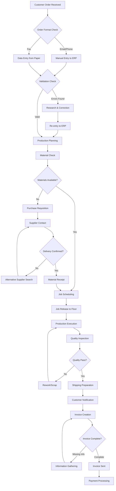

### Detailed AS-IS Process Analysis

#### Phase 1: Order Entry and Validation (Days 1-3)

**Current Process**:
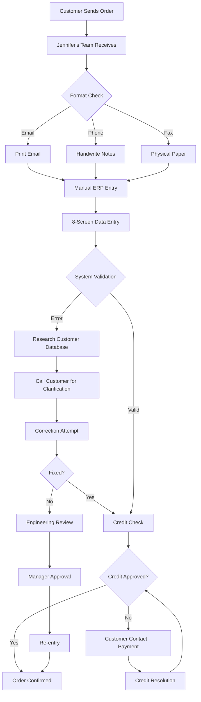

**Key Metrics (AS-IS)**:
- **Average Time**: 2.3 days
- **Error Rate**: 30% of orders require correction
- **Touch Points**: 6-8 people involved
- **System Interactions**: 3 separate systems (ERP, Credit, Email)
- **Rework Frequency**: 1.2 iterations per order average

**Waste Analysis**:
- **Waiting**: 45% of time spent waiting for clarifications
- **Transport**: Physical movement of papers between departments
- **Motion**: Excessive clicking through ERP screens
- **Defects**: 30% error rate requiring rework
- **Over-processing**: Duplicate data entry across systems

#### Phase 2: Production Planning (Days 3-4)

**Current Process**:
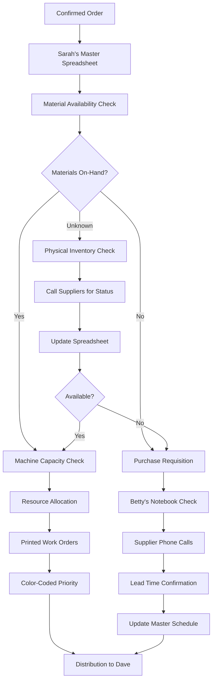

**Key Metrics (AS-IS)**:
- **Average Time**: 3.2 days
- **Spreadsheet Complexity**: 47 columns, 300+ rows
- **Daily Updates Required**: 2-3 hours manual work
- **Supplier Calls**: 8-12 calls per day
- **Schedule Changes**: 3-5 per day average

**Waste Analysis**:
- **Over-production**: Excess safety stock due to poor visibility
- **Waiting**: Delays while hunting for material information
- **Inventory**: 15% more raw material than optimal due to uncertainty
- **Over-processing**: Manual spreadsheet maintenance
- **Motion**: Physical delivery of paper work orders

#### Phase 3: Material Procurement (Days 5-15)

**Current Process**:
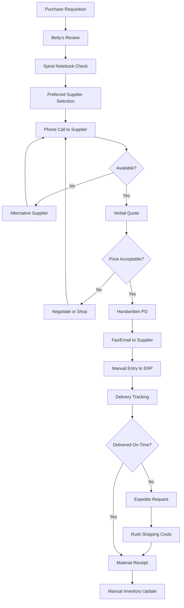

**Key Metrics (AS-IS)**:
- **Lead Time Variability**: 5-15 days (200% variance)
- **Expediting Frequency**: 35% of orders
- **Cost Premium**: 15-20% for expedited materials
- **Supplier Documentation**: Paper notebooks only
- **Tracking Method**: Manual phone follow-ups

**Waste Analysis**:
- **Waiting**: Extended lead times due to poor planning
- **Transportation**: Expedited shipping costs
- **Over-processing**: Manual PO creation and tracking
- **Defects**: Delayed orders due to supplier issues
- **Motion**: Constant phone calls and paper handling

#### Phase 4: Manufacturing Execution (Days 15-20)

**Current Process**:
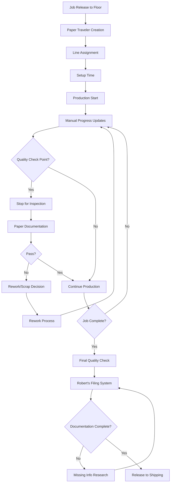

**Key Metrics (AS-IS)**:
- **Production Time**: 15-20 days
- **Setup Time**: 25% of total cycle time
- **Quality Hold Time**: 2-4 hours per checkpoint
- **Visibility Delays**: 30 minutes to locate job status
- **Documentation Time**: 3-4 hours for complex jobs

**Waste Analysis**:
- **Waiting**: Jobs queued due to poor scheduling
- **Over-production**: Excess WIP due to push system
- **Motion**: Paper traveler handling and filing
- **Defects**: Rework rate 8% (industry average 3-5%)
- **Over-processing**: Redundant quality documentation

#### Phase 5: Shipping and Invoicing (Days 2-3 + 5-10)

**Current Process**:
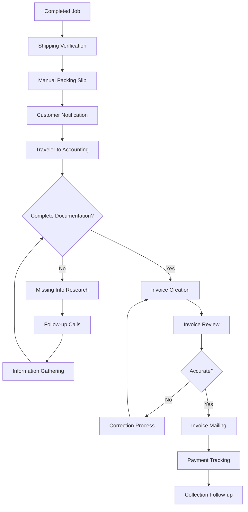

**Key Metrics (AS-IS)**:
- **Shipping Prep**: 2-3 days
- **Invoice Delays**: 20% require follow-up
- **Information Gathering**: 1-2 days for complex jobs
- **Payment Terms**: Net 30
- **Collection Time**: 15-25 days average

**Waste Analysis**:
- **Waiting**: Invoice delays due to missing information
- **Motion**: Paper document movement between departments
- **Over-processing**: Manual invoice creation and review
- **Defects**: Invoice errors requiring correction
- **Transport**: Physical mail for invoice delivery

## TO-BE Process Design

### Optimized Order-to-Cash Flow

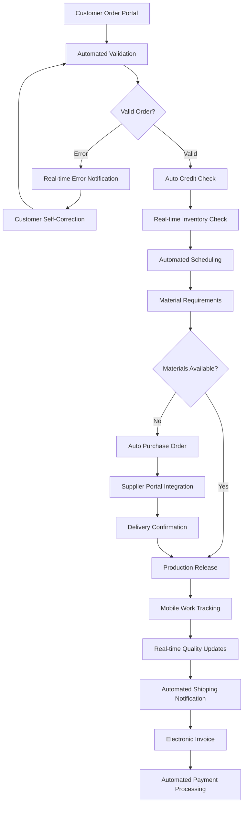

### Detailed TO-BE Process Design

#### Phase 1: Digital Order Entry (Target: 2 hours)

**Optimized Process**:
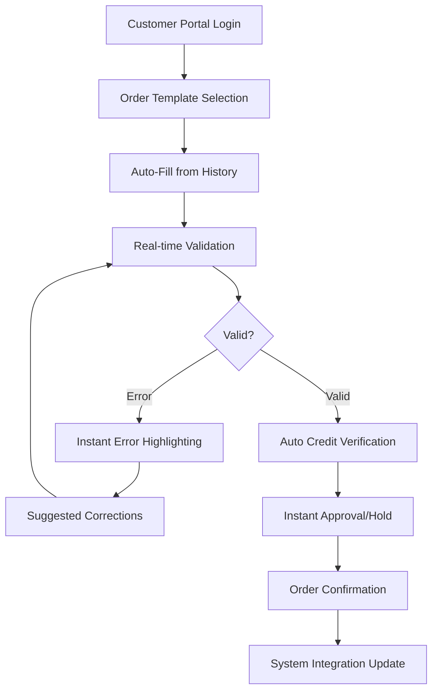

**Target Metrics (TO-BE)**:
- **Average Time**: 2 hours (was 2.3 days)
- **Error Rate**: 2% (was 30%)
- **Touch Points**: 1-2 people (was 6-8)
- **System Integration**: Single source of truth
- **Automation Rate**: 85% of orders fully automated

**Improvements Delivered**:
- **Time Reduction**: 90% cycle time improvement
- **Quality Improvement**: 93% reduction in errors
- **Resource Efficiency**: 70% reduction in manual effort
- **Customer Experience**: Real-time order status
- **Scalability**: System handles 10x volume

#### Phase 2: Intelligent Production Planning (Target: 4 hours)

**Optimized Process**:
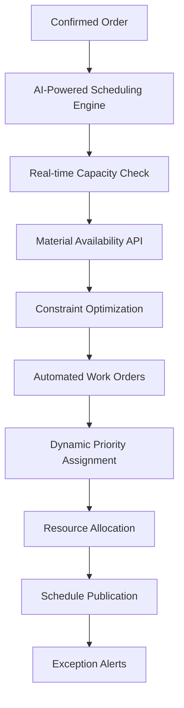

**Target Metrics (TO-BE)**:
- **Planning Time**: 4 hours (was 3.2 days)
- **Schedule Accuracy**: 95% (was 70%)
- **Material Visibility**: Real-time (was daily calls)
- **Change Management**: Automated re-scheduling
- **Planner Efficiency**: Focus on exceptions only

**Improvements Delivered**:
- **Speed**: 95% faster planning cycle
- **Accuracy**: Real-time data vs. spreadsheet estimates
- **Responsiveness**: Instant schedule adjustments
- **Scalability**: AI handles complexity growth
- **Reliability**: Removes single point of failure

#### Phase 3: Automated Procurement (Target: 3-5 days)

**Optimized Process**:
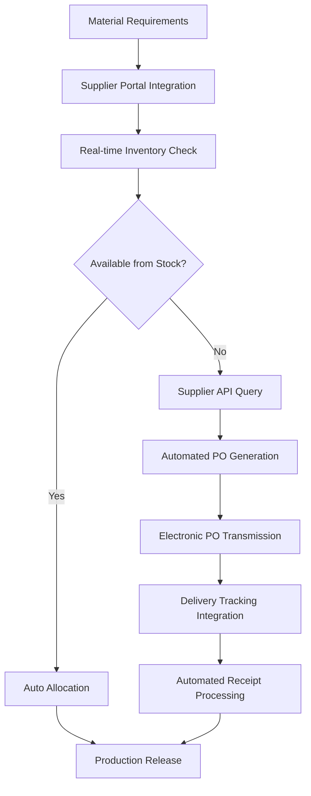

**Target Metrics (TO-BE)**:
- **Lead Time**: 3-5 days (was 5-15 days)
- **Expediting**: 5% (was 35%)
- **Cost Reduction**: 12% through automation
- **Supplier Integration**: Electronic transactions
- **Inventory Accuracy**: 99%+ real-time

**Improvements Delivered**:
- **Predictability**: Consistent 3-5 day delivery
- **Cost Savings**: Reduced expediting and manual processing
- **Visibility**: Real-time supplier performance tracking
- **Efficiency**: Automated PO generation and tracking
- **Relationships**: Supplier portal improves collaboration

#### Phase 4: Smart Manufacturing Execution (Target: 10-12 days)

**Optimized Process**:
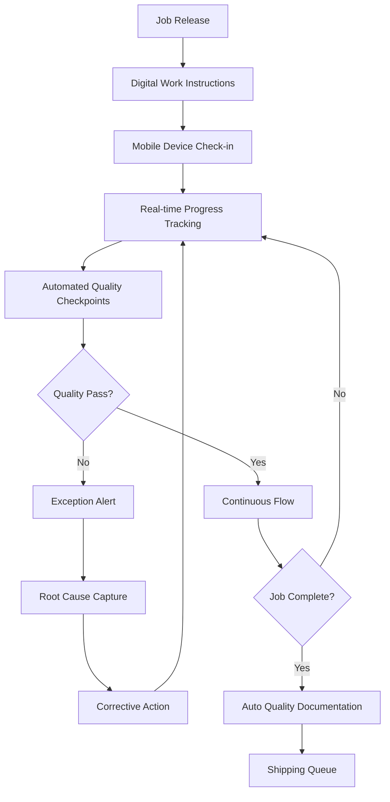

**Target Metrics (TO-BE)**:
- **Production Time**: 10-12 days (was 15-20 days)
- **Setup Reduction**: 40% through digital instructions
- **Quality Response**: Real-time (was hours/days)
- **Visibility**: Live dashboard updates
- **Documentation**: Automated generation

**Improvements Delivered**:
- **Speed**: 35% faster production cycles
- **Quality**: Real-time detection and correction
- **Transparency**: Live job status for all stakeholders
- **Efficiency**: Reduced setup and changeover times
- **Compliance**: Automated quality documentation

#### Phase 5: Streamlined Fulfillment (Target: 1 day + 3-5 days collection)

**Optimized Process**:
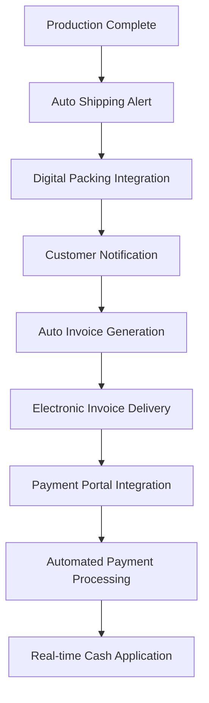

**Target Metrics (TO-BE)**:
- **Shipping Time**: 1 day (was 2-3 days)
- **Invoice Accuracy**: 99% (was 80%)
- **Invoice Speed**: Same day (was 5-10 days)
- **Payment Terms**: Optimized with early pay discounts
- **Collection Time**: 3-5 days (was 15-25 days)

**Improvements Delivered**:
- **Cash Flow**: 85% faster invoice-to-payment
- **Accuracy**: Automated data flow eliminates errors
- **Customer Satisfaction**: Real-time delivery notifications
- **Working Capital**: Faster collection improves cash flow
- **Efficiency**: Eliminates manual invoice processing

## Waste Elimination Analysis

### Current State Waste Quantification

| Waste Type | Current Impact | Annual Cost | Improvement Opportunity |
|------------|----------------|-------------|------------------------|
| **Waiting** | 32% of cycle time | $1.2M | Eliminate through automation |
| **Transport** | 8% of cycle time | $380K | Digital document flow |
| **Motion** | 12% of cycle time | $580K | Mobile/digital interfaces |
| **Defects** | 15% rework rate | $950K | Real-time quality controls |
| **Over-processing** | 18% of activities | $720K | Process automation |
| **Over-production** | 10% excess WIP | $620K | Pull-based scheduling |
| **Inventory** | 15% excess stock | $2.1M | Real-time visibility |
| **Skills** | 25% underutilized | $480K | Task automation/upskilling |

**Total Waste**: $7.03M annually (15% of revenue)

### TO-BE Waste Reduction

| Waste Type | Reduction Target | Annual Savings | Implementation Method |
|------------|------------------|----------------|----------------------|
| **Waiting** | 85% reduction | $1.02M | Automated workflows |
| **Transport** | 90% reduction | $342K | Digital processes |
| **Motion** | 70% reduction | $406K | Mobile technology |
| **Defects** | 60% reduction | $570K | Real-time quality |
| **Over-processing** | 80% reduction | $576K | Process automation |
| **Over-production** | 75% reduction | $465K | Demand-driven production |
| **Inventory** | 40% reduction | $840K | Real-time planning |
| **Skills** | 50% reduction | $240K | Automation + upskilling |

**Total Savings**: $4.44M annually (63% waste reduction)

## KPI Framework and Measurement

### Primary Success Metrics

#### Cycle Time Performance
- **Current**: 42 days average order-to-cash
- **Target**: 29 days (30% reduction)
- **Measurement**: Daily tracking with dashboard visibility
- **Accountability**: Cross-functional process team

#### Quality and Accuracy
- **Order Accuracy**: 30% errors → 2% errors
- **On-time Delivery**: 78% → 95%
- **First-pass Quality**: 92% → 98%
- **Invoice Accuracy**: 80% → 99%

#### Financial Impact
- **Cash Conversion Cycle**: 87 days → 55 days
- **Working Capital**: $8M reduction
- **Cost of Quality**: 50% reduction
- **Operational Efficiency**: 25% improvement

### Supporting Metrics

#### Process Efficiency
- **Order Entry Time**: 2.3 days → 2 hours
- **Production Planning**: 3.2 days → 4 hours
- **Material Lead Time**: 10 days average → 4 days average
- **Documentation Time**: 3 hours → 15 minutes automated

#### System Performance
- **Data Accuracy**: 75% → 99%
- **System Integration**: 3 separate systems → 1 unified platform
- **Real-time Visibility**: 0% → 100%
- **Automated Processes**: 15% → 85%

#### Customer Satisfaction
- **Order Status Visibility**: Manual inquiry → Self-service portal
- **Delivery Predictability**: 70% confidence → 95% confidence
- **Response Time**: 30 minutes → 30 seconds
- **Complaint Resolution**: 5 days → 1 day

## Implementation Roadmap

### Phase 1: Foundation (Days 1-30)
1. **Week 1-2**: System architecture design and vendor selection
2. **Week 3**: Data migration planning and cleanup
3. **Week 4**: Integration development and testing

### Phase 2: Pilot Implementation (Days 31-90)
1. **Week 5-6**: Order entry automation deployment
2. **Week 7-8**: Production tracking implementation
3. **Week 9-10**: Quality system integration
4. **Week 11-12**: Pilot testing and refinement

### Phase 3: Full Rollout (Days 91-150)
1. **Week 13-16**: Full production deployment
2. **Week 17-18**: Training and adoption support
3. **Week 19-20**: Performance optimization
4. **Week 21-22**: Benefits validation and measurement

### Phase 4: Optimization (Days 151-180)
1. **Week 23-24**: Advanced analytics implementation
2. **Week 25**: Continuous improvement integration
3. **Week 26**: Final validation and hand-off

## Risk Mitigation Strategy

### Technology Risks
- **Integration Challenges**: Phased approach with fallback procedures
- **Data Migration**: Parallel systems during transition
- **System Performance**: Load testing and scalability planning
- **User Adoption**: Comprehensive training and support

### Operational Risks
- **Production Disruption**: Pilot approach with gradual rollout
- **Quality Compliance**: Maintain paper backup during transition
- **Staff Resistance**: Change management and communication plan
- **Customer Impact**: Transparent communication and service guarantees

### Financial Risks
- **Budget Overrun**: Fixed-price phases with clear scope control
- **ROI Achievement**: Quick wins to build momentum and confidence
- **Cash Flow**: Staged implementation minimizes upfront investment
- **Opportunity Cost**: Parallel implementation maintains current operations

---

## Student Exercise: Process Analysis

### Your Process Mapping Assignment

Using the discovery insights and process analysis above, create your own detailed process maps addressing:

1. **Current State Documentation**: Map 2-3 critical sub-processes in detail
2. **Bottleneck Analysis**: Identify the top 5 constraints limiting throughput
3. **Waste Quantification**: Calculate specific waste costs for your chosen processes
4. **Future State Design**: Design optimized processes with specific improvement targets
5. **KPI Definition**: Define measurable success criteria for each process improvement
6. **Implementation Planning**: Create detailed 90-day implementation roadmap

This process analysis forms the foundation for your technology solution design and business case development in subsequent capstone deliverables.

---

## Navigation
**Previous**: [[discovery_transcript|Discovery Transcript]]  
**Next**: [[automation_poc|Automation POC]]  
**Up**: [[index|Capstone Home]]